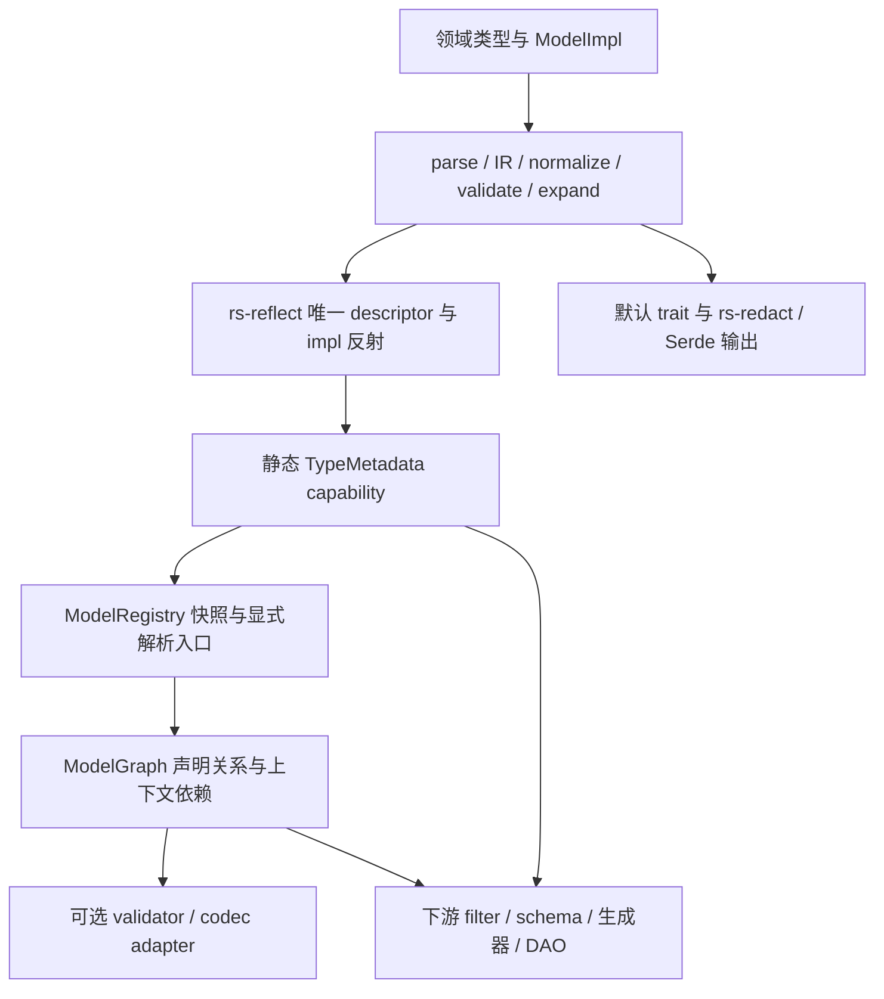

# 模型元数据与派生宏重构设计

- 版本：2026-09-10，依据用户已确认的[冻结需求](rs-model-derive-requirements.zh_CN.md)。
- 状态：本轮目标设计；描述重构后的行为，不表示当前实现已经支持。
- 适用范围：`qubit-model-metadata` 与 `qubit-model-derive`，以及必要的 reflect/redact/validator/codec 集成。
- 现状证据：[实现缺口评估](rs-model-implementation-gaps.zh_CN.md)。
- 重构任务：[实施计划](../../doc/plans/2026-09-10-model-metadata-plan.md)。
- 本文替代原先以旧查询策略和 metadata-only 宏为前提的设计。历史讨论不覆盖冻结需求。

## 1. 架构与边界

保留单一反射根、typed capability、不可变声明、显式 registry 快照和结构解析。重构围绕领域能力补齐，不重新实现反射系统。



| 层 | 输入 | 输出 | 不执行 |
| --- | --- | --- | --- |
| derive | token、可见 derive、类型约束 | 反射委托、metadata provider、默认能力实现 | 数据库、业务实例生成、filter 计划 |
| 静态 metadata | reflect 根及领域 capability | 只读字段、Property 来源、角色、约束、关系声明 | 全局结构解析、getter 调用、策略绑定 |
| registry/resolver | 显式快照、显式根、稳定 ID | 只读结构图及确定性多错误 | 父实例推断、业务回退、查询展开 |
| 可选 adapter | 结构图和显式策略 registry | 类型检查后的执行绑定 | 隐式策略查找、改变原 metadata |
| 下游 | metadata、结构图、显式实例上下文 | 验证、查询、生成、持久化等产品行为 | 反向改变模型声明含义 |

角色宏的默认 trait 生成属于本库，不因“只收集 metadata”的业务职责边界而删除。自动 Debug/Display/Serialize 接入 rs-redact；字段 helper 不执行 validator、codec 或查询。

## 2. 编译流水线

沿用 `derive/src/{parse,ir,normalize,validate,expand}`。模型类型和 ModelImpl 共享诊断收集、来源定位、依赖路径发现；两者各自维护类型声明 IR 与 impl IR。

1. parse 保留 token span、显式/默认来源，重复单项参数立即报告；validator occurrence 使用有序列表，不能按 ID 去重。
2. normalize 计算角色默认能力、约束有效参数、索引原因、Enum canonical 名称和 selector 目标。
3. validate 处理当前声明可判定的问题；真实 Rust 类型相等性用 sealed 类型约束，不能以名称判断 Id 或文本能力。
4. expand 委托 Reflect/reflect_impl，输出领域 capability 和自动 trait；跨来源 Property 冲突留给可失败的组装。
5. 不以 runtime registry 信息抑制当前声明的重复 trait 实现；独立 impl 的抑制仍要求用户使用 no_*。

`DeclarationOptions` 增加能力选择 IR；`UniqueIr` 将显式 `ignore_case` 与有效值分开，避免把默认 true 当作非文本字段的显式错误。字段/selector 的类型约束保留来源，遇到类型自身约束时叠加，不覆盖。

## 3. 默认能力与输出

| 能力 | 默认 | 生成与冲突规则 |
| --- | --- | --- |
| Clone、PartialEq、Eq、Hash | 五种角色启用 | 标准字段语义；保留 no_partial_eq/no_eq 对 Eq/Hash/Ord 的联动 |
| Copy | 仅全 unit Enum | no_copy 关闭；其他角色 copy 显式启用并检查 Clone/字段 Copy |
| Default、PartialOrd、Ord | 关闭 | 显式开关；Enum Default 要求一个标准 default unit variant |
| Redact、Debug、Display、Serialize、Deserialize | 启用 | 输出执行字段策略；Deserialize 不脱敏；可分别关闭 |

可见 derive 只用于避免重复生成；无法与输出脱敏安全组合的显式 derive 必须拒绝。生成的 bound 按实际访问字段和序列化方向构造，不给不相关泛型参数机械追加所有 trait。用户 opt-out 后手写输出自行承担脱敏契约。

采用 rs-redact 的派生/字段投影协议作为唯一脱敏执行源：Debug 与 Display 使用借用脱敏视图，Serialize 使用结构化脱敏投影，不能先转 JSON 字符串再序列化。普通 named 字段的空 Option/标准集合自动 omit/default 仅在用户未提供对应 Serde 配置时注入。keep_serializing 只抑制自动 omit。透明 Value 的 Display/Serialize 使用内值表示，Debug 保留名义类型。

`redact(skip)` 在启用策略时跳过整个字段，包括 tuple/newtype/透明唯一载荷；disabled 恢复字段但不取消 Serde skip。空载荷的合法外层表示由 rs-redact/serializer 决定。map key 输出冲突返回错误。`no_redact` 只关闭当前类型的 Redact，嵌套值自己的输出实现仍被调用。

将模型 low/medium/high/secret 规范化后交给 rs-redact 对应等级；不继续将旧敏感度别名作为独立模型语义公开。with/serialize_with 等用户回调按 rs-redact 允许的组合委托，敏感字段不向不安全组合泄漏原值；普通或 skip 字段能够安全委托的组合保留。完整保留 Serde token，同时只对静态可发现名称/skip 等事实建立 metadata，不声称推导任意用户 serializer 的最终 schema。

运行时 facade 增加生成输出所需的受控 rs-redact/Serde 重导出。默认 metadata 查询不触发输出执行；validator/codec 仍是可选 feature。依赖重命名由现有 runtime_path 流程处理。

## 4. ModelImpl 与 Property

ModelImpl 先提取模型方法标记，再将 impl 委托给 reflect_impl；trait impl、泛型 impl 和不能动态调用的方法按反射契约描述。模型层不复制整个方法调用系统。

同一类型可以有多个 ModelImpl block。每个 block 以独立 checked capability 注册；读取时仅聚合当前反射快照可见的 provider，并按 owner TypeId 与 provider 集合缓存结果。聚合检查各 provider 的 owner 和 accessor 类型，不使用每个 impl 重复实现的 seal trait。泛型 concrete 方法贡献沿用 reflect_impl 的显式 specialize 声明。

确定退出自动 Property 的语法为：

```rust
#[ModelImpl]
impl User {
    #[model_property(skip)]
    pub fn validate(&self) -> bool { !self.name.is_empty() }

    pub fn full_name(&self) -> String { self.name.clone() }
}
```

`model_property(skip)` 只允许在 ModelImpl 中的方法上；只支持单个无值 skip 参数。重复标记、未知选项和非方法位置报错。该标记在反射委托前消费，仅移除 Property 候选，不删除反射方法或同名 field 的贡献。

public、同步、safe、非泛型的 inherent getter/setter 形状按冻结规则自动识别；不符合形状只保留方法信息，不能报“必须是 getter”。trait impl 方法不贡献 Property。getter 不接受 text/indexed/validator/codec/redact 等模型属性，不提供 computed 标记。

Property 组装输入是存储 field 和方法来源 fragment；逻辑类型优先由 field 确定，否则由 getter 的兼容值类型确定，再校验 setter。显式 accessor 优先，兼容支持 T/&T、String/str、Vec/slice、Option<T>/Option<&T>。重复不同 getter 或不同 setter、类型不兼容返回有序 PropertyBuildErrors。兼容映射不能把借用返回伪装为 owned 或 static。

每个具名 field 始终形成可读写 Property，不因 private visibility 消失；无 field 且有 getter 为 Computed，只有 setter 为 Virtual。泛型 impl fragment 按 concrete TypeId 实例化并缓存；未满足 where 条件或无法动态调用时沿用反射的能力/不可调用信息，不能制造一个必定可调用的 adapter。

## 5. 路径类型与依赖语法

普通 PropertyPath 继续表示点分隔属性选择。新增独立导航类型，不把 `..` 编成空属性字符串。

```rust
pub enum NavigationStep {
    Property(&'static str),
    Parent,
}
pub struct ObjectPath { /* 私有静态步骤切片及来源 */ }
impl ObjectPath {
    pub fn steps(&self) -> &'static [NavigationStep];
}
impl ReferenceMetadata {
    pub fn path(&self) -> Option<&'static ObjectPath>;
}
```

以上为目标接口声明，类型体的私有存储不属于调用者契约。路径接受非空相对步骤，以 `/` 分隔，Parent 可连续出现；不接受独立 `.`、空步骤或绝对根路径。普通字段导航段沿用合法属性名规则。旧 dotted reference.path 在迁移中改写，不作为第二种永久语法接收。

ResolveError 的 object_path() 保留强类型对象导航，path() 仅保留字段或所选 Property 的路径；父步骤不转存为普通属性名。本地 child/.. 不要求外部父上下文；只有越过声明所属对象的导航才要求父上下文。结构解析检查已知本地 validator 依赖的存在性和可读性，未知外部父类型保留为上下文要求。

reference 的 path=None 表示未指定复用绑定；进入 reference 属性后描述完整 Entity 绑定，最终目标角色/类型在可确定时检查。实例绑定与回退不在 metadata 实现。

validator 确定如下声明形式，既支持多个对象来源，也保留简单当前对象依赖：

```rust
#[validator(
    id = "qubit.identity.card",
    depends_on(
        gender,
        birthday(path = "..", property = birthday),
    ),
    params(strict = true),
)]
identity_card: String,
```

裸 `gender` 规范化为名为 gender 的依赖、空对象导航和同名属性选择。复杂形式 `slot(path = "../owner", property = profile.birthday)` 中 slot 为 validator 注册依赖槽名，property 必填，path 可省略；property 支持点分隔 token 或字符串表达，统一进入 PropertyPath。当前单字段无父路径表达继续有效。旧 named `slot = property` 可在同一次下游迁移中改写为 `slot(property = property)`，目标文档只公开统一形式。

规范化后每项包含 name、ObjectPath、PropertyPath、DeclarationLocation。空依赖名、重复槽名、重复完整导航/选择、未知参数报错；同一个 validator ID 的不同 occurrence 不去重。字符串点路径是 property 表达，不扩展为 reference 的对象绑定访问。

```rust
impl DependencyBindingMetadata {
    pub fn name(&self) -> &'static str;
    pub fn object_path(&self) -> ObjectPath;
    pub fn property(&self) -> PropertyPath<'static>;
    pub fn declaration(&self) -> &'static DeclarationLocation;
}
```

DeclarationLocation 区分 field index、Enum variant index、selector；可查询源文件/行列和所属模型类型。字段与 selector 的基准对象是所属实例；在元素类型内部的声明以元素为基准。None、集合和父节点缺失属于实例执行输入，不由宏猜测。

## 6. 泛型、匿名类型与注册

GenericModelMetadata 的 model_id 改为 Option<ModelId>；有无 ID 都构造定义 overlay。类型声明宏无条件为泛型生成 model definition provider，仅在 Some(id) 时提交模型稳定 ID 索引项。reflect 仍拥有原始 TypeDefinitionDescriptor。

```rust
impl GenericModelMetadata {
    pub fn model_id(&self) -> Option<ModelId>;
    pub fn definition(&self) -> &'static TypeDefinitionDescriptor;
    pub fn fields(&self) -> &'static [FieldMetadata];
    pub fn variants(&self) -> &'static [EnumVariantMetadata];
}
```

concrete 泛型 metadata 不合成 ModelId，不成为链接期模型注册项，generic_definition 总能导航到所属泛型模型定义。无 ID 类型可以按静态 Rust 类型查询，也可作为结构解析入口。ReflectRegistry 的类型/定义注册与 ModelRegistry 的稳定 ID 枚举分离。

泛型定义和 concrete 元数据均沿用静态缓存：key 为实际 TypeId；发布完成的不可变值后才可供并发读取。循环类型由反射 TypeRef 惰性边解决，不能递归持有模型缓存锁。初始化错误保留结构化原因，不能缓存空结果冒充无能力。const 支持基础整数/bool/char和直接 N，不解释复杂 const 运算。

## 7. 显式结构解析与图身份

```rust
pub struct ResolveInputs<'a> {
    pub models: &'a ModelRegistry<'a>,
    pub roots: &'a [&'static TypeMetadata],
}
impl<'a> StructureResolver<'a> {
    pub fn new(inputs: ResolveInputs<'a>) -> Self;
    pub fn resolve(self) -> Result<ModelGraph<'a>, ResolveErrors>;
}
```

解析集合是 registry concrete entries 与显式 roots 的并集，再沿结构字段/variant 和声明关系访问可达模型。visited key 使用 TypeId；模型 ID 只作为稳定查找/诊断补充。对递归类型登记节点后访问边，不能无限展开路径；来源按确定性声明顺序记录，多根共享子类型只组装一次。

FieldLocation 使用所属 TypeId、可选 variant index、field index，代替仅靠 field name 或指针的身份。即使 Enum tuple field 无名字，错误也能定位到 variant 和字段序号。Property 仍使用名称。父上下文路径的解析结果区分静态已解析与 RequiresContext；后者保留未解析步骤和已确定前缀，不能当作成功已取得依赖，也不能当作非法路径。

```rust
pub enum ContextRequirement { None, ParentObject }
pub struct ResolvedDependency { /* 图拥有的结构解析结果 */ }
impl ResolvedDependency {
    pub fn declaration(&self) -> &'static DependencyBindingMetadata;
    pub fn context_requirement(&self) -> ContextRequirement;
}
```

结构错误保留原有分类和底层 cause，新增必要的导航/位置数据；无 ID 错误记录 TypeId、诊断类型名和路径，不生成假 ModelId。查询顺序不得依赖 HashMap 迭代。ModelGraph 借用 registry 快照，图内动态汇总只在图生命周期内共享；static metadata 不能引用图内临时内存。

## 8. Reference、Enum 与 Value 边界

Reference 字段兼容检查把外层 Option、Box/Rc/Arc、sequence/set/array 保留为 cardinality/shape 信息，再比较保存值与选中目标属性的兼容类型；不是拿 Vec<Id> 的 TypeId 与 Id 比较。目标属性本身可以是复杂值，因此逐层尝试精确兼容后再解引用字段包装，记录实际匹配位置；不要无条件剥掉目标属性自身的容器。Map 不作为直接引用保存形状。

Enum payload 允许 reference；真实 FieldMetadata 挂在 variant 下，不注入类型级 properties。Entity/Projection 载荷必须显式引用。Value 闭包检查穿过 Enum payload、包装、容器和其他 Value，遇到 reference 或 Entity/Projection/Model 拒绝；opaque 不能用于藏匿已知模型角色。

identifier 沿用仅针对真实 Id 的 sealed IdentifierType 检查，真实别名可通过；不增加名称启发式。unique 的默认 ignore_case 由 text capability 决定，非文本普通 unique 不启用，非文本显式 ignore_case 报错。保留 indexed 冗余错误、Set/数组冗余限制及 Eq/Hash 联动。

## 9. 约束、codec 与 validator 绑定

约束按 DeclarationLocation 和来源（类型/使用位置）保存，标准单项重复在同一声明位置拒绝；跨位置叠加。optional 解包、容器 selector 和 opaque 边界保持完整，getter 不是约束声明位置。

validator/codec 的静态 metadata 不暴露执行 crate 类型；可选 adapter 接受调用者提供的 registry。保留现有 ValueCodecDescriptor 和 validator 注册协议，不另外定义策略执行 trait。注册时检查编码/解码/构造 bound，模型使用位置绑定时核对准确目标类型。

ValidationPlan 将根身份改为 TypeId 加 Option<ModelId>，不得 expect 一个必填 ID。上下文依赖路径分为静态编译前缀和运行时导航后缀；绑定只有在已具备目标类型时才核对注册依赖类型，否则保留显式上下文需求供消费端完成。执行时上下文不足返回带 occurrence/依赖路径的结构化错误，不能默认为 None 或静默跳过；调用者可以在执行前提供相应上下文。标准 None 跳过规则和业务父对象缺失是不同事件。

本库只完成必要 adapter 的输入/输出连接；父实例栈、生成回退、数据库查找和 filter 算法由下游拥有。源码已有 target/on_none/validate_nested 扩展没有被本轮需求采纳为新增能力；迁移时改写为既定 selector/Option 语义或显式下游执行配置，不能悄悄扩充冻结语法。

## 10. 查询声明视图

移除 resolver 中 build_query 的产品 filter 推导及 EmptyIndexedObject/平面名冲突等策略性失败。保留 unique scope 的存在性/可读性检查，移入结构关系校验；不能随查询逻辑一起删除。

QueryMetadata 仍由 ModelGraph 为 Entity 构造，但改为以下只读声明视图：

```rust
impl QueryMetadata {
    pub fn declarations(&self) -> &[QueryDeclaration];
}
impl QueryDeclaration {
    pub fn field(&self) -> &'static FieldMetadata;
    pub fn reasons(&self) -> IndexingReasons;
    pub fn path(&self) -> PropertyPath<'_>;
}
```

declarations 记录 Entity 直接 indexed 成员，包括 identifier、global unique 和 reference；field 导航其类型、unique scope 与 reference 关系。嵌套 metadata/已解析边由消费者访问，不构造无限展开列表。删除 filters/filter_by_flat_name 作为新 API；平面名不进入 QueryDeclaration。消费者有权实现 ID 列表筛选、不同深度、子串/范围和组合条件。

## 11. 公共 API 与实现文件分工

未改变的入口以以下模块中的声明为复用基础，其语义受冻结需求约束；本节和前述新增签名优先于现有接口。实施验收由 rustdoc 编译校对，不将源代码是否存在等同于满足行为。

| 接口族 | 公共信息/返回与缺失 | 实施文件 |
| --- | --- | --- |
| TypeMetadata | try_of -> Result<static metadata, AbiViolation>；of 为 panic 便利；model_id 可空；fields 与角色只读 | src/type_metadata.rs、src/type_metadata/、src/role.rs |
| FieldMetadata | index/name/type_ref/descriptor/visibility/attributes；单项无声明返回 None，多项空集合 | src/field_metadata.rs、src/metadata_vocabulary.rs |
| Property | try_properties/try_property 明确组装失败与缺失；field/getter/setter 来源、storage_kind、可调用性 | src/property.rs、src/local_property_set.rs、src/property_resolution_error.rs |
| TypeRef/TypeDescriptor | 复用 reflect：resolved/opaque/symbolic；opaque 不假装完整 descriptor | src/reflect_facade.rs、src/private/reflect_codegen.rs |
| 角色 payload | Entity identifier；Projection identifier/source；Enum variants；Value transparent/canonical codec | src/type_metadata/、src/role.rs |
| 声明 metadata | 强类型参数、来源、有序 occurrence；上述 ObjectPath/依赖绑定替代旧纯 PropertyPath 复用 | src/metadata/、src/metadata_vocabulary.rs、src/relation.rs、拟新增 src/relation/object_path.rs |
| Registry | 全局 fallible/panic、ModelId registration/concrete/generic 查询、TypeId concrete 查询、确定性枚举 | src/registry/、src/model_id/ |
| Graph | properties/reference/projection_source/query 导航只读，不存在返回 None；错误在 resolve 聚合 | src/resolve/{resolver,relations,graph,error,queries}.rs |
| Adapter | 原 codec/validation feature 入口，新增无 ID 根和显式上下文依赖支持 | src/codec/、src/validation/ |

所有返回类型可从 metadata facade 到达；属性/导航集合返回借用切片，不克隆整张图。动态 getter/setter 访问使用 reflect 的 Local/ThreadSafe 能力边界，不能为了 static metadata 要求领域实例 Send+Sync；调用前类型/所有权检查失败与方法执行失败分开。

## 12. 生产 ABI、迁移和错误分期

保持版本化隐藏 ABI，新增协议集中发布为 `__private::v6`，同步 metadata 与 derive 版本；不改变 rs-reflect 自己的 ABI 版本。复用当前 checked 构造、capability 校验和 provider_v2 协议，不通过命名猜测调用反射内部函数。旧 v5 在重构阶段仅服务于旧测试迁移；交付时仓库展开统一使用 v6，错误消息明确 ABI mismatch。

| 阶段 | 必须处理 | 不处理 |
| --- | --- | --- |
| 宏 | 角色/参数/重复/静态范围、输出冲突、方法标记、path 语法 | 全局 ID 存在性、父实例 |
| Rust 类型检查 | 精确 Id、字段 trait bound、约束能力 | 任意业务 validator 可满足性 |
| registry | 稳定 ID 重复、capability/ABI 错误 | filter 策略 |
| resolver | 属性组装、目标角色/结构兼容、Value 闭包、可确定依赖 | 缺少父实例时编造错误或实例 |
| adapter/消费者 | 注册、准确输入/依赖类型、实例上下文、运行结果 | 修改静态声明 |

下游先统一删除与自动能力重复的可见 derive，保留有意 opt-out；旧 reference 点路径改为斜杠；依赖采用新声明形式；删除调用 filters/flat_name 的本库耦合，迁往真实消费者。需求未要求的业务算法不为消除编译错误临时塞回 resolver。

## 13. 验收场景与交付门槛

1. 不手写 derive 的五角色类型具备默认能力；float 等不支持 Eq 的字段只有显式关闭相应自动能力后才通过；泛型 bound 不过约束。
2. 显式输出 derive、Serde 回调、skip、透明 Value、map key 冲突、disabled 策略验证实际输出，不只检查 metadata 标签。
3. ModelImpl trait/generic/普通方法可反射；skip 方法不贡献 Property；同名 field 仍存在；借用返回不逃逸。
4. 无 ID 泛型定义可导航，无 ID 根完成结构解析；并发查询同 TypeId 使用同一 metadata 根；递归类型终止。
5. reference 的 Option/Vec/Enum tuple、父路径和 Value 闭包分别验正反例；错误保留 variant/index。
6. 同一 validator ID 重复且参数不同保持源码顺序；局部与父依赖并存，静态类型不足保留上下文要求；缺上下文不 panic。
7. 合法但旧方案会 flat-name 冲突或展开为空的模型仍可 resolve；unique scope 真错误仍拒绝。
8. 真实多 crate fixture 验证 ID/能力/宏重命名；rs-platform 131 个现状声明迁移后重新统计和编译。
9. 台账每项标明实际用例与结果，设计参考及下游算法不伪装成已完成本库测试；不降低冻结需求以适配旧测试。

新 API 引入、借用访问和最终集成分别审查。测试细分命令、依赖顺序、任务写入范围见实施计划。
