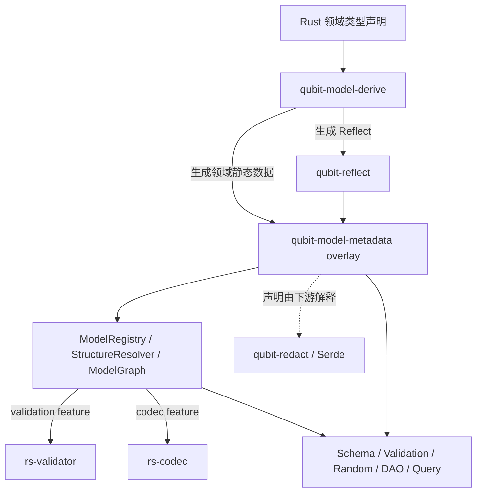

# `rs-model-derive` 最终需求规范（中文版）

- 状态：已冻结（2026-09-10 用户整体确认）
- 适用范围：角色化重构完成后的 `qubit-model-derive`、`qubit-model-metadata`、`rs-validator`、
  `rs-codec` 与 `qubit-redact` 集成契约
- 面向读者：产品与架构审核者、实现者、测试者、用户手册维护者、下游框架开发者
- 目标设计：[模型元数据与派生宏重构设计](rs-model-derive-final-design.zh_CN.md)（2026-09-10 重写）
- 缺口评估：[实现缺口与必要性](rs-model-implementation-gaps.zh_CN.md)
- 历史讨论：[2026-08-28 讨论记录](../../doc/archive/2026-09-10/derive/doc/2026-08-28-discuss-session.md)（本轮已确认修订优先）
- 冻结审阅：[范围摘要与收尾审查](rs-model-requirements-freeze-review.zh_CN.md)
- 验证映射：[需求覆盖台账](rs-model-derive-requirements-coverage.zh_CN.md)
- 下游基线：[`rs-platform` 模型声明基线](rs-platform-model-baseline.zh_CN.md)

## 0. 文档定位与规范用语

本文定义系统最终必须呈现的公共能力、语义、API、约束和可观察行为。本文不描述迁移步骤，也不规定提交顺序。
重构交付时，代码、测试、Rustdoc、新设计和用户手册必须与本文一致；当前历史材料及旧实现不因本次文档修订而自动满足要求。

本轮确认后的本文是需求依据；历史讨论和旧设计与本文冲突时，以本文为准。结构层由 `qubit-reflect` 提供唯一的 `TypeDescriptor`、`FieldDescriptor`、
`VariantDescriptor`、`TypeRef`、泛型表达和安全动态访问；`qubit-model-metadata` 在同一个 descriptor 根上提供角色、
字段约束、关系、策略、Property、注册与解析 overlay。本文确定领域语义、可观察行为与组件边界；最终设计和公开 API
必须满足这些要求，不以现有实现反向定义需求。完整 Rust 签名集中在最终设计和 API 参考中维护；本文保留明确约定的
宏名、核心查询入口及其语义，示例用于说明使用场景。

本文使用以下规范用语：

- “必须”表示实现和调用者不可偏离的要求；
- “应”表示默认必须遵循，只有有明确理由并补充规范时才可偏离；
- “不得”表示禁止的行为；
- “可以”表示规范允许但不强制的能力；
- 正文按已确认决定持续修订；第 10 章明确标为设计参考的内容不构成强制实现要求。

需求编码按最终组件重新组织，不继承讨论过程中的 C/F/R/A 编号。编号不得复用于不相关需求；经确认的语义修订
须同步更新相关条目与验收映射。废弃或降为设计参考的条目保留编号并明确状态。

## 1. 系统概要

### 1.1 系统提供的组件

| 组件 | 对外 crate/API | 主要职责 | 不负责的内容 |
| --- | --- | --- | --- |
| 模型声明宏 | `qubit-model-derive` | 解析五种角色、字段属性和 Property impl；编译期校验；生成静态 metadata 与能力实现 | 不执行数据库、validator、codec 或生成器 |
| 结构反射 | `qubit-reflect` | 提供唯一的 Rust 类型、字段、variant、泛型、类型引用与安全动态访问描述 | 不定义模型角色、领域约束或关系 |
| 模型 metadata | `qubit-model-metadata::metadata` | 在 reflect descriptor 上附加领域角色、Field、Property、约束、关系和策略声明；提供静态查询 | 不复制 Rust 结构图，不保存对象实例，不公开执行 crate 类型 |
| 模型注册与解析 | `ModelRegistry`、`StructureResolver` 及 `ModelGraph` | 按稳定 `ModelId` 动态发现具体类型或泛型定义；完成跨 crate 关系、Property、查询和 validator 依赖路径的结构校验 | 不绑定 codec 或 validator，不为匿名类型制造 ID，不枚举无限泛型实例 |
| 可选执行适配 | `codec::bind_codecs`、`validation::ValidationPlan` | 在结构解析成功后显式绑定调用方提供的 codec 或 validator registry | 不改变静态声明或结构图，不在默认 feature 中引入执行依赖 |
| Validator 契约 | `rs-validator` | 定义 validator、稳定 ID、注册表、纯 validation 执行协议 | 不访问 repository、网络或外部业务状态 |
| Codec 契约 | `rs-codec` | 定义领域值与规范文本之间的 codec、稳定 ID 和注册表 | 不替代任意 Serde 格式或数据库专用编码 |
| 输出安全 | `qubit-redact`、Serde 联动 | 执行字段脱敏以及默认 Debug、Display、Serialize 安全输出 | 不改变字段身份、关系和值合法性 |
| 下游消费者 | schema、接口文档、validation、随机生成、DAO 测试、查询生成器 | 消费统一 metadata 实现各自功能 | 不反向扩展或改变模型宏语义 |

### 1.2 数据流和依赖方向



模型声明示例：

```rust
#[Entity(id = "qubit.platform.iam.User")]
pub struct User {
    #[identifier]
    pub id: Id,

    #[unique]
    #[text(min_chars = 3, max_chars = 32, allowed_chars = code)]
    pub username: String,

    #[redact(skip)]
    pub password_hash: String,
}
```

该声明必须同时向不同消费者提供同一事实：User 是 Entity，id 是实例身份，username 不区分大小写唯一且有文本约束，
password_hash 不得出现在安全输出中。各消费者不得自行发明另一套字段语义。

### 1.3 系统级约束

- **REQ-SYS-001**：系统必须以强类型、不可变、可静态共享的 metadata 表达模型语义，不得使用任意字符串键值表作为
  核心公共模型。
- **REQ-SYS-002**：`qubit-model-metadata` 不得依赖 `qubit-model-derive`；过程宏展开后的代码可以引用 metadata crate。
- **REQ-SYS-003**：过程宏必须只根据 token、Rust 类型约束和生成的链接期注册项工作，不得在宏执行时读取数据库、
  网络、业务 registry 或加载领域 crate 的运行时类型。
- **REQ-SYS-004**：schema、validation、随机生成、DAO 测试和查询生成器必须消费同一规范化 metadata；宏输入简写不得
  泄漏为消费者必须理解的第二套语义。
- **REQ-SYS-005**：模型 metadata 必须与对象实例分离；读取 metadata 不应要求构造对象。
- **REQ-SYS-006**：同一模型事实在不同组件中的解释必须一致。例如 `reference` 隐含 indexed、opaque 截断递归、
  Value 禁止包含 Entity 等规则必须在派生、registry 和消费者中保持一致。
- **REQ-SYS-007**：可以在当前声明内判定的问题必须在编译期报告；只有跨 crate、稳定 ID 或完整图依赖的问题才可延后到
  registry/resolver 校验。
- **REQ-SYS-008**：所有公开 metadata API 必须只读；全局注册表必须在初始化完成后不可变并可安全并发读取。
- **REQ-SYS-009**：系统必须允许循环 Entity reference 图，但所有 descriptor、查询路径和图校验算法必须有明确递归边界，
  不得无限展开。
- **REQ-SYS-010**：公共类型、宏参数、错误类型和行为必须具备 Rustdoc；用户手册示例和本文规范必须作为 API 验收输入。
- **REQ-SYS-011**：每个 concrete Rust 类型必须只有一个由 `qubit-reflect` 提供的 `TypeDescriptor` 根；模型 metadata
  必须作为该根的 typed capability/overlay 存在，不得建立平行结构描述符或重复字段访问器。

## 2. 模型声明宏组件

### 2.1 功能、作用和使用场景

模型声明宏将普通 Rust 类型标记为五种互斥的领域角色，并生成该角色的静态 metadata、注册信息和默认能力。

| 角色 | 典型场景 | 是否有实例身份 | 是否有独立持久化生命周期 |
| --- | --- | ---: | ---: |
| Entity | 用户、订单、租户、设备 | 是 | 是 |
| Projection | UserInfo、OrderSummary、公开视图 | 借用来源 Entity 的 ID | 否 |
| Model | 请求、响应、命令、配置、分页、对象图根 | 否 | 否 |
| Enum | 状态、分类、互斥结果 | 否 | 否 |
| Value | EmailAddress、Phone、Money、Revision | 否 | 否 |

同一业务中的五种角色示例：

```rust
#[Value(transparent, id = "qubit.platform.iam.EmailAddress")]
pub struct EmailAddress(
    #[text(format = email)]
    #[redact(level = "medium")]
    String,
);

#[Enum(id = "qubit.platform.iam.UserState")]
pub enum UserState {
    Pending,
    Active,
    Locked,
}

#[Entity(id = "qubit.platform.iam.User")]
pub struct User {
    #[identifier]
    pub id: Id,
    pub username: String,
    pub email: EmailAddress,
    pub state: UserState,
    pub created_at: DateTime,
    #[redact(skip)]
    pub password_hash: String,
}

#[Projection(source = User)]
pub struct UserInfo {
    #[identifier]
    pub id: Id,
    pub username: String,
    pub email: EmailAddress,
    pub state: UserState,
}

#[Model]
pub struct FindUserRequest {
    #[reference(entity = User, property = id)]
    pub user_id: Id,
}
```

### 2.2 公共角色约束

- **REQ-ROLE-001**：同一 Rust 声明必须且只能使用 `Entity`、`Projection`、`Model`、`Enum`、`Value` 中一个角色宏。
- **REQ-ROLE-002**：五种角色必须共享 Field、Property、TypeDescriptor、约束、输出策略和静态查询基础设施，不得为每个
  角色复制一套不一致的结构模型。
- **REQ-ROLE-003**：角色必须是 metadata 中可查询的一等值，至少包含 Entity、Projection、Model、Enum、Value。
- **REQ-ROLE-004**：注册与角色必须正交；为非 Entity 类型声明 `id` 只增加动态发现能力，不得赋予 identifier、
  持久化或 relation target 身份。
- **REQ-ROLE-005**：五种角色默认实现 Clone、Debug、Display、PartialEq、Eq、Hash、Redact、Serialize、Deserialize。
- **REQ-ROLE-006**：只有全部 variant 都是 unit 的 Enum 默认实现 Copy；其他角色默认不得实现 Copy。
- **REQ-ROLE-007**：五种角色默认不得实现 Default、PartialOrd、Ord。
- **REQ-ROLE-008**：角色宏必须识别当前类型声明上可见的显式 derive，避免重复生成同一能力；角色 attribute 必须位于
  这些 derive 之前。用户通过独立 impl 或其他宏提供实现时，必须使用对应能力开关关闭自动生成；输出能力还须满足
  第 7 章的脱敏契约。impl 反射可以记录方法和 trait 实现事实，但这些事实不作为类型声明宏自动抑制 trait 生成的依据。
- **REQ-ROLE-009**：泛型类型的自动能力实现必须带准确 trait bound，不得要求所有潜在泛型实参无条件支持该能力。

### 2.3 Entity

Entity 表示具有独立领域身份和持久化生命周期的对象。它是 reference 的唯一正式目标角色。

```rust
#[Entity(id = "qubit.platform.order.Order")]
pub struct Order {
    #[identifier(assigned_by = database)]
    pub id: Id,
    #[indexed]
    pub state: OrderState,
}
```

- **REQ-ENT-001**：`#[Entity]` 必须只接受非泛型、无 lifetime、无 where 子句的具名字段 struct。
- **REQ-ENT-002**：Entity 的 `id = "ModelId"` 参数必须存在，并使该类型进入全局注册表。
- **REQ-ENT-003**：Entity 必须有且仅有一个符合身份约束的直接 identifier 字段。
- **REQ-ENT-004**：Entity 可以声明 reference、indexed、unique 和全部允许的值约束及输出策略。
- **REQ-ENT-005**：Entity 不得直接嵌入另一个 Entity 或 Projection 作为普通值；出现这两种角色必须通过 reference
  明确关联语义。
- **REQ-ENT-006**：Entity 不得声明单数 `projection` 或 `projection_id` 参数。一个 Entity 可以产生零个、一个或多个
  Projection，关系必须从 Projection source 和 Property getter 输出反向发现。
- **REQ-ENT-007**：Entity 的默认 PartialEq、Eq、Hash 必须采用标准结构化字段语义，不得擅自改为只比较 identifier。

### 2.4 Projection

Projection 是某个 Entity 实例的派生表示，适用于公开摘要、列表项、关联值或特定读取场景。它借用来源 Entity 的
identifier，但不是独立记录。

```rust
#[Projection(
    id = "qubit.platform.order.OrderSummary",
    source = Order,
)]
pub struct OrderSummary {
    #[identifier]
    pub id: Id,
    pub state: OrderState,
    pub total: Money,
}
```

- **REQ-PRJ-001**：`#[Projection]` 必须只接受非泛型、无 lifetime 的具名字段 struct。
- **REQ-PRJ-002**：Projection 必须有且仅有一个直接 `Id` identifier；它表示来源 Entity 实例 ID，不产生 Projection
  自己的主键或持久化记录。
- **REQ-PRJ-003**：Projection 可以不声明 source，表示开放 Projection；也可以使用 `source = EntityType` 或
  `source_id = "ModelId"` 声明固定来源，二者最多一个。
- **REQ-PRJ-004**：`source` 与 `source_id` 的业务效果必须相同；前者通过 Rust 类型约束校验，后者通过完整 registry 解析。
- **REQ-PRJ-005**：source 只表达来源约束和数据血缘，不得被解释为自动转换函数。
- **REQ-PRJ-006**：没有 projector 的 Projection 仍可以由 DAO/SQL mapper 或反序列化过程构造；需要默认生成但无
  projector adapter 时，生成器必须报告明确错误。
- **REQ-PRJ-007**：固定来源 Projection 的 producer getter 所属 Entity 必须与 source 一致，生成结果的 identifier
  必须等于来源 Entity identifier。
  resolver 检查来源和声明结构，实际生成结果的 ID 一致性由调用 producer 的消费者检查；metadata 查询不执行 getter。
- **REQ-PRJ-008**：Projection 的 `id` 可选；提供时进入注册表，省略时仍必须可以按 Rust 类型取得完整 metadata。

### 2.5 Model

Model 是没有独立身份的数据契约，适用于请求、响应、命令、配置、分页或组合对象图。

```rust
#[Model(id = "qubit.commons.Page")]
pub struct Page<T>
where
    T: Reflect + 'static,
{
    pub items: Vec<T>,
    pub total: u64,
}

#[Model]
pub struct RefreshCache;
```

- **REQ-MDL-001**：`#[Model]` 必须接受具名字段 struct 和 unit struct，不得接受 tuple struct、enum 或 union。
- **REQ-MDL-002**：Model 必须支持类型参数、`const N: usize` 和 where 子句。
- **REQ-MDL-003**：Model 不得支持 lifetime 参数；可形成静态 metadata 的 concrete 实例必须满足 `'static`。
- **REQ-MDL-004**：Model 禁止 identifier 和独立持久化语义，但可以声明 Entity reference。
- **REQ-MDL-005**：Model 的 `id` 可选；有 id 时通过反射 capability 注册泛型定义或非泛型类型，无 id 时仍提供静态 metadata。
- **REQ-MDL-006**：单字段领域包装应使用 Value，而不是 tuple Model。

### 2.6 Enum

Enum 表示封闭值域或带 payload 的代数和类型。

```rust
#[Enum(id = "qubit.platform.payment.PaymentResult")]
pub enum PaymentResult<T> {
    Pending,
    Success(T),
    Failure {
        code: String,
        message: String,
    },
}
```

- **REQ-ENUM-001**：`#[Enum]` 必须接受 unit、tuple、struct 和混合 variant。
- **REQ-ENUM-002**：Enum 必须支持类型参数、`const N: usize` 和 where 子句，不得支持 lifetime 或 union。
- **REQ-ENUM-003**：Enum 禁止 identifier 和独立持久化；payload 字段可以显式声明 reference，
  保存 Entity、identifier 或其他被选择的 Property 值。Entity 或 Projection 载荷必须通过 reference 明确关联语义。
  包含 reference 的 Enum 不得进入 Value 的传递字段闭包，不能借助 Enum 绕过 Value 的纯值限制。
- **REQ-ENUM-004**：每个 payload 字段必须拥有完整 TypeDescriptor、约束与输出 metadata。
- **REQ-ENUM-005**：Enum 的 `id` 可选；声明 id 时注册具体类型或泛型定义 capability。
- **REQ-ENUM-006**：全部 unit variant 的 Enum 必须默认 Copy，且可用 `no_copy` 关闭。

### 2.7 Value

Value 是只由内容决定语义和相等性的值对象。

```rust
#[Value(transparent, copy, ord)]
pub struct Revision(u64);

#[Value]
pub struct Coordinate {
    #[decimal(precision = 9, scale = 6)]
    pub latitude: Decimal,
    #[decimal(precision = 9, scale = 6)]
    pub longitude: Decimal,
}
```

- **REQ-VAL-001**：`#[Value]` 必须接受具名字段 struct 和单字段 tuple newtype，不得接受 unit struct、多字段 tuple、
  enum 或 union。
- **REQ-VAL-002**：Value 必须支持类型参数、`const N: usize` 和 where 子句，不得支持 lifetime。
- **REQ-VAL-003**：Value 禁止 identifier、reference 和独立持久化生命周期。
- **REQ-VAL-004**：Value 的传递字段闭包不得包含 Entity、Projection 或 Model；它可以包含 scalar、Enum、其他 Value、
  Option、容器和显式 opaque 外部值。可包含的 Enum 及其传递载荷必须同样满足纯值限制，不得包含 reference。
- **REQ-VAL-005**：Value 的 `id` 可选；有 id 时可注册，但注册不得改变纯值角色。
- **REQ-VAL-006**：`transparent` 只允许恰好一个存储字段的 Value，包括单字段 tuple 和单字段 named struct。
- **REQ-VAL-007**：透明 Value 必须保留独立名义类型和完整 metadata；Serialize、Deserialize、Display 使用内部值表示，
  Debug 保留 Value 类型名，Redact 执行唯一字段策略。
- **REQ-VAL-008**：transparent 不得自动生成 Deref、From、Into、TryFrom；表示透明不得绕过值约束。

### 2.8 能力开关

```rust
#[Model(no_debug, no_display, no_serialize)]
struct InternalCommand { /* ... */ }

#[Value(transparent, copy, default, ord)]
struct SequenceNumber(u64);
```

- **REQ-CAP-001**：五种角色必须支持 `no_clone`、`no_debug`、`no_display`、`no_partial_eq`、`no_eq`、`no_hash`、
  `no_redact`、`no_serialize`、`no_deserialize`。
- **REQ-CAP-002**：五种角色必须支持 opt-in `copy`、`default`、`partial_ord`、`ord`。
- **REQ-CAP-003**：`copy` 必须要求 Clone 未关闭且所有存储字段实现 Copy；冲突必须编译报错。
- **REQ-CAP-004**：`no_partial_eq` 必须同时移除 Eq、Hash、PartialOrd、Ord。
- **REQ-CAP-005**：`no_eq` 必须保留 PartialEq，但移除默认 Hash 并禁止 Ord。
- **REQ-CAP-006**：`ord` 必须同时启用 PartialEq、Eq、PartialOrd、Ord，并与 `no_eq/no_partial_eq` 冲突。
- **REQ-CAP-007**：struct 的 `default` 必须使用字段 Default；Enum 的 `default` 必须要求恰有一个标准 `#[default]`
  unit variant。
- **REQ-CAP-008**：自动 Default 只保证 Rust 值可构造，不得声明其一定满足模型约束或 validator。
- **REQ-CAP-009**：`no_redact` 只允许类型及所有 selector 中不存在任何 redact 规则；关闭后保留的 Debug、Display、
  Serialize 使用普通非脱敏实现。
  此开关只关闭当前类型自动生成的 Redact，不关闭整个对象图的脱敏；调用字段类型自身的 Debug、Display、Serialize
  时，必须保留这些实现已有的脱敏行为。上述 redact 规则限制针对当前类型直接声明的字段及 selector 规则，
  不因嵌套类型自身声明脱敏规则而禁止外层使用 no_redact。
- **REQ-CAP-010**：`no_debug/no_display/no_serialize` 只关闭对应接口，不得关闭 Redact。

## 3. Field 与 Property metadata 组件

### 3.1 功能、作用和使用场景

Field 表示真实存储槽位；Property 表示可按名称读取或写入的逻辑属性。Property 名集合是 field、getter、setter 的并集。
这一区分允许框架同时理解 private field、借用 getter、computed getter 和 setter-only 虚拟属性。

```rust
#[Model]
pub struct PersonName {
    first_name: String,
    last_name: String,
    display_name: String,
}

#[ModelImpl]
impl PersonName {
    pub fn display_name(&self) -> &str {
        &self.display_name
    }

    pub fn full_name(&self) -> String {
        format!("{} {}", self.first_name, self.last_name)
    }

    pub fn set_alias(&mut self, value: String) {
        self.display_name = value;
    }
}
```

结果：display_name 是 field-backed 且使用显式 getter；full_name 是 computed 只读 Property；alias 是 virtual 只写
Property。系统不需要 `#[computed]`。

### 3.2 Field 约束

- **REQ-FLD-001**：所有真实 struct 字段必须进入 TypeMetadata.fields，不受 public/private 等 Rust visibility 影响。
- **REQ-FLD-002**：FieldMetadata 必须提供零基 index、可选 name、TypeDescriptor、FieldVisibility、规范化属性和专用
  查询方法。
- **REQ-FLD-003**：具名字段 name 必须为 Some；tuple Value 或 Enum tuple payload 字段 name 必须为 None，并保留 index。
- **REQ-FLD-004**：Enum 顶层 fields 必须为空；payload fields 必须属于对应 EnumVariantMetadata。
- **REQ-FLD-005**：FieldMetadata 类型访问器必须命名为 `descriptor()`，不得使用含义不明确的 `ty()` 或旧
  `field_type()` 作为最终公共入口。
- **REQ-FLD-006**：FieldVisibility 必须包含 Public、Crate、Super、Path(&'static str)、Private。
- **REQ-FLD-007**：`pub(in crate)`、`pub(in super)`、`pub(in self)` 必须分别归一化为 Crate、Super、Private；普通
  `pub(in path)` 保留 Path。
- **REQ-FLD-008**：visibility 只描述源代码声明，不得决定 metadata 是否可查询，也不得改变 Property readable/writable。

### 3.3 Property 约束

- **REQ-PROP-001**：`#[ModelImpl]` 必须作为 impl 反射上的模型扩展入口，提供 `#[reflect_impl]` 的反射能力，
  复用其 inherent impl、trait impl、泛型和动态调用支持边界。在 inherent impl 中，只有 public、同步、safe、
  非泛型且符合 getter/setter 形状的方法自动贡献 Property；其他方法保留反射信息，不因不符合 Property 形状而报错。
  trait impl 记录实现及方法信息，不自动贡献同名 Property；不能动态调用的方法仍按反射契约记录不可调用原因。
- **REQ-PROP-002**：getter 形状必须为 `pub fn name(&self) -> T`，不得有额外参数，返回值不得为 `()`。
- **REQ-PROP-003**：setter 形状必须为 `pub fn set_name(&mut self, value: T) -> ()`，并且只能有一个值参数。
- **REQ-PROP-004**：同名 field、getter、setter 必须合并为一个 Property；显式 getter/setter 必须优先于生成的 field
  accessor。
- **REQ-PROP-005**：`is_readable()` 必须等价于 `is_field() || is_getter()`。
- **REQ-PROP-006**：`is_writable()` 必须等价于 `is_field() || is_setter()`。
- **REQ-PROP-007**：存在同名 field 的 Property 必须是 FieldBacked；无 field 有 getter 必须是 Computed；无 field、
  无 getter、有 setter 必须是 Virtual。
- **REQ-PROP-008**：`is_computed()` 必须等价于 storage_kind == Computed；不得通过字段或方法 attribute 重复声明。
- **REQ-PROP-009**：PropertyMetadata 必须提供 name、descriptor、field/getter/setter、is_field/is_getter/is_setter、
  is_readable/is_writable/is_computed、storage_kind。
- **REQ-PROP-010**：getter 与 field/setter 的兼容检查至少必须支持 `T ↔ &T`、`String ↔ str/&str`、
  `Vec<T> ↔ [T]/&[T]`、`Option<T> ↔ Option<&T>`。
- **REQ-PROP-011**：getter/setter 的 erased 访问协议必须遵守 Rust ownership、aliasing 和 lifetime 规则；不得将借用结果
  伪装为 `'static` owned 值。
- **REQ-PROP-012**：tuple Value 的无名字段不得自动形成具名 Property；Enum payload field 不得进入类型级 properties。
- **REQ-PROP-013**：ModelImpl 必须支持方法级标记，显式排除该方法对 Property 的自动贡献，但保留其方法反射信息。
  未标记的方法继续按 getter/setter 形状自动识别；标记名称与具体语法由设计阶段确定。
  排除只作用于该方法，不删除同名存储字段或其他未排除方法贡献的 Property。

getter 不扩展为 text、indexed、validator、codec、redact 等领域属性的声明位置；这些声明仍使用已有字段及 selector 入口。
未被显式排除且符合 getter 形状的方法，在无同名存储字段时自动形成 computed Property；
不提供 computed 宏或标记，遵循 REQ-PROP-007～008 和 REQ-OUT-002。

## 4. 身份、查询和关联组件

### 4.1 功能、作用和使用场景

该组件表达对象实例身份、逻辑查询能力、唯一约束和 Entity 关联。它服务于 schema、DAO、查询条件生成、对象图装配和
随机测试，不等同于物理数据库索引配置。

```rust
#[Entity(id = "qubit.platform.order.Order")]
pub struct Order {
    #[identifier]
    pub id: Id,

    #[unique(respect_to(tenant_id), ignore_case = false)]
    pub order_no: String,

    #[indexed]
    pub created_at: DateTime,

    #[reference(entity = User, property = id)]
    pub owner_id: Id,

    pub tenant_id: Id,
}
```

### 4.2 Identifier

- **REQ-ID-001**：`#[identifier]` 只允许标在 Entity 或 Projection 的直接字段。
- **REQ-ID-002**：identifier 必须是准确类型为 `qubit_id::Id` 的直接字段，按 Rust 类型身份判断；真正指向该类型的
  类型别名合法。同名其他类型、包装 newtype、Option、容器以及嵌套字段路径不满足该契约。
- **REQ-ID-003**：语法必须支持 `#[identifier]` 和
  `#[identifier(assigned_by = application | database)]`，默认 application。
- **REQ-ID-004**：database assignment 只允许 Entity；Projection 必须使用默认 application。
- **REQ-ID-005**：database assignment 表示数据库对最终 ID 负责。DAO 必须返回或回填数据库最终 ID，不得假设调用方
  暂时提供的值是权威值。
- **REQ-ID-006**：identifier metadata 只记录分配责任方，不得记录序列、自增、触发器等数据库机制。
- **REQ-ID-007**：identifier 必须隐含 indexed 查询能力；是否进入某种 list filter 由下游查询方案决定。

### 4.3 Indexed 和 list filter 投影

`indexed` 的直接使用场景之一是供下游自动生成查询 filter。例如，User 的 `nickname`、`age`、`birthday`、
`create_time` 标记为 indexed 后，未来查询消费者可以智能选择：字符串条件 `nickname = "abc"` 表达子串匹配，
类似 SQL `LIKE '%abc%'`；适合排序比较的标量、日期和时间字段生成上下界，例如 `min_age`、`max_age`、
`min_birthday`、`max_birthday`、`min_create_time`、`max_create_time`。
这些例子说明 metadata 的用途，不规定本库生成 filter、SQL 或比较算法。参数命名、匹配方式、区间端点、
缺省条件以及具体类型与操作的映射，由未来查询消费者单独设计。

- **REQ-QRY-001**：`#[indexed]` 只支持无参数形式，语义是字段路径可参与查询过滤，不是创建物理数据库索引。
- **REQ-QRY-002**：identifier、unique、reference 必须分别增加 IDENTIFIER、UNIQUE、REFERENCE 索引原因。
- **REQ-QRY-003**：字段已有任一隐含 indexed 原因时，再显式添加 `#[indexed]` 必须编译报冗余错误。
- **REQ-QRY-004**：IndexingReasons 必须是集合并支持 EXPLICIT、IDENTIFIER、UNIQUE、REFERENCE；`is_indexed()` 等价于
  该集合非空。
REQ-QRY-005～014 的查询方案记录移至第 10.3 节，不再约束本库的解析或输出。
- **REQ-QRY-015**：物理组合索引、字段顺序、排序、前缀、部分索引不得进入字段 `indexed` 语义。
- **REQ-QRY-016**：本库必须记录并公开有意义的 indexed 声明、索引原因、来源字段或 Property 路径及其类型，
  供下游生成 filter。实际 filter 对象生成、参数展开、操作选择和执行不属于本库职责；本节的 filter 示例不作为
  本库输出这些对象或执行这些操作的验收要求。

### 4.4 Unique

- **REQ-UNQ-001**：`#[unique]` 必须声明当前字段在全局或 respect_to scope 内唯一。
- **REQ-UNQ-002**：`respect_to(field, ...)` 可选；当前字段与 scope 字段按声明顺序构成唯一约束。
- **REQ-UNQ-003**：`ignore_case` 只对 text-capable 当前字段有效，默认 true；显式 false 表示大小写敏感。
  非文本字段的普通 `#[unique]` 使用其值比较语义，不启用 ignore_case；对非文本字段显式指定 ignore_case 必须报告
  参数不适用。text-capable 按类型能力判断，包括明确提供该能力的 Value，不依赖类型名称是否写成 `String`。
  不区分大小写比较必须采用与语言区域无关的 Unicode 默认 case folding，不隐含 trim、重音移除或 Unicode
  规范化；所用 Unicode 版本由实现契约统一固定，各消费者必须保持一致。持久化消费者无法等价实现该比较语义时，
  必须报告不支持，不得静默使用数据库默认排序规则替代。
- **REQ-UNQ-004**：unique 不得支持逻辑 `name` 参数。
- **REQ-UNQ-005**：schema 必须能消费 unique metadata 建立约束；外部状态唯一性检查不属于纯字段 validator。
- **REQ-UNQ-006**：随机生成器必须同时避开已有数据和当前批次的唯一冲突，并对不可满足情况返回明确错误。

### 4.5 Reference

```rust
#[reference(entity = User)]
pub owner: User,

#[reference(entity = User, property = id)]
pub owner_id: Id,

#[reference(entity_id = "qubit.platform.iam.User", property = info)]
pub owner_info: UserInfo,

#[reference(entity = User, existing = false)]
pub new_owner: User,

#[reference(entity = User, path = "owner")]
pub approver: User,
```

- **REQ-REF-001**：`entity = RustType` 与 `entity_id = "ModelId"` 必须二选一。
- **REQ-REF-002**：RustType 必须通过编译期 trait/role 约束验证为 Entity；entity_id 必须在完整 registry 中解析为 Entity。
- **REQ-REF-003**：省略 property 表示保存完整 Entity；`property = id` 表示 identifier；其他路径必须通过统一
  PropertyMetadata 解析。
- **REQ-REF-004**：reference property 必须存在、可读，并且 descriptor 与 reference 字段兼容；它是否 computed 不影响
  可选性。兼容性检查以实际保存的引用值为对象，须穿透引用字段的 Option、Box/Rc/Arc、sequence、set、array
  包装，不得直接用外层容器 descriptor 与目标属性比较；metadata 必须保留包装形状、可选性和多值结构。
- **REQ-REF-005**：`existing` 默认 true；false 表示目标无需预先持久化。
- **REQ-REF-006**：`path` 必须表示在当前对象实例上下文中定位并复用同一 Entity 的绑定。路径以 `/` 分隔，
  支持 `..` 向父对象导航及其组合，例如 `street/district`、`../country`、`../../province/country`。最终语法统一
  使用 `/`，现有点分隔的 reference.path 声明须在重构时迁移。metadata 必须以结构化步骤区分属性导航与父级导航，
  不要求消费者重新解释原始路径字符串。路径经过 reference 字段时，
  导航的是该字段所绑定的完整 Entity，而不只是字段实际保存的 ID 或 Projection；终点必须符合声明的目标 Entity。
  定位 Entity 后再由 `property` 选择其属性；`property` 及普通 Property 路径继续使用 `.` 分隔，
  与 `path` 的对象绑定路径是不同语义。validator 依赖的对象导航与属性选择规则见 REQ-VLD-005。
  普通相对路径从当前对象开始，不需要单独的 `.` 当前对象标记。父级导航依赖具体实例所处的对象图上下文，
  不能仅凭模型类型注册表确定；本库收集并保留路径声明及其导航语义，实例绑定和父级缺失时的回退由下游消费者处理。

例如，订单持有订单项列表时，订单项上的 `#[reference(entity = Order, property = id, path = "..")]`
复用所属订单的绑定并取得订单 ID；列表本身不形成额外的领域父对象。地址中的 district 可以通过
`path = "street/district"` 复用 street 所绑定的 Street Entity 的 district 关联，即使 street 字段只保存摘要 Projection。

下游对象生成器也可以支持 Java 实现中的使用场景：单独生成订单项、没有父订单上下文时，准备一个新订单并按需持久化，
再装配订单项的引用。这说明 path 信息如何被消费，不要求 metadata 库创建对象、访问数据库，或规定统一的回退策略。

- **REQ-REF-007**：reference 不得支持 name、select、bind、reference_key 等替代参数。
- **REQ-REF-008**：reference 必须隐含 indexed；Map 不得作为 reference 的直接保存形状。
  reference 必须支持单值、Option 可选引用、Box/Rc/Arc 指针包装，以及 sequence、set、array 中的多值引用，
  包括这些形状的组合；集合引用的查询、实例装配和持久化策略由下游消费者定义。
- **REQ-REF-009**：对象生成器必须根据 existing、path 和 property 规划目标 Entity 创建顺序、既有对象复用和字段装配。

### 4.6 Key part

```rust
#[Value]
pub struct Owner {
    #[key_part(order = 0)]
    pub kind: String,
    #[key_part(order = 1)]
    pub id: Id,
    pub label: Option<String>,
}
```

- **REQ-KEY-001**：`#[key_part(order = n)]` 只允许标在具名 Model 或 Value 的真实存储字段。
- **REQ-KEY-002**：未标注字段不得参与键投影；允许只选择部分字段。
- **REQ-KEY-003**：order 必须从 0 连续、无重复、无缺号。
- **REQ-KEY-004**：key_part 必须服务于复杂 unique、respect_to、随机去重和 DAO 重复键诊断。
- **REQ-KEY-005**：下游键提取消费者必须先产生结构化键分量值，再进行比较、大小写规范化或诊断渲染。
  本库提供字段选择和顺序 metadata；键值提取及 KeyComponentValue 的具体表示由下游设计。
- **REQ-KEY-006**：key_part 不得创建物理数据库索引，不得成为通用序列化协议或安全边界。

## 5. 声明式值约束组件

### 5.1 功能、作用和使用场景

值约束描述对象必须满足的不变量，并由 validation、schema、接口文档和合法随机生成共同消费。纯 validator 不修改值；
需要规范化时必须在 codec、解析器或构造流程中完成。

### 5.2 Text

```rust
#[text(
    min_chars = 3,
    max_chars = 32,
    max_bytes = 64,
    non_blank,
    allowed_chars = code,
)]
pub username: String,

#[text(format = email)]
pub email: String,
```

- **REQ-TXT-001**：text 只允许 text-capable 叶子，不得负责 trim、大小写转换等值修改。
- **REQ-TXT-002**：必须支持 min_chars/max_chars，并按 Unicode scalar value 数量计算。
- **REQ-TXT-003**：必须支持 min_bytes/max_bytes，并按 UTF-8 字节长度计算；字符和字节约束必须分别验证。
- **REQ-TXT-004**：`non_blank` 必须拒绝空串和完全由 Unicode whitespace 组成的字符串。
- **REQ-TXT-005**：format 必须支持 email、cn_mobile、uri、uuid；不得使用含义不明确的 mobile。
- **REQ-TXT-006**：allowed_chars 必须支持 unicode、printable_unicode、ascii、printable_ascii、code，默认 unicode。
- **REQ-TXT-007**：unicode 表示所有 Unicode scalar value，包括控制字符；ascii 表示 U+0000..U+007F，包括控制字符。
- **REQ-TXT-008**：printable_ascii 必须限制 U+0020..U+007E；printable_unicode 必须排除控制、格式、私用、未分配、
  行和段分隔符。
- **REQ-TXT-009**：code 必须等价 `[A-Za-z0-9_-]`，不限制首字符且不隐含 non_blank。
- **REQ-TXT-010**：每组 min 不得大于 max；参数不得重复。
- **REQ-TXT-011**：完全无约束的 `#[text]` 必须报错；显式 `allowed_chars = unicode` 必须合法。
- **REQ-TXT-012**：allowed_chars 必须同时可供 validation、前端、随机生成和 schema/charset 消费。

### 5.3 Decimal 与 Money

```rust
#[decimal(
    precision = 8,
    scale = 4,
    min = "0",
    max = "1",
    rounding = half_even,
)]
pub ratio: Decimal,

#[money(
    precision = 12,
    scale = 2,
    min = "0",
    rounding = unnecessary,
)]
pub amount: Decimal,
```

- **REQ-DEC-001**：decimal 和 money 只允许精确 decimal-capable 类型，不得允许 f32/f64。
- **REQ-DEC-002**：必须支持 precision、scale、字符串 min/max、min_inclusive/max_inclusive、rounding。
- **REQ-DEC-003**：同时声明 scale 与 precision 时，scale 不得大于 precision；min 不得大于 max；
  min 与 max 相等时两端必须均为包含边界，否则区间为空，必须报错。
- **REQ-DEC-004**：min/max 必须以字符串保存，避免浮点字面量精度损失。
- **REQ-DEC-005**：rounding 必须支持 up、down、ceiling、floor、half_up、half_down、half_even、unnecessary。
- **REQ-DEC-006**：decimal 默认 rounding 为 half_even，并且至少包含一个有效约束。
- **REQ-DEC-007**：money 必须要求显式 scale，默认 rounding 为 unnecessary，metadata numeric semantic 为 Money。
- **REQ-DEC-008**：money 不得包含 currency、货币符号或分组显示参数。
- **REQ-DEC-009**：同一作用位置的 decimal 与 money 必须互斥。
- **REQ-DEC-010**：validator 只验证当前值；超过 scale 的规范化必须在构造最终对象前由 codec/解析器完成。

### 5.4 Time

```rust
#[time(precision = millisecond)]
pub created_at: DateTime,
```

- **REQ-TIME-001**：time 必须要求 precision，支持 second、millisecond、microsecond、nanosecond，不得提供默认值。
- **REQ-TIME-002**：time 只允许有相应亚秒能力的 instant/datetime/time 类型，纯 date 不使用该约束。
- **REQ-TIME-003**：值必须能被声明精度准确表示；validator 不得截断，生成器必须直接生成对齐值。
- **REQ-TIME-004**：时区、过去/未来和跨字段先后关系不得进入 time；它们由类型或 validator 表达。

### 5.5 Sequence 和 Element

```rust
#[sequence(min_items = 1, max_items = 10, unique_items)]
#[element(
    text(max_chars = 32),
    validator(id = "qubit.tag.syntax"),
    redact(level = "low"),
)]
pub tags: Vec<String>,
```

- **REQ-SEQ-001**：sequence 必须支持 min_items、max_items、unique_items，并至少提供一个参数。
- **REQ-SEQ-002**：min_items 不得大于 max_items。
- **REQ-SEQ-003**：unique_items 按元素值相等性禁止重复，不等于数据库 unique。
- **REQ-SEQ-004**：Set 天然唯一，再声明 unique_items 必须报冗余错误。
- **REQ-SEQ-005**：固定数组不得声明 min_items/max_items，但可以声明 unique_items。
- **REQ-SEQ-006**：element 只选择 sequence、set、array 的第一层元素，不作用于容器本身。
- **REQ-SEQ-007**：生成器无法满足容量或唯一性时必须返回约束不可满足错误，不得无限重试。

### 5.6 Map、Map key 和 Map value

```rust
#[map(min_entries = 1, max_entries = 20)]
#[map_key(text(allowed_chars = code, max_chars = 32))]
#[map_value(
    text(max_chars = 256),
    validator(id = "qubit.attribute.value"),
    redact(level = "medium"),
)]
pub attributes: HashMap<String, String>,
```

- **REQ-MAP-001**：map 只约束 entry 数，支持 min_entries/max_entries，至少一个且 min 不得大于 max。
- **REQ-MAP-002**：Map key 唯一由类型保证，不得提供 unique_entries 参数。
- **REQ-MAP-003**：map_key 与 map_value 分别作用于每个实际 key/value，每个 Map 字段最多各一个。
- **REQ-MAP-004**：key/value 是 Option 时，None 必须跳过局部值约束；具名复杂类型必须按 descriptor 递归。
- **REQ-MAP-005**：map_key/map_value 不得继续嵌套 sequence、map、element、map_key、map_value；深层局部结构必须使用
  具名 Value。
- **REQ-MAP-006**：生成器必须同时满足 entry 数、key 规则和 Map 天然键唯一性；有限 key 空间不足时必须返回不可满足。

### 5.7 Selector 组合和递归位置

- **REQ-SEL-001**：element、map_key、map_value 必须允许组合 text、decimal、money、time、validator、codec、redact。
- **REQ-SEL-002**：同一 selector 内每种标准约束最多一个；decimal/money 互斥；允许多个 validator occurrence，包括相同 ID；codec/redact
  各最多一个。
- **REQ-SEL-003**：selector 不得包含 identifier、indexed、unique、reference、key_part 或任意角色身份语义。
- **REQ-SEL-004**：Option、Box、Rc、Arc 必须是透明包装；None 跳过标准约束、validator、codec，其他情况解包处理，
  metadata 保留完整包装。
- **REQ-SEL-005**：sequence、set、array、map 不得被视为透明包装。直接字段 validator/codec 作用于整个容器，
  selector 中的 validator/codec 才逐成员执行。
- **REQ-SEL-006**：标准 text/decimal 等不得从容器字段自动下沉；必须使用 element/map_key/map_value。
- **REQ-SEL-007**：未 opaque 的命名 Value、Model、Enum 必须按自身 descriptor 递归，无论位于字段、Option、元素或
  Map key/value。
- **REQ-SEL-008**：opaque 必须截断叶子内部递归，但不得删除外层 Option/容器 shape。
- **REQ-SEL-009**：类型自身约束与字段或 selector 使用位置的附加约束必须叠加，不能以使用位置声明覆盖或取消类型约束。
  metadata 必须分别保留约束及其声明来源。例如 EmailAddress 内部的 text(format = email) 与使用字段上的
  text(max_chars = 64) 同时成立。实际执行与不满足约束时的处理由消费者负责；本库不要求求解任意约束组合的可满足性。

## 6. 自定义策略组件

### 6.1 Validator 的作用与场景

Validator 用于无法由标准属性充分表达、但由当前值及显式提供的对象图依赖上下文决定的语法和一致性检查，
例如身份证校验位，以及其与当前对象或父对象中的 birthday/gender 的一致性。

```rust
register_validator!(
    id = "qubit.identity.card",
    validator = IdentityCardValidator,
    value = String,
);

#[validator(
    id = "qubit.identity.card",
    depends_on(gender, birthday),
    params(strict = true),
)]
pub identity_card: String,
```

- **REQ-VLD-001**：validator 必须同步、确定、无副作用，只验证当前值及显式提供的对象图依赖上下文可决定的事实。
- **REQ-VLD-002**：validator 不得访问 repository、数据库、网络、权限、库存或其他外部业务状态。
- **REQ-VLD-003**：字段 occurrence 必须使用稳定 ValidatorId，并可以携带 params 和 depends_on。
- **REQ-VLD-004**：params 只允许 bool、整数、字符串及同类型数组；精确 decimal、时间等结构化值使用字符串。
- **REQ-VLD-005**：validator 依赖声明必须支持 path 和父对象导航，不得限制为当前对象的 Field/Property。
  每个依赖独立声明对象导航 path 和属性选择 property，而不是整个 validator 共用一个 path。
  path 以 `/` 分隔并支持 `..` 父对象导航；省略 path 表示当前对象。property 使用普通点分隔 Property 路径。
  字段及其 selector 上的依赖以该字段所属对象为起点；元素类型内部字段上的依赖以该元素对象为起点，
  集合本身不额外形成一级领域父对象。metadata 必须保留结构化导航步骤、属性选择和声明位置。
  此处复用 reference.path 的导航语法，不自动复用其 Entity 绑定语义：依赖读取显式提供的对象图，
  不因字段声明 reference 而自动获取未提供的完整 Entity，不访问数据库或其他外部业务状态。
  实例导航、父对象缺失处理及依赖值提供由 validation adapter/消费者负责；类型上下文不足不等于声明非法。
  上述语义已确认，具体宏参数形式由设计阶段确定；原 depends_on 示例仅说明当前对象依赖的用途。

例如，同一个身份证 validator 可以分别依赖当前对象的 gender（省略 path、property 为 gender）和父对象的
birthday（path 为 `..`、property 为 birthday）。两项依赖独立定位，不要求它们来自同一对象。
- **REQ-VLD-006**：同一字段或 selector 可以多次声明同一 validator ID，参数和依赖可以不同。
  每次声明作为独立 occurrence 保留，执行和 violation 汇集顺序必须与源码顺序一致；不得按 ID 自动合并或去重。
- **REQ-VLD-007**：validator 必须满足 `qubit-validator` 的执行与注册契约；注册项必须关联稳定 ID、执行实现与
  支持的准确输入类型。模型字段统一通过稳定 ID 引用 validator，具体执行 trait 签名由 validator 组件契约定义。
- **REQ-VLD-008**：结构解析必须检查在显式类型上下文中可确定的 validator 依赖路径的存在性与可读性；
  依赖具体实例父对象上下文的部分必须保留为待上下文解析信息，不得仅因类型 registry 无法确定父对象而拒绝声明。
  可选 validation adapter 必须在具有所需上下文的绑定阶段
  按注册项的准确输入类型检查字段或 selector 目标类型、参数和依赖值，报告结构化不兼容错误。
- **REQ-VLD-009**：ValidationResult 必须结构化，violation 至少包含稳定 code、字段路径和消息参数；本地化展示不属于
  validator 核心契约。
- **REQ-VLD-010**：Validator trait、registration、registry 与 context 属于 `qubit-validator`；小写字段 helper 属于
  `rs-model-derive` 且只生成 occurrence metadata。

### 6.2 Codec 的作用与场景

Value codec 描述领域值与规范文本之间的双向 whole-value 表示。

```rust
register_value_codec!(
    id = "qubit.contact.phone",
    codec = PhoneCodec,
    value = Phone,
);

#[Value(transparent, codec = PhoneCodec)]
pub struct Phone(String);

#[codec(id = "qubit.contact.phone.international")]
pub international_phone: Phone,
```

- **REQ-CODEC-001**：codec 类型必须实现 `ValueEncoder<T, Output = String>`、
  `ValueDecoder<str, Output = T>` 和 `Default`。
- **REQ-CODEC-002**：`register_value_codec!` 必须用稳定 ID、codec 类型和值类型提交链接期 registration，并形成
  可执行 `ValueCodecDescriptor`；注册入口必须在编译期检查 REQ-CODEC-001 的编码、解码和构造能力。
- **REQ-CODEC-003**：ValueCodecRegistry 必须按 ValueCodecId 查询，保存领域类型身份、文本外部表示和 erased 双向入口。
- **REQ-CODEC-004**：同一领域类型允许注册多个不同 codec；重复 ID 和类型不匹配必须成为 registry 错误。
- **REQ-CODEC-005**：Value 可以使用 `codec = RustType` 声明 canonical codec。模型宏只记录声明中的 Rust 类型身份；
  使用 Rust 类型引用也必须提供相应 codec 注册项，由可选 codec adapter 显式绑定并检查 occurrence 的目标值类型。
- **REQ-CODEC-006**：字段 `#[codec(RustType)]` 与 `#[codec(id = "ValueCodecId")]` 必须二选一，最多一个，
  不得携带 params 或 depends_on；两种引用都遵循 REQ-CODEC-005 的注册与绑定边界。
- **REQ-CODEC-007**：codec 解析优先级必须为字段显式、类型 canonical、无 codec；字段显式选择与类型 canonical
  相同的 codec 合法，仍按字段显式声明处理。
- **REQ-CODEC-008**：codec trait、descriptor、ID、registration 与 registry 属于 `qubit-codec`；字段 helper 属于 derive。

### 6.3 Opaque

```rust
struct ExternalKeyMaterial;

#[opaque]
pub material: Option<ExternalKeyMaterial>,
```

- **REQ-OPAQUE-001**：opaque 必须是无参数 marker，并把最终叶子视为外部黑盒。
- **REQ-OPAQUE-002**：opaque 叶子不得要求 Reflect；默认 validation 不进入叶子，默认生成器不能自行构造。
- **REQ-OPAQUE-003**：opaque 值必须由调用方提供或通过模型系统之外的类型生成 adapter 提供。
- **REQ-OPAQUE-004**：opaque 不得与 identifier 或 reference 组合，不得隐藏 Entity、Projection、Model 以绕过角色检查。
- **REQ-OPAQUE-005**：opaque 与 indexed/unique 同时声明时，本库必须保留 opaque 类型身份及查询、唯一性声明。
  查询比较、filter 参数生成和持久化所需的 adapter 由对应消费者定义与检查，不作为本库接收声明的统一前提。
- **REQ-OPAQUE-006**：系统不得提供字段级 generator attribute；未来生成策略如有需求必须单独设计。

## 7. 输出表示与安全组件

### 7.1 Redact

```rust
#[redact(level = "high")]
pub phone_numbers: Vec<String>,

#[redact(nested)]
pub email: EmailAddress,

#[redact(skip)]
pub password_hash: String,
```

- **REQ-RED-001**：字段只能选择 level=low/medium/high/secret、skip、nested、map、keyed_by、json 中一种模式。
- **REQ-RED-002**：空参数、重复模式或多个模式组合必须报错；未标字段不得根据字段名猜测敏感性。
- **REQ-RED-003**：nested 必须委托给字段值的 Redact；map、keyed_by、json 必须遵循 qubit-redact 对应能力契约。
- **REQ-RED-004**：FieldMetadata 必须保存规范化 RedactionMode，实际输出必须由 qubit-redact 执行。
- **REQ-RED-005**：字段级 redact 必须穿透 Option、Box/Rc/Arc、sequence、set、array 到实际值。
- **REQ-RED-006**：Map 字段级 redact 默认只进入 value；Map key 必须用 map_key(redact(...)) 显式选择。
- **REQ-RED-007**：字段级与 selector redact 不得同时作用同一路径；重复或歧义必须报错。
- **REQ-RED-008**：redact(skip) 表示启用脱敏时，在 Debug、Display/文本输出和 JSON/Serde 输出中省略整个字段，
  不受字段值形状或具名/位置字段形式限制；适用于 tuple、Enum payload、newtype 和透明 Value 的字段。
  省略整个容器字段，不等于逐个省略其中元素；skip 不得出现在 element/map_key/map_value。
  输出和显式关闭脱敏时的行为遵循 qubit-redact：启用时不输出该字段的名称和值，disabled 时恢复字段，
  但仍遵守独立的 Serde skip 配置。唯一载荷被省略后，外层格式所需的合法空表示由 qubit-redact/serializer 决定，
  不得为维持原序列化形状而输出被省略的载荷，也不要求脱敏输出能反序列化还原原对象。
- **REQ-RED-009**：Map key 脱敏产生重复输出 key 时不得静默覆盖，必须返回结构化序列化错误。
- **REQ-RED-010**：五种角色默认 Debug、Display、Serialize 必须执行字段脱敏；Deserialize 只负责输入，不应用脱敏。
  对当前声明中可识别的、与脱敏契约冲突的显式输出 derive，宏必须编译报错。用户关闭相应自动输出并提供手写实现时，
  由用户保证该实现遵守脱敏契约；宏不承诺自动验证任意手写输出实现的行为。

### 7.2 Serde 与 keep_serializing

```rust
#[serde(rename = "userName")]
pub username: String,

#[keep_serializing]
pub nickname: Option<String>,

#[keep_serializing]
pub aliases: Vec<String>,
```

- **REQ-SER-001**：五种角色必须完整保留标准 Serde 类型、variant 和字段属性；显式 Serde 配置优先。
  此优先级适用于命名、默认省略等自动策略，不得绕过字段脱敏。同一输出路径上的自定义序列化与脱敏模式
  无法按 qubit-redact 契约安全组合时，宏必须明确报错；关闭自动输出后的手写实现遵循 REQ-RED-010。
- **REQ-SER-002**：metadata 必须规范化最终序列化名称、反序列化名称、方向性 skip 等可发现事实，不得重新定义
  rename/skip/with/flatten 参数。
- **REQ-SER-003**：宏默认只对具名字段省略 Option::None 和空标准集合，并在反序列化缺失时补默认。
- **REQ-SER-004**：标准集合至少包含 Vec、VecDeque、LinkedList、HashMap、BTreeMap、HashSet、BTreeSet、BinaryHeap。
- **REQ-SER-005**：固定数组、newtype、tuple struct、Enum tuple payload 不得自动省略位置。
  此处仅限制默认的空值省略策略，不限制用户显式声明的 redact(skip) 或 Serde skip。
- **REQ-SER-006**：keep_serializing 必须是无参数 marker，只允许可被默认省略的具名 Option/集合字段。
- **REQ-SER-007**：keep_serializing 只关闭自动 skip_serializing_if，不关闭反序列化缺失默认，也不覆盖用户显式 serde skip。
- **REQ-SER-008**：在不可能被默认省略的字段上使用 keep_serializing 必须报冗余错误。

### 7.3 Enum variant 名称

```rust
#[Enum]
pub enum ReviewState {
    InReview,
    #[variant(name = "APPROVED")]
    #[serde(rename = "accepted")]
    Approved,
}
```

- **REQ-VAR-001**：variant helper 只允许 `name = "CANONICAL_NAME"`。
- **REQ-VAR-002**：省略 name 时，canonical name 必须由 Rust variant 名转换为 SCREAMING_SNAKE_CASE。
- **REQ-VAR-003**：canonical name 不得为空，同一 Enum 内不得重复；index/ordinal 按当前声明顺序确定，
  不承诺在增删或重排 variant 后保持不变，不得据此推导跨版本持久化编码。
- **REQ-VAR-004**：Rust name、canonical name、serialized name 必须分别保存；Serde rename 可以使 wire name 与
  canonical name 不同。
- **REQ-VAR-005**：按 canonical name 查询的 API 不得同时模糊匹配 Rust/serialized name；其他名称必须使用独立查询。
- **REQ-VAR-006**：variant 不得增加 code、weight 或随机生成概率参数；Default 使用标准 `#[default]`。
- **REQ-VAR-007**：`#[Enum]` 在未声明类型级 `serde(rename_all)` 且 variant 未声明 Serde 重命名时，宏必须为每个
  variant 注入与 metadata `serialized_name` / `deserialized_name` 一致的默认 Serde 重命名；其中未写
  `#[variant(name)]` 且未写 variant Serde 重命名时，wire name 等于 canonical name（SCREAMING_SNAKE_CASE）。
  类型级或 variant 级显式 Serde 配置优先（REQ-SER-001）。

## 8. Runtime metadata 组件

### 8.1 功能、作用和使用场景

runtime metadata 是模型声明宏与所有下游消费者之间的只读公共契约。它必须同时支持：

- 已知 Rust 类型时，不依赖全局注册表进行静态查询；
- 只知道稳定 `ModelId` 时，通过注册表动态发现；
- 从模型类型导航到 Field、Property、角色和泛型定义；
- 从 Field、Property 导航回完整类型 descriptor 及其约束、策略和关系语义。

```rust
let user = TypeMetadata::of::<User>();
let optional_infos = TypeDescriptor::of::<Option<Vec<UserInfo>>>();

assert_eq!(user.role(), ModelRole::Entity);
assert_eq!(user.type_id(), std::any::TypeId::of::<User>());
assert_eq!(user.field("username").unwrap().name(), Some("username"));
let registry = ModelRegistry::try_global().unwrap();
assert!(registry.metadata_for(optional_infos).unwrap().is_none());
```

runtime metadata 的公共对象关系必须符合下图；任何被公开方法返回的 metadata 类型都不得只声明名称而没有公共接口定义：

```text
TypeDescriptor --ModelRegistry::metadata_for()--> TypeMetadata
                                  |-- fields() --> FieldMetadata --type_ref()--> TypeRef
                                  |-- try_properties() --> LocalPropertySet --> PropertyMetadata
                                  |-- role_metadata() --> RoleMetadata
                                  `-- generic_definition() --> GenericModelMetadata

ModelRegistry / Resolver --stable ID--> TypeMetadata / strategy metadata
```

- **REQ-META-001**：runtime metadata 必须由类型描述、成员描述、角色描述、字段语义、泛型描述和动态发现六组公共组件
  构成；组件职责不得由一个无类型字符串属性表代替。
- **REQ-META-002**：任何从稳定公共接口返回的公开 metadata 类型，都必须定义查询能力、返回信息、缺失语义、错误
  语义、生命周期与共享边界，并提供使用示例。完整 Rust 签名集中由最终设计和 API 参考定义，必须满足本文的行为契约；
  需求不重复维护整套签名，也不通过“以现有 API 为准”回避语义定义。
- **REQ-META-003**：所有普通用户查询 API 必须只读；metadata 对象必须可静态共享，查询不得要求构造模型实例。

### 8.2 普通查询 API 与派生宏生产 API 的边界

普通开发者只使用 `TypeMetadata::of()`、`TypeDescriptor::of()` 和从它们导航得到的只读接口。派生宏生成代码还需要
构造静态 metadata、生成 resolver 和提交链接期注册项，但该生产接口不属于普通用户 API。

```rust,ignore
#[doc(hidden)]
pub mod __private {
    // derive expansion only
}
```

- **REQ-META-010**：普通用户查询 API 与派生宏生产 API 必须分层；用户手册不得要求业务代码手工构造 metadata。
- **REQ-META-011**：派生宏生产 API 必须公开可达，以允许下游 crate 中的宏展开代码调用，但必须放入明确的隐藏模块并
  标记为非普通用户接口。
- **REQ-META-012**：生产 API 的构造器必须重复验证角色与结构组合、descriptor 与 accessor 对齐等内存安全不变量，
  不得因为调用方是派生宏就依赖 unchecked cast。
- **REQ-META-013**：隐藏生产 ABI 必须位于 `qubit_model_metadata::__private` 的版本化子模块，提供 checked 构造器、
  capability 注册、registration fragment 和 facade 重导出；它不属于普通用户 API。

### 8.3 两个静态查询入口

已知五种角色类型时使用：

`TypeMetadata::try_of::<T>()` 返回静态共享的模型 metadata 或结构化 ABI 错误；
`TypeMetadata::of::<T>()` 是相同查询的 panic 便利入口。两者均要求类型满足 `HasTypeMetadata` 和静态生命周期约束。

已知任意可描述 Rust 类型时使用：

`TypeDescriptor::of::<T>()` 提供结构描述符。持有显式 registry 时，`metadata_for(descriptor)`
查询该类型的模型 overlay，区分成功找到、成功但不存在，以及反射初始化、capability 或 ABI 错误。

```rust
let user = TypeMetadata::of::<User>();
let string = TypeDescriptor::of::<String>();
let optional_user = TypeDescriptor::of::<Option<User>>();

assert_eq!(user.role(), ModelRole::Entity);
let registry = ModelRegistry::try_global().unwrap();
assert!(registry.metadata_for(string).unwrap().is_none());
assert!(registry.metadata_for(TypeDescriptor::of::<User>()).unwrap().is_some());
```

- **REQ-META-020**：`TypeMetadata` 只能描述 Entity、Projection、Model、Enum、Value 五种领域声明类型。
- **REQ-META-021**：`TypeDescriptor` 必须描述任意模型系统可理解的 Rust 类型，包括 scalar、透明包装、容器、tuple、
  opaque、五种角色、泛型参数和 concrete 泛型实例。
- **REQ-META-022**：五种角色类型的静态入口必须为 `TypeMetadata::try_of::<T>()` 与
  `TypeMetadata::of::<T>()`；类型不满足约束时必须编译失败，不得返回 `Option`。`try_of` 必须以结构化
  `AbiViolation` 报告 hidden ABI 不变量破坏；`of` 仅作为 ABI 完整时的便利入口，遇到同一错误时可以 panic。
- **REQ-META-023**：任意可描述类型的唯一静态入口必须为 `TypeDescriptor::of::<T>()`；显式
  `ModelRegistry::metadata_for()` 仅在 descriptor 对应五种角色类型且存在有效模型 overlay 时成功返回 metadata；
  成功但不存在 overlay 与初始化、capability、ABI 错误必须区分。
- **REQ-META-024**：系统不得同时公开 `metadata_of::<T>()` 自由函数，也不得向用户类型注入 `User::metadata()` 固有
  方法。
- **REQ-META-025**：`HasTypeMetadata` 必须是 sealed 的公共泛型约束并继承 `Reflect`；业务代码不得手工实现内部
  metadata provider。

### 8.4 `TypeMetadata` 公共 API

`TypeMetadata` 必须提供类型身份、稳定模型 ID、泛型定义关联、注册状态、字段查询、可失败的 Property 查询、
角色标签及角色专属 metadata 导航。各项语义由下列需求定义，完整签名由设计与 API 参考集中维护。

身份示例：

```rust
let metadata = TypeMetadata::of::<User>();

assert_eq!(metadata.type_id(), std::any::TypeId::of::<User>());
assert!(metadata.type_name().ends_with("::User"));
assert_eq!(
    metadata.model_id().unwrap().as_str(),
    "qubit.platform.iam.User",
);
```

字段和 Property 导航示例：

```rust
let metadata = TypeMetadata::of::<User>();

let username = metadata.field("username").unwrap();
assert_eq!(username.name(), Some("username"));
assert_eq!(metadata.field_at(username.index()).unwrap().name(), Some("username"));
assert!(metadata.field("missing").is_none());

let info = metadata.try_property("info").unwrap().unwrap();
assert_eq!(info.name(), "info");
```

- **REQ-META-030**：`type_id()` 必须直接返回 `std::any::TypeId`；系统不得定义 `RustTypeIdentity`、`RustTypeId` 或自有
  `TypeId` 包装替代它。
- **REQ-META-031**：`type_name()` 必须返回诊断用完整 Rust 类型名；其字符串不得作为稳定协议、持久化键或类型相等依据。
- **REQ-META-032**：`model_id()` 必须表示稳定动态身份；未声明 ID 的非泛型类型和 concrete 泛型实例必须返回 `None`。
- **REQ-META-033**：`generic_definition()` 必须让 concrete 泛型实例返回所属 `GenericModelMetadata`；非泛型类型返回
  `None`。此能力不以泛型定义声明模型 ID 为前提；无 ID 定义同样保留模型元数据和实例到定义的关联。
- **REQ-META-034**：`is_registered()` 只表示当前 metadata 本身是否直接存在于 registry；不得等价于“可以静态查询”，
  也不得因为 concrete 实例链接到已注册定义就返回 `true`。
- **REQ-META-035**：`fields()` 必须提供只读字段集合；`field(name)` 只查具名字段，
  `field_at(index)` 按 Rust 声明顺序查询，查不到返回 `None`。
- **REQ-META-036**：Entity、Projection、具名 Model 和具名 Value 的 `fields()` 必须返回全部存储字段；unit Model 返回
  空切片；tuple Value 返回一个无名称字段；Enum 顶层返回空切片。
- **REQ-META-037**：`try_properties()` 与 `try_property(name)` 必须提供可失败的只读 Property 查询；每个具名存储字段形成同名
  Property，显式 getter/setter 再按名称合并。字段声明与独立 `#[ModelImpl]` 无法在单次宏展开中完成的跨来源
  一致性检查，必须以确定排序的 `PropertyBuildErrors` 返回，普通 metadata 查询不得因此 panic。
- **REQ-META-038**：`role()`、`role_metadata()` 和五个 `as_*()` 方法必须提供角色标签、只读角色 payload 和角色导航；角色不匹配返回 `None`，
  不得提供 panic 型 `unwrap_*()` 便利方法。

### 8.5 `TypeDescriptor` 与 `TypeRef` 结构 API

Field 和 Property 的类型查询必须统一返回 `&'static TypeRef`；只有 resolved 类型的 `descriptor()` 返回
`Some(&'static TypeDescriptor)`，opaque 和 symbolic 类型不得伪装成已解析类型。

```rust
let field = TypeMetadata::of::<User>().field("aliases").unwrap();
let descriptor: &'static TypeDescriptor = field.descriptor().unwrap();

assert!(registry.metadata_for(descriptor).unwrap().is_none()); // Vec<String> 本身不是五种角色类型
```

- **REQ-META-040**：`TypeDescriptor::of()` 和 `ModelRegistry::metadata_for()` 必须具有第 8.3 节给出的精确语义。
- **REQ-META-041**：`TypeDescriptor` 必须能够区分并导航 scalar、Option、sequence、set、array、map、tuple、
  `Box`/`Rc`/`Arc`、五种角色、opaque、泛型参数和 concrete 泛型实例，不得通过解析 `type_name()` 字符串推断结构。
- **REQ-META-042**：公开结构表示、容器导航、descriptor 类型身份、能力查询和 opaque
  查询必须保留已解析、opaque 与 symbolic 的区别，并提供只读导航和明确的缺失、失败语义。
- **REQ-META-043**：类型能力查询必须区分 Rust trait 实现能力与字段约束适用能力；能力描述由反射层拥有，模型层复用，
  不建立平行能力系统。

### 8.6 `FieldMetadata` 公共 API

`FieldMetadata` 必须提供字段 index、可选名称、TypeRef、可选 resolved descriptor、源码可见性、
规范化属性集合，以及 identifier、索引原因、unique、reference、约束、validator、codec 和 redact 的只读查询。
单项声明不存在时返回缺失状态，多项声明不存在时返回空集合。

```rust
let field = TypeMetadata::of::<User>().field("username").unwrap();

assert_eq!(field.is_identifier(), field.identifier().is_some());
assert_eq!(field.is_unique(), field.unique().is_some());
assert_eq!(field.is_reference(), field.reference().is_some());
assert_eq!(field.is_indexed(), !field.indexing_reasons().is_empty());
```

```rust
bitflags! {
    pub struct IndexingReasons: u8 {
        const EXPLICIT   = 0b0001;
        const IDENTIFIER = 0b0010;
        const UNIQUE     = 0b0100;
        const REFERENCE  = 0b1000;
    }
}

#[derive(Clone, Copy, Debug, PartialEq, Eq)]
pub enum FieldVisibility {
    Public,
    Crate,
    Super,
    Path(&'static str),
    Private,
}
```

- **REQ-META-050**：`FieldMetadata` 必须提供上述完整基础接口；字段类型方法必须命名为 `descriptor()`，不得退回含义
  较弱的 `ty()` 或只返回 Rust 类型字符串。
- **REQ-META-051**：`is_identifier()`、`is_unique()`、`is_reference()` 必须严格等价于对应 metadata 是否存在。
- **REQ-META-052**：`IndexingReasons` 必须具有上述四个 flag；一个字段可以同时具有多个隐含原因，metadata 不得压缩成
  单一来源。
- **REQ-META-053**：`is_indexed()` 必须严格等价于 `!indexing_reasons().is_empty()`；合法输入不得同时存在
  `EXPLICIT` 和由 identifier、unique、reference 产生的重复显式声明。
- **REQ-META-054**：`FieldVisibility` 必须精确区分 `Public`、`Crate`、`Super`、`Path`、`Private`；可见性只记录源码
  事实，不限制 metadata 查询或自动改变 Property 读写语义。
- **REQ-META-055**：`FieldAttributeMetadata` 必须以可枚举的强类型声明表示字段语义，区分不同属性并保留规范化后的参数；
  具体表示须满足 REQ-SYS-001 和 REQ-META-002。

### 8.7 `PropertyMetadata` 公共 API

Property 必须提供名称、合并后的逻辑 TypeRef、可选 resolved descriptor、field/getter/setter 来源、
可读写性与存储分类。来源可以同时存在，各来源缺失必须分别可查询。

```rust
pub enum PropertyStorageKind {
    FieldBacked,
    Computed,
    Virtual,
}
```

三种代表性状态：

```text
field only:  readable=true,  writable=true,  storage=FieldBacked
getter only: readable=true,  writable=false, storage=Computed
setter only: readable=false, writable=true,  storage=Virtual
```

```rust
assert_eq!(property.is_field(), property.field().is_some());
assert_eq!(property.is_getter(), property.getter().is_some());
assert_eq!(property.is_setter(), property.setter().is_some());
```

- **REQ-META-060**：`PropertyMetadata` 必须提供上述完整基础接口；`descriptor()` 表示 field/getter/setter 合并后的
  逻辑 Property 类型。
- **REQ-META-061**：`is_field()`、`is_getter()`、`is_setter()` 必须严格等价于相应 metadata 是否存在；它们不得与
  readable/writable 混为一谈。
- **REQ-META-062**：一个 Property 可以同时具有 field、getter 和 setter；API 不得把三者建模成互斥 variant。
- **REQ-META-063**：field-backed Property 必须可读、可写；getter 使 Property 可读；setter 使 Property 可写；只有
  setter 的 Property 必须允许不可读但可写。
- **REQ-META-064**：`Computed` 表示无同名 field 且有 getter；`Virtual` 表示无同名 field 且只有 setter；不得要求用户
  添加 `#[computed]` 标记。
- **REQ-META-065**：`GetterMetadata`、`SetterMetadata` 必须公开方法来源、输入/输出类型、借用或所有权方式与可调用性；
  erased 访问遵守 REQ-PROP-011，失败必须结构化，并区分调用前拒绝与调用后失败；线程安全边界必须显式定义。

### 8.8 公共角色导航与角色专属 metadata

```rust
pub enum ModelRole {
    Entity,
    Projection,
    Model,
    Enum,
    Value,
}

pub enum RoleMetadata {
    Entity(EntityMetadata),
    Projection(ProjectionMetadata),
    Model(ModelMetadata),
    Enum(EnumMetadata),
    Value(ValueMetadata),
}
```

```rust
let metadata = TypeMetadata::of::<User>();

assert_eq!(metadata.role(), ModelRole::Entity);
assert!(metadata.as_entity().is_some());
assert!(metadata.as_value().is_none());

match metadata.role_metadata() {
    RoleMetadata::Entity(entity) => {
        // 使用 Entity 专属 metadata
    }
    _ => unreachable!(),
}
```

- **REQ-META-070**：`ModelRole` 与 `RoleMetadata` 必须具有上述五个角色；角色公共信息放在 `TypeMetadata`，不得在每个
  角色 payload 中重复存放字段、Property、类型身份和注册状态。
- **REQ-META-071**：角色专属 metadata 必须提供最小角色信息：Entity 暴露 identifier；Projection 暴露
  identifier、declared source 与 open/fixed；Model 不重复公共字段；Enum 暴露 variant；Value 暴露 transparent
  field 与 canonical codec。

### 8.9 字段语义 metadata 与查询汇总

`IdentifierMetadata`、`UniqueMetadata`、`ReferenceMetadata`、`ConstraintMetadata`、`ValidatorMetadata`、
`CodecMetadata` 和 `RedactMetadata` 都会由稳定公共方法直接返回，因此每个类型都必须形成闭合的公共 API。

例如，schema 消费者读取 unique 的范围与大小写规则，validation 消费者按强类型 variant 读取约束，
输出适配器读取 redact 的模式和作用位置；各消费者查询的是同一份规范化声明。

- **REQ-META-080**：`IdentifierMetadata` 必须提供 ID 分配责任方，语义遵循第 4.2 节。
- **REQ-META-081**：`UniqueMetadata` 必须提供有序 scope 路径、全局或 scoped 分类及有效大小写比较规则，语义遵循第 4.4 节。
- **REQ-META-082**：`ReferenceMetadata` 必须提供声明目标、Entity 或 Property 选择、existing 与复用路径；声明事实与解析结果分离。
- **REQ-META-083**：`ConstraintMetadata` 必须区分第 5 章的约束种类，提供其完整规范化参数和 selector；未声明的边界必须可区分。
- **REQ-META-084**：`ValidatorMetadata` 必须提供稳定策略 ID、有序参数和依赖路径，保留同一作用位置 occurrence 的源码顺序。
  每个依赖必须分别提供结构化对象导航路径、Property 选择和声明位置，以支持 REQ-VLD-005 的相对起点语义。
- **REQ-META-085**：`CodecMetadata` 必须区分 Rust 类型引用与稳定 ID 引用，并标明字段、类型 canonical 或 selector 声明来源；
  查询声明不隐式绑定执行策略，codec 不提供 occurrence 参数。
- **REQ-META-086**：`RedactMetadata` 必须提供规范化模式及字段或 selector 作用位置，语义遵循第 7.1 节。
- **REQ-META-087**：`QueryMetadata` 必须由 `ModelGraph` 拥有并只为 Entity 构造；它不得塞入静态
  `EntityMetadata`。
  此处仅表示 Entity 查询相关声明及已解析关系的只读视图，不包含具体 filter 的字段选择、展开、平面命名或执行计划。
  第 10.3 节的候选查询策略不得成为该视图的构造前提。

## 9. ModelId、注册与完整解析组件

### 9.1 功能、作用和使用场景

当调用者只持有字符串协议 ID 而不知道 Rust 类型时，注册表提供动态发现。已知 Rust 类型的 metadata 获取不依赖注册。

```rust,ignore
let static_metadata = TypeMetadata::of::<LocalRequest>();

let dynamic_metadata = ModelRegistry::global()
    .get("qubit.platform.iam.User")
    .expect("linked User registration");
```

注册表负责索引已经链接的稳定注册项；resolver 在该事实集合和显式入口上完成跨 crate 结构关系校验，策略 ID 绑定由
对应 adapter 负责。两者都不得参与已知类型
的普通静态 metadata 递归。

### 9.2 ModelId

- **REQ-REG-001**：ModelId 必须是 Java fully-qualified-class-name 风格的稳定字符串，精确语法为
  `Segment ('.' Segment)*`，Segment 为 `[A-Za-z][A-Za-z0-9_]*`。
- **REQ-REG-002**：单段 ModelId 必须合法；空段、前导点、尾随点、连字符、Unicode 非 ASCII 字符必须非法。
- **REQ-REG-003**：命名空间 lower_snake_case、末段 UpperCamelCase 只能作为推荐，不得成为强制规则；末段不要求等于
  Rust 类型名。
- **REQ-REG-004**：ModelId 必须在所有角色共享的全局命名空间内唯一。
- **REQ-REG-005**：reference.entity_id 和 Projection.source_id 必须只解析到 Entity；ModelId 自身不改变角色。

`ModelId` 的公开构造、验证、借用字符串和错误接口属于普通用户 API，最终必须支持下列使用路径：

```rust,ignore
let id = ModelId::new("qubit.platform.iam.User");
assert_eq!(id.as_str(), "qubit.platform.iam.User");

let invalid = ModelIdBuf::parse("qubit..User");
assert!(invalid.is_err());
```

- **REQ-REG-006**：`ModelId::new()` 接受宏已验证的静态字面量；动态输入必须使用 `ModelIdBuf::parse()` 返回
  `ModelIdError`，并通过 `as_str()` 取得规范字符串。

### 9.3 注册规则

- **REQ-REG-010**：Entity id 必填并始终注册；Projection、Model、Enum、Value 只有声明 id 才注册。
- **REQ-REG-011**：无 id 类型不得产生 ModelRegistry 的匿名稳定 ID 注册项；这不禁止反射层注册无 ID 类型或泛型定义，
  不限制其模型 capability、静态查询或作为显式解析入口。
- **REQ-REG-012**：无论是否注册，五种角色都必须可以通过已知 Rust 类型取得 TypeMetadata。
- **REQ-REG-013**：registry 必须检测重复 ModelId，并返回包含两个注册来源位置的结构化错误。
- **REQ-REG-014**：registry 必须能够按 ModelId 查询注册 metadata，并能够使用标准 TypeId 管理当前进程 concrete 类型缓存。
- **REQ-REG-015**：registry 初始化完成后必须不可变；全局入口必须提供可处理错误和 panic 便利两种形式。

`ModelRegistry` 的普通用户 API 必须覆盖以下能力：

注册表提供稳定 ID 查询、注册来源、确定性遍历和 concrete 类型索引；完整能力见 REQ-REG-016。

- **REQ-REG-016**：`ModelRegistry` 必须提供 fallible/panic 全局入口、按稳定 ID 查询 registration/concrete/generic、
  按 `TypeId` 查询 concrete metadata，以及确定性 registration 和 generic definition 迭代。

### 9.4 泛型定义

- **REQ-GEN-001**：带 id 的泛型 Model、Enum、Value 在链接期只注册一等泛型定义，不得枚举 concrete 实例。
- **REQ-GEN-002**：定义必须描述类型参数、const 参数、where 约束和使用参数的字段 descriptor shape。
- **REQ-GEN-003**：`TypeMetadata::of::<Concrete>()` 必须按需实例化并按当前进程标准 TypeId 缓存 concrete metadata。
- **REQ-GEN-004**：定义 ID 标识泛型声明；首版不得为 concrete 实例拼接或合成新的 ModelId。
- **REQ-GEN-005**：未声明模型 ID 的泛型定义仍由反射注册，并保留 generic-model capability；concrete 类型可静态查询，
  也可查询所属泛型模型定义。模型 ID 决定是否能通过稳定 ID 发现定义，不决定是否具有模型元数据；
  不得为无 ID 定义或 concrete 实例合成稳定 ID。
- **REQ-GEN-006**：未来若需要字符串 concrete 泛型身份，必须另行设计 TypeExpression，不得使用 Rust type_name 作为协议。

```rust
#[Model(id = "qubit.commons.Page")]
struct Page<T> {
    items: Vec<T>,
    total: u64,
}

let concrete = TypeMetadata::of::<Page<UserInfo>>();

assert_eq!(concrete.model_id(), None);
assert!(!concrete.is_registered());
assert!(concrete.generic_definition().is_some());
```

以上示例中的 `Page<UserInfo>` 是当前程序内可静态查询、可缓存的 concrete metadata，但不是链接期注册项。

- **REQ-GEN-007**：`GenericModelMetadata`、类型参数、const 参数、where 约束、concrete
  实参、定义关联和 registry 枚举必须可只读查询；symbolic 定义与 concrete 实例必须明确区分。
- **REQ-GEN-008**：const generic 必须支持 Rust 基础整数类型、bool、char 参数，常量实参和直接参数引用，
  包括 `[T; N]` 形状；本版不要求模型系统解释涉及泛型参数运算的复杂 const 表达式。

### 9.5 完整解析

- **REQ-RES-001**：`StructureResolver` 必须解析 entity_id 与 source_id，并验证目标存在；validator 和 codec 的稳定
  ID 由各自可选 adapter 在结构解析后绑定。
- **REQ-RES-002**：`StructureResolver` 必须验证 ID 目标角色、字段/property descriptor 兼容性和 validator 依赖
  在显式类型上下文中可确定的属性路径；父对象依赖遵循 REQ-VLD-008，执行策略值类型兼容性由对应 adapter 验证。
- **REQ-RES-003**：resolver 必须验证 fixed Projection source 与 producer 一致，并验证 Projection identifier 契约。
- **REQ-RES-004**：resolver 必须检测跨 crate Value 传递闭包中的非法 Entity/Projection/Model/reference。
- **REQ-RES-005**：resolver 错误必须确定性排序，并包含可用的稳定 ID、完整路径、期望/实际角色或类型及源码位置。
  无 ID 类型通过类型诊断信息及其在解析图中的路径定位，不得为错误报告要求或合成模型 ID。

完整解析必须是显式操作，不得由 metadata getter 偷偷读取全局状态：

```rust,ignore
let projection = TypeMetadata::of::<UserInfo>()
    .as_projection()
    .unwrap();

let declared_source = projection.source();
// declared_source 只表示声明事实。

let graph = StructureResolver::new(ResolveInputs { models: &registry })
    .resolve()?;
let resolved = graph.projection_source(projection);
```

- **REQ-RES-006**：`ProjectionMetadata::source()`、`ReferenceMetadata` getter、validator/codec metadata getter 都不得隐式
  使用 `ModelRegistry::global()`；需要结构解析时必须由调用者显式提供 registry，需要执行绑定时必须显式提供相应
  执行 registry。
- **REQ-RES-007**：resolver 必须接受显式结构解析输入，成功时返回只读结构图，失败时返回结构化多错误集合；
  结构图须提供已解析关系、Projection source/producer、Property 与 Entity 查询 metadata。
  调用者必须能显式提供无模型 ID 的类型及 concrete 泛型实例作为解析入口，并检查从这些入口可达的引用、
  Property 和结构依赖；完整检查不得以入口具有稳定模型 ID 或链接期注册项为前提。
  稳定 ID 引用仍通过调用者显式提供的 registry 解析。
- **REQ-RES-008**：registry/resolver 错误必须提供稳定类别、结构化路径、相关 ID、源码位置与适用的期望/实际类型或角色；
  多错误集合必须可确定性遍历，并保留底层错误原因。

## 10. 下游实现需求与设计参考

### 10.1 功能、作用和使用场景

metadata 的价值来自多个下游共享同一模型事实。消费者可以选择只实现与自身相关的能力，但不得改变 metadata 定义。
本章及其他章节中涉及查询执行、filter 生成、随机对象生成和 DAO 持久化的条目，是对相应消费者的语义约束与使用场景，
不要求 `rs-model-metadata` 或其 derive 实现这些业务算法。消费策略的细化设计由各自 crate 承担。
本章区分已确认的下游实现需求与尚未冻结的设计参考；后者不得成为本库或未来消费者的强制验收条款。

```text
text(max_chars = 64)
  ├─ validator：检查实际字符数
  ├─ schema：生成长度/检查约束
  ├─ random：只生成合法长度
  └─ API docs：公开输入限制

reference(entity = User, property = id)
  ├─ query：形成 owner_id 条件
  ├─ schema：表达 Entity 关联
  ├─ random：先准备或复用 User
  └─ DAO tests：验证关联装配
```

- **REQ-CONS-001**：实例 validation 必须递归遵守 TypeDescriptor、Option、容器 selector、opaque 和 Value 边界。
- **REQ-CONS-002**：schema 消费者可以将领域约束映射到具体数据库/API schema，但不得把数据库专用配置回写为字段语义。
- **REQ-CONS-003**：随机生成器必须生成满足声明式约束的值，并对有限空间、unique、sequence/map 容量等不可满足条件
  返回结构化错误。
- **REQ-CONS-004**：对象图生成必须使用 identifier/reference/existing/path/property 规划依赖，不得将 Value/Model
  误作 Entity 生命周期节点。
- **REQ-CONS-005**：查询消费者必须依据 indexed 原因、类型、结构化属性路径、unique scope 和 reference 声明设计查询能力，
  不得将某一种 filter 展开或命名策略反向作为本库接收合法 metadata 的条件。
- **REQ-CONS-006**：接口文档必须能发现类型角色、字段约束、最终 Serde 名称、optional/container shape 和 redaction 分类，
  但不得输出敏感实际值。
- **REQ-CONS-007**：DAO 重复键诊断和随机唯一缓存必须基于结构化 key components，不得依赖不稳定 Debug/Display 文本。

### 10.2 Validator 与 codec 的下游实现需求

以下为已确认的职责与能力要求，执行协议和具体 API 在相应组件设计中细化：

- validator 组件拥有执行 trait、稳定 ID、注册表、上下文和结构化 violation；模型宏只提供 occurrence metadata。
  adapter 显式绑定注册项，检查准确输入类型、参数和可确定的依赖类型；不得因上下文暂缺而把声明当成非法。
- 每项依赖独立使用对象 path 与 property；支持父对象导航，起点遵循 REQ-VLD-005。
  消费者提供对象图上下文、解析依赖值并明确父对象缺失时的处理；不自动加载 reference 指向但尚未提供的 Entity。
- 执行须遵守标准约束、类型与使用位置约束叠加、Option/selector/opaque 边界；重复 validator ID 保留为独立 occurrence，
  按声明顺序执行和汇集 violation。validator 同步、确定、无副作用，不访问外部业务状态。
- codec 组件拥有注册与双向文本执行能力；adapter 显式检查注册和目标类型，按字段显式、类型 canonical、无 codec
  的顺序选择。validator 不修改值，规范化由 codec、解析器或构造流程完成。

### 10.3 Indexed、filter 与查询的下游需求和参考

已确认的使用需求：未来查询组件可消费 indexed 信息生成 filter，利用类型能力选择合适操作。
例如 nickname 为字符串时，条件 `"abc"` 可以表达子串匹配，类似 SQL `LIKE '%abc%'`；age、birthday、create_time
等适合有序比较的字段可以形成 min/max 条件。具体匹配规则、参数名、区间端点、缺省条件与能力适配留待该组件设计。
本库仅提供查询相关 metadata 并检查声明本身的类型和关系，不生成 filter，不执行比较，不验证消费者特有的展开结果。

下列保留原需求编码供追溯，均已降为下游设计参考，**不是必须采用的查询方案**：

- **REQ-QRY-005**：可从显式 indexed 字段和 reference 关联路径构造 list filter。
- **REQ-QRY-006**：可为 identifier 和全局 unique 提供专用唯一查找；是否也进入 list filter 由查询组件决定。
- **REQ-QRY-007**：可为 scoped unique 同时提供字段过滤和完整唯一键查找。
- **REQ-QRY-008**：复杂字段的一种展开方案是只沿内部 indexed 成员递归，并在未标记节点停止。
- **REQ-QRY-009**：采用叶子展开方案的消费者负责识别无法生成查询条件的情况，并提供路径、声明来源和明确诊断；
  这不是本库宏或 StructureResolver 的查询展开错误。
- **REQ-QRY-010**：查询身份应保留结构化路径；`category.id` 映射为 `category_id` 只是可选平面命名方案。
- **REQ-QRY-011**：采用平面命名的消费者负责检测并处理冲突，诊断应标明原路径和生成名称；不得丢失或静默覆盖条件。
- **REQ-QRY-012**：reference 只展开一跳是一种控制复杂度的候选方案，不是模型关系图的固定限制。
- **REQ-QRY-013**：采用 reference 深度限制时，可分别设计普通值对象嵌套的展开规则。
- **REQ-QRY-014**：多个条件按 AND 组合是一种默认方案；组合表达能力由查询组件设计。

### 10.4 对象生成、唯一性、持久化及输出消费者

- 对象生成器消费 identifier 分配责任、reference 的 existing/path/property 和 Projection 来源信息，规划对象创建与复用。
  无父上下文时创建所需 Entity 是已记录的 Java 使用场景，是否启用及如何回退由生成器决定；本库不创建或持久化对象。
- 唯一性消费者使用 unique scope、ignore_case、key_part 及其声明顺序；结构化键提取、Unicode case folding、
  既有数据和批次去重、有限空间不可满足诊断由下游负责，须遵守已确认的唯一语义。
- schema/DAO 消费者负责物理约束、索引、数据库分配 ID 的回填和重复键诊断；这些机制不进入字段 metadata 参数。
- 输出实现集成 qubit-redact 的字段省略、嵌套脱敏和输出策略；接口文档消费类型、约束、Serde 名称和脱敏分类，
  不公开敏感实际值。各组件分别承担其实现测试，本库测试负责声明收集、结构检查与约定的集成行为。

## 11. 诊断和错误组件

### 11.1 编译期诊断

- **REQ-ERR-001**：角色与 Rust shape 不匹配、identifier 数量/类型错误、无效参数、约束范围、重复属性、互斥组合必须
  在编译期报告。
- **REQ-ERR-002**：错误必须定位到导致问题的用户 token；涉及两处声明时应同时保留主错误和相关位置。
- **REQ-ERR-003**：parser 应聚合互相独立的错误，使一次编译可以报告多个问题；不得在首个无关错误处停止。
- **REQ-ERR-004**：重复显式/隐含 indexed、key_part 缺号、selector 非法嵌套必须有专用编译期诊断，不得退化为泛化的
  “invalid attribute”。消费者特有的查询展开和平面名冲突诊断归属第 10.3 节，不由本库宏或 StructureResolver 执行。
- **REQ-ERR-005**：与类型 capability 不匹配的 text/decimal/time/container 约束必须通过清晰编译错误说明期望能力。
- **REQ-ERR-006**：已废弃。原条款中的 validator/codec `with = RustType` 路径不属于模型声明契约；执行实现的注册
  检查与 occurrence 绑定检查分别由 REQ-VLD-007～008、REQ-CODEC-002、REQ-CODEC-005～006 定义。

### 11.2 运行时/注册表错误

- **REQ-ERR-010**：跨 crate 缺失 ID、重复 ID、错误角色、property 不存在/不可读/类型不兼容、策略未注册必须返回
  结构化错误。
- **REQ-ERR-011**：错误类型必须提供稳定错误类别和机器可读数据；展示文案和本地化不属于核心 metadata。
- **REQ-ERR-012**：错误路径必须使用结构化 Field/Property 路径，并能渲染为清晰诊断文本。
- **REQ-ERR-013**：Map key 脱敏冲突、随机生成不可满足、缺少 Projection projector 等执行期错误必须明确区分，
  不得静默降级或无限重试。

## 12. 明确排除的最终 API

以下能力不得出现在最终公共 API；它们不是暂缓实现的必备项：

- **REQ-OUT-001**：不得提供 lookup_relation 或 ownership 字段/类型属性。
- **REQ-OUT-002**：不得提供 `#[computed]` 或 computed depends_on；computed 必须由 Property 是否有同名 field 推导。
- **REQ-OUT-003**：不得提供字段级 `#[generator]`。
- **REQ-OUT-004**：不得提供字段级 modified/unmodified；它们属于具体 DAO 操作 metadata。
- **REQ-OUT-005**：不得提供通用 `#[exclude]`；一次生成任务的排除必须在生成请求中按结构化路径配置。
- **REQ-OUT-006**：不得提供 `#[key_index]`；最终只使用 `#[key_part(order = n)]`。
- **REQ-OUT-007**：indexed、unique、reference 不得支持逻辑 name 参数。
- **REQ-OUT-008**：不得在字段宏中表达物理数据库表名、列名、组合索引、排序、前缀或部分索引。
- **REQ-OUT-009**：不得提供两套同义 metadata 静态查询入口。
- **REQ-OUT-010**：不得根据 Rust type_name 字符串判断类型相等或生成稳定跨进程 ID。

## 13. 需求验收和文档对齐

- **REQ-ACC-001**：每个本库实现需求编码必须映射到自动化测试、可执行 doctest 或适用的文档边界审查清单。
  第 10 章已确认的下游实现需求由对应组件验收；设计参考只保留追溯记录，不要求本库为其提供行为实现或测试。
- **REQ-ACC-002**：每个合法宏示例必须有 compile-pass 或 runtime metadata 测试；每个明确非法组合必须有 compile-fail
  测试和稳定诊断断言。
- **REQ-ACC-003**：跨 crate ID、注册、source、reference、validator、codec 必须使用真实多 crate fixture 验证。
- **REQ-ACC-004**：Field/Property erased accessor 必须有内存安全测试；借用 getter 和可写 setter 是高风险必测路径。
- **REQ-ACC-005**：默认能力矩阵、transparent Value、Serde 省略、keep_serializing、Redact 容器传播必须有行为测试。
- **REQ-ACC-006**：泛型定义注册、concrete descriptor 实例化和缓存必须有并发与重复查询测试。
- **REQ-ACC-007**：用户手册中的 API 名称、参数、代码示例和限制必须与本文需求编码一致；修改公共语义时必须同时更新
  本文、用户手册、Rustdoc 和测试。
- **REQ-ACC-008**：需求规范、最终设计、公开签名、用户手册、Rustdoc 和测试必须同步，不得保留未决 API 占位符。
  此项是重构交付验收要求；需求冻结不等于设计或实现完成。仅留给设计阶段的参数拼写、公开签名与内部表示
  必须在新设计中确定，不能以历史设计中的占位符作为实现依据。

## 14. 需求索引

| 编码前缀 | 组件 |
| --- | --- |
| REQ-SYS | 系统架构与依赖边界 |
| REQ-ROLE / ENT / PRJ / MDL / ENUM / VAL / CAP | 五种角色与默认能力 |
| REQ-FLD / PROP | Field 与 Property |
| REQ-ID / QRY / UNQ / REF / KEY | 身份、查询、唯一、关联、键投影 |
| REQ-TXT / DEC / TIME / SEQ / MAP / SEL | 声明式值约束和递归 selector |
| REQ-VLD / CODEC / OPAQUE | 自定义策略与结构边界 |
| REQ-RED / SER / VAR | 输出安全、Serde、Enum variant |
| REQ-META | Runtime metadata API |
| REQ-REG / GEN / RES | ModelId、注册、泛型和完整解析 |
| REQ-CONS | 下游消费者契约 |
| REQ-ERR | 诊断和错误 |
| REQ-OUT | 明确排除的 API |
| REQ-ACC | 验收与文档对齐 |

## 2026-09-05 快照与生成协议修订

全局 `try_properties`/`try_property` 使用 `PropertyResolutionError` 区分 `Reflection` 初始化错误和 `Assembly` 属性组装错误；`property_fragments` 也返回 `Result`，不得将注册失败当作缺少 overlay。显式 `try_properties_in`/`try_property_in`/`property_fragments_in` 使用传入的反射快照，`StructureResolver` 通过自己的 `ModelRegistry::properties_for` 查询，不访问全局反射状态。

泛型模型宏指定自己拥有的 `definition_provider_v2` 函数名；反射宏根据版本化契约生成无参数定义访问入口。模型宏不再推测反射宏的内部命名，所有具体模型 capability 必须使用按 `TypeId` 隔离的 provider。
