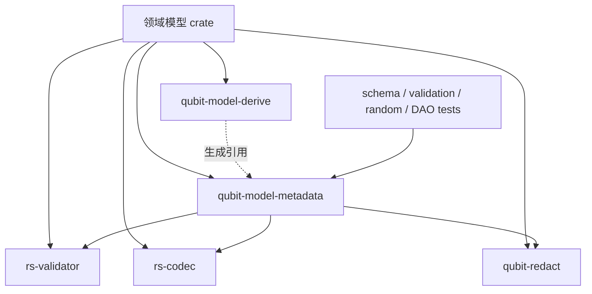
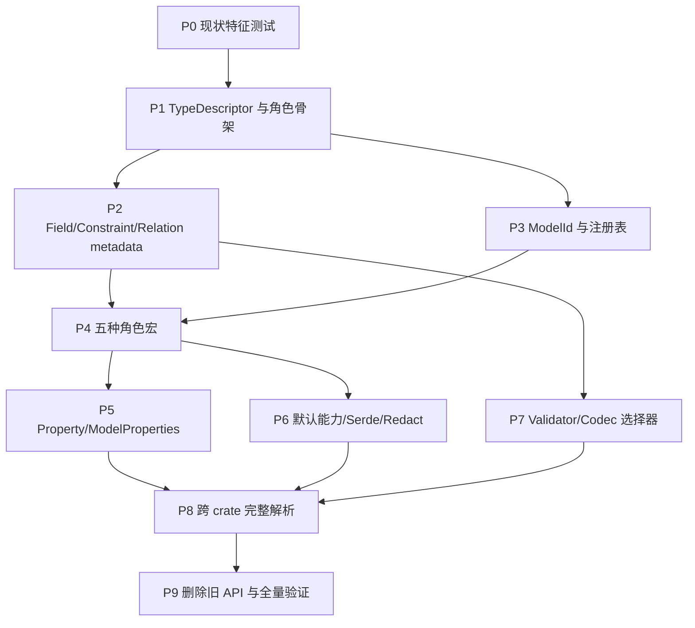

# `rs-model-derive` 目标 API 重构蓝图

- 日期：2026-08-28
- 状态：工程设计审核稿
- 面向读者：负责重构 `rs-model-derive`、`rs-model-metadata` 及配套 crate 的开发者或智能体
- 产品契约：[目标 API 用户手册与参考](2026-08-28-rs-model-derive-target-api-guide.zh_CN.md)
- 未决设计：[待确认清单](2026-08-28-rs-model-derive-requirements-open-questions.md)

## 1. 目的和使用方式

本文不是面向用户的宏参数说明，也不按历史讨论顺序记录决策。它回答实现者最需要的四个问题：

1. 当前代码和目标 API 相差在哪里；
2. 最终架构中每个 crate、模块和核心类型负责什么；
3. 应按什么依赖顺序重构，才能让每一阶段都可测试、可审查；
4. 哪些旧 API 必须删除，哪些行为必须由回归测试锁定。

本文是工程蓝图，不是可直接执行的逐提交计划。A003 角色专属 metadata 尚未确认，正式实施前应先确认该组 API，
再从本文生成包含精确代码和逐步测试命令的实施计划。

## 2. 目标边界

### 2.1 目标

- 用五个互斥角色宏替代当前统一、含义过载的模型入口。
- 将“任意 Rust 类型结构”与“五种领域声明类型 metadata”分开。
- 将 Field 与 Property 分开，并提供可执行 getter/setter metadata。
- 允许只有稳定 ModelId 的类型进入链接期注册表；已知 Rust 类型始终可静态查询。
- 支持泛型 Model/Enum/Value 的模板 metadata 与 concrete descriptor 实例化。
- 将字段属性规范化为强类型 metadata，供 schema、validation、生成器和 DAO 测试共同消费。
- 将 validator/codec 的实现与注册分别交给 `rs-validator`、`rs-codec`，derive 只生成引用。
- 统一默认派生、Serde 与 Redact 行为，并在编译期诊断非法组合。

### 2.2 非目标

- 本 crate 不实现 SQL、数据库迁移、repository、DAO 或 Web API。
- 本 crate 不执行 validator、codec、random generator 或 redaction 策略。
- 不在字段 `indexed` 中表达物理数据库组合索引。
- 不保留为了迁移而长期存在的两套公共 API；这是 0.1 发布前的破坏性重构。
- 不为 generic concrete instance 临时拼接字符串 ModelId。

## 3. 当前实现基线

### 3.1 `rs-model-derive`

当前公开入口位于 `rs-model-derive/src/lib.rs`：

```rust
pub fn Model(args: TokenStream, input: TokenStream) -> TokenStream;
pub fn Enum(args: TokenStream, input: TokenStream) -> TokenStream;
```

当前实现的关键事实：

- 只有 `Model`、`Enum`，没有 Entity、Projection、Value、ModelProperties。
- `id` 对所有模型必填；`expand.rs` 直接调用 `input.id.first().expect(...)`。
- `ModelInput -> normalize::ModelIr -> validate -> expand` 已形成可复用的四段流水线。
- parser 已识别 identifier、indexed、unique、text、decimal、money、time、sequence、map、element、reference、
  lookup_relation、codec、generator、opaque、keep_serializing。
- parser/IR 仍保留目标已删除的 lookup_relation、ownership、generator、旧 primary key/key/index 等语义。
- `model_attribute.rs` 负责默认 derive、Serde 默认字段行为、Redact 联动和 Display/Enum API；现有能力开关与目标集合不同。
- 当前验证拒绝泛型，并且错误文案仍把 computed 建议为真实字段，尚无 Property 模型。
- expansion 直接生成 `TypeMetadata::new(ModelId, TypeIdentity, TypeKind, attributes)` 和每类型注册项。

### 3.2 `rs-model-metadata`

当前核心结构：

```rust
pub struct TypeMetadata {
    id: ModelId,
    identity: TypeIdentity,
    kind: TypeKind,
    attributes: &'static [AttributeMetadata],
}

pub struct FieldMetadata {
    ordinal: usize,
    name: &'static str,
    rust_type_name: &'static str,
    field_type: TypeRef,
    attributes: &'static [AttributeMetadata],
}
```

当前与目标的主要差距：

| 当前 | 目标 |
| --- | --- |
| `TypeMetadata.id: ModelId` 必有 | `model_id() -> Option<ModelId>`；只有 Entity 必有 |
| 自定义 `TypeIdentity` | 公开身份接口直接返回 `std::any::TypeId` 与 `type_name()` |
| `TypeRef`/`TypeShape` 同时承担字段类型结构 | 公开 `TypeDescriptor` 描述任意类型；`TypeMetadata` 只描述五种角色 |
| `TypeKind::{Struct, Enum, Newtype}` | 结构 shape 与 `ModelRole`/`RoleMetadata` 正交 |
| 只有 fields | fields + properties + getter/setter erased accessor |
| field name 必为字符串 | tuple payload/newtype 字段允许 `name() == None` |
| `FieldMetadata.field_type()` | `FieldMetadata.descriptor()` |
| AttributeMetadata 包含 PrimaryKey/LookupRelation/Ownership/Generator | 删除旧语义，增加 identifier assignment、index reasons、validator、codec、redact、selector、key_part |
| 每个 TypeMetadata 都有 ModelRegistration | 只有带 ModelId 的类型/模板注册 |
| registry 主索引假设所有条目有 ID | ID 主索引 + Rust TypeId/concrete cache；匿名类型不注册 |
| `metadata_of::<T>()` 自由函数 | `TypeMetadata::of::<T>()` 唯一入口 |
| 现有 ModelGraph 校验旧关系 | 新 resolver 校验角色、source、property、策略 ID 与类型兼容性 |

### 3.3 当前测试资产

可保留和改造的测试层次：

- `rs-model-derive/src/tests/`：parser、normalize、属性支持的白盒单元测试；
- `rs-model-derive/tests/ui/pass|fail/`：trybuild 语法和诊断测试；
- `rs-model-derive/tests/runtime_metadata_tests.rs`：展开后 metadata 行为；
- `rs-model-derive/tests/runtime-fixtures/`：依赖重命名、缺失 runtime、跨 crate registration；
- `rs-model-metadata/tests/`：constraint、type shape、type metadata、registry、model graph、relation 查询测试。

旧测试不能机械保留。每个测试必须分类为：目标语义仍成立、需按新 API 改写、目标明确删除。

## 4. 目标架构

### 4.1 crate 依赖方向



约束：

- metadata 不能依赖 proc-macro crate。
- derive 不执行策略，也不加载领域类型；生成代码引用消费方解析出的 runtime crate 路径。
- validator/codec 的注册契约属于各自主 crate，必要时通过 companion proc-macro crate 实现并重导出。
- metadata 只能依赖这些 crate 的轻量 ID/metadata 契约，不能依赖执行器、数据库或网络。

### 4.2 类型描述分层

```rust
pub struct TypeMetadata {
    // 五种领域声明类型的公共 metadata
}

pub struct TypeDescriptor {
    // 任意可理解 Rust 类型的递归描述
}

pub enum ModelRole {
    Entity,
    Projection,
    Model,
    Enum,
    Value,
}

pub enum RoleMetadata {
    Entity(EntityMetadata),
    Projection(ProjectionMetadata),
    Model(ModelMetadata),
    Enum(EnumMetadata),
    Value(ValueMetadata),
}
```

必须保证：

- String 等 scalar 有 TypeDescriptor，没有 TypeMetadata。
- Option/Box/Rc/Arc/Vec/Set/Map/array 的 descriptor 递归指向 payload。
- 五种角色同时拥有 TypeDescriptor 与 TypeMetadata。
- opaque 只截断叶子递归，不丢失外层结构。
- generic definition、type parameter 与 concrete instance 是 descriptor 层的一等结构。

### 4.3 静态 metadata 入口

```rust
pub trait HasTypeMetadata: 'static {
    fn type_metadata() -> &'static TypeMetadata;
}

impl TypeMetadata {
    pub fn of<T: HasTypeMetadata + 'static>() -> &'static TypeMetadata;
}

pub trait HasTypeDescriptor: 'static {
    fn type_descriptor() -> &'static TypeDescriptor;
}

impl TypeDescriptor {
    pub fn of<T: HasTypeDescriptor + 'static>() -> &'static TypeDescriptor;
}
```

不得继续公开同义的 `metadata_of::<T>()`。如果内部迁移期需要 helper，应保持 crate-private，并在最终阶段删除。

### 4.4 Field 与 Property

建议按职责拆分：

```rust
pub struct FieldMetadata { /* 存储、约束、关系、输出 metadata */ }
pub struct PropertyMetadata { /* field/getter/setter 合并结果 */ }
pub struct GetterMetadata { /* 类型信息和 erased read 入口 */ }
pub struct SetterMetadata { /* 类型信息和 erased write 入口 */ }

pub enum PropertyStorageKind {
    FieldBacked,
    Computed,
    Virtual,
}
```

宏需要为 private field 生成安全 erased accessor。访问 API 必须保持 Rust aliasing/ownership 规则；不能用 `transmute`
伪造生命周期，不能把 borrowed getter 伪装成 owned 值。建议把“借用视图”和“owned 构造”分成不同 erased value 类型，
不要用一个 `Any` 接口混合。

### 4.5 注册与解析

注册项只为有 ModelId 的非泛型类型或泛型模板生成：

```rust
pub struct ModelRegistration {
    model_id: ModelId,
    role: ModelRole,
    metadata_factory: fn() -> &'static TypeMetadata,
    source: SourceLocation,
}
```

registry 至少需要：

- `ModelId -> registration/template metadata` 的稳定索引；
- 当前进程 concrete `TypeId -> TypeMetadata` 的缓存或按需入口；
- 重复 ID 与角色目标校验；
- entity_id、source_id、validator id、codec id 的显式 resolver；
- 不把匿名类型加入仅可枚举、无法稳定查询的注册集合。

泛型类型：

- 链接期注册 `GenericTypeMetadata` 模板；
- `TypeMetadata::of::<Page<User>>()` 按具体 TypeId 实例化并缓存；
- 模板字段通过 type parameter placeholder 表达；
- 首版 concrete metadata 的 `model_id()` 仍表示模板 ID 或按最终确认的 API 暴露模板来源，绝不拼接临时字符串；
- lifetime 一律拒绝，具体类型和 accessor 均要求 `'static`。

## 5. `rs-model-metadata` 目标模块布局

以下是建议的职责布局。实现者应遵循现有项目“一个公开概念一个聚焦文件”的惯例；若最终命名变化，必须同步更新
本蓝图和用户 API 文档。

```text
rs-model-metadata/src/
├── lib.rs
├── model_id.rs
├── type_descriptor.rs
├── type_descriptor/
│   ├── has_type_descriptor.rs
│   ├── descriptor_kind.rs
│   ├── scalar_descriptor.rs
│   ├── container_descriptor.rs
│   ├── generic_definition.rs
│   └── generic_argument.rs
├── type_metadata.rs
├── type_metadata/
│   ├── has_type_metadata.rs
│   ├── model_role.rs
│   ├── role_metadata.rs
│   ├── entity_metadata.rs
│   ├── projection_metadata.rs
│   ├── model_metadata.rs
│   ├── enum_metadata.rs
│   ├── enum_variant_metadata.rs
│   └── value_metadata.rs
├── field_metadata.rs
├── property_metadata.rs
├── property_metadata/
│   ├── field_visibility.rs
│   ├── getter_metadata.rs
│   ├── setter_metadata.rs
│   └── storage_kind.rs
├── constraint.rs
├── constraint/
│   ├── text.rs
│   ├── decimal.rs
│   ├── temporal.rs
│   ├── sequence.rs
│   ├── map.rs
│   └── selector.rs
├── identity.rs
├── identity/
│   ├── identifier.rs
│   ├── indexing.rs
│   ├── unique.rs
│   ├── reference.rs
│   └── key_part.rs
├── strategy.rs
├── strategy/
│   ├── validator_metadata.rs
│   └── codec_metadata.rs
├── representation.rs
├── representation/
│   ├── serde_metadata.rs
│   └── redact_metadata.rs
└── registry.rs
    └── ...
```

不应继续把所有语义塞进通用 `AttributeMetadata` 大枚举后再由每个消费者自行解释。可以保留统一 attributes 迭代接口，
但 identifier、unique、reference、constraints 等高频语义必须有强类型字段和直接查询 API。

## 6. `rs-model-derive` 目标流水线

### 6.1 公共入口

`src/lib.rs` 最终公开：

```rust
#[proc_macro_attribute]
pub fn Entity(args: TokenStream, input: TokenStream) -> TokenStream;

#[proc_macro_attribute]
pub fn Projection(args: TokenStream, input: TokenStream) -> TokenStream;

#[proc_macro_attribute]
pub fn Model(args: TokenStream, input: TokenStream) -> TokenStream;

#[proc_macro_attribute]
pub fn Enum(args: TokenStream, input: TokenStream) -> TokenStream;

#[proc_macro_attribute]
pub fn Value(args: TokenStream, input: TokenStream) -> TokenStream;

#[proc_macro_attribute]
pub fn ModelProperties(args: TokenStream, input: TokenStream) -> TokenStream;
```

每个入口只选择 role 并进入共享管线，不应复制六套 parser/normalizer/expander。

### 6.2 输入、IR、验证、展开

建议的内部模型：

```rust
ParsedDeclaration
  -> NormalizedDeclaration
  -> ValidatedDeclaration
  -> GeneratedItems
```

共享 IR 必须包含：

- role 与角色专属 options；
- Rust declaration shape、generics、where；
- fields 和 enum variants；
- 完整 descriptor tree；
- 字段 identity/query/relation；
- constraints 和 selector；
- validator/codec/redact/serde；
- capabilities；
- optional ModelId 与 registration strategy。

Property impl 使用单独 `PropertyImplIr`，最后以同一 Rust TypeId/类型路径与声明 metadata 合并。

### 6.3 验证分层

验证器按职责拆分，避免一个 `validate.rs` 持续膨胀：

```text
validate/
├── declaration_shape.rs
├── role_composition.rs
├── model_id.rs
├── field_identity.rs
├── query.rs
├── relation.rs
├── constraints.rs
├── selectors.rs
├── properties.rs
├── capabilities.rs
└── representation.rs
```

当前声明内能判断的问题一律输出 `syn::Error`，并尽可能聚合多个独立错误。跨 crate 目标仅生成类型断言或 registry
校验项，不能在 proc-macro 进程中加载业务 crate。

### 6.4 expansion 分层

```text
expand/
├── declaration.rs
├── descriptor.rs
├── type_metadata.rs
├── fields.rs
├── properties.rs
├── role.rs
├── registration.rs
├── capabilities.rs
├── serde.rs
├── redact.rs
└── assertions.rs
```

生成代码只引用 runtime 公开或 `__private` 稳定桥接 API。依赖重命名继续通过 `proc-macro-crate` 解析，并保留现有
missing/renamed runtime fixture 测试。

## 7. 重构阶段与依赖关系



### P0：建立现状特征测试和需求映射

目标：在破坏性修改前明确哪些行为要保留、替换或删除。

工作：

- 为当前 `ModelInput -> normalize -> validate -> expand` 补齐关键 golden 测试。
- 建立测试清单，将每个现有 UI case 标注为 KEEP、REWRITE、DELETE。
- 为 runtime path 重命名、missing dependency、duplicate registration 保留 fixture。
- 新建需求覆盖矩阵，键使用目标 API 章节名，不再使用讨论轮次。

验收：当前两个 crate 的测试基线可重复；每个目标能力都有预定测试层次。

### P1：引入 TypeDescriptor、ModelRole 和 TypeMetadata 新骨架

目标：先建立下游都依赖的稳定 runtime 接口。

工作：

- 将任意 Rust 类型结构从 TypeMetadata 中抽离到 TypeDescriptor。
- 增加 ModelRole、RoleMetadata、HasTypeDescriptor、`TypeDescriptor::of`、`TypeMetadata::of`。
- 以 `std::any::TypeId` 和 type_name 替换公开 TypeIdentity 接口。
- 暂时只构造最小 RoleMetadata payload；A003 确认后固化专属方法。
- 为 scalar、Option、Box、Rc、Arc、sequence、set、map、array、opaque 提供 descriptor 单元测试。

验收：普通 String 只有 descriptor；五种测试类型同时有 descriptor 与 role metadata。

### P2：重建 Field、约束、查询与关系 metadata

目标：建立不依赖宏语法简写的规范化 runtime 语义。

工作：

- FieldMetadata 改为 index、可选 name、descriptor、visibility 与强类型查询方法。
- 实现 IdentifierAssignment、IndexingReasons、UniqueMetadata、ReferenceMetadata、KeyPartMetadata。
- 实现 Text/Decimal/Money/Time/Sequence/Map/Selector constraints。
- 实现 validator/codec/redact/serde occurrence metadata，但暂不连接外部 registry。
- 删除 metadata 层 LookupRelation、Ownership、Generator、旧 PrimaryKey/Index/Key 的目标公共入口。

验收：所有规则都可以手工构造 metadata 并通过纯 runtime 单元测试查询；非法组合不能由安全 constructor 构造。

### P3：重构 ModelId、registration 和 generic template

目标：将“具有 metadata”与“进入动态注册表”彻底解耦。

工作：

- ModelId 采用 `Segment ('.' Segment)*` 的 ASCII 语法，不强制 namespace 小写或末段 UpperCamelCase。
- registration 只接受有 ID 的类型或泛型模板。
- registry 使用 ModelId 全局唯一索引，并保留 source location 诊断。
- 引入 GenericTypeMetadata、type parameter/const argument 描述和 concrete TypeId cache。
- 删除匿名注册项和 `registration_of<T>` 的无条件假设。

验收：Entity 必注册；匿名 Model 可静态查询但 registry 不包含；带 ID 的 generic Model 只出现一个模板注册项。

### P4：实现五种角色宏

目标：用共享管线生成角色化 metadata。

工作：

- 新增 Entity、Projection、Value 入口；重写 Model、Enum 入口语义。
- parser 分离公共能力参数和角色参数。
- role-specific shape/composition validator 拒绝非法字段图。
- identifier、source/source_id、transparent、variant name 和 optional id 按目标语义展开。
- 增加五种角色 pass/fail UI 测试和 runtime metadata 测试。

验收：用户指南“选择角色”章节的示例全部作为 UI pass fixture；每条明确非法 shape 都有 fail fixture。

### P5：实现 Property 与 `#[ModelProperties]`

目标：提供 field/getter/setter 合并和可执行访问协议。

工作：

- 解析 impl block 中 public、安全、同步、非泛型 getter/setter。
- 生成 GetterMetadata/SetterMetadata 和 erased accessor。
- 合并同名 field/getter/setter，计算 readable/writable/storage kind。
- 实现 borrowed/owned compatibility adapter。
- reference property resolver 改为查询统一 PropertyMetadata，而非 computed 标记。

验收：field-only、getter-only、setter-only、三者合并、借用 getter、非法签名、类型不兼容均有测试；Miri 或等价
内存安全验证覆盖 erased accessor 高风险路径。

### P6：统一默认能力、Serde 和 Redact

目标：角色宏自动产生用户手册承诺的标准能力。

工作：

- 重写 `model_attribute/internal/default_derives.rs` 为角色无关 capability planner。
- 实现 no_* 与 opt-in 参数依赖图，识别用户已有 derive。
- 实现 transparent Value 的 Serialize/Deserialize/Display/Debug/Redact 差异。
- 更新默认 Option/空集合省略和 keep_serializing。
- 实现 selector 与字段级 redact 的容器传播和 Map key 冲突错误。

验收：五角色能力矩阵逐格测试；compile-fail 覆盖矛盾开关；序列化 snapshot 覆盖 None、空集合、transparent、nested、Map。

### P7：连接 validator 与 codec 契约

目标：derive 只生成稳定引用，外部 crate 负责实现和注册。

工作：

- 与 `rs-validator` 固化 ValidatorId、FieldValidator、ValidationContext/Result、Registration。
- 与 `rs-codec` 固化 ValueCodecId、ValueEncoder/Decoder、ValueCodecRegistry、Registration。
- 解析字段级 validator params/depends_on 和 codec with/id。
- 实现字段与 selector 的作用位置差异，以及字段 codec > canonical > 无的优先级。
- 完整 registry 验证策略 ID 存在与准确值类型兼容。

验收：跨 crate fixture 覆盖成功注册、缺失 ID、重复 ID、类型不兼容、字段覆盖 canonical、冗余选择。

### P8：完整 registry/resolver 与跨角色图校验

目标：完成单 crate 编译期无法判断的全图一致性校验。

工作：

- 校验 entity_id/source_id 目标存在且角色为 Entity。
- 校验 fixed Projection source、producer getter、identifier 一致性契约。
- 校验 reference property 存在、可读、类型兼容。
- 生成 QueryMetadata：根对象唯一键排除、scoped unique、复杂值递归、reference 一跳、平面名冲突。
- 校验 Value 的传递闭包不包含 Entity/Projection/Model/reference。

验收：linked-workspace fixtures 覆盖跨 crate 正常图和每类结构化错误；错误输出确定性排序。

### P9：删除旧 API、迁移文档并完成全量验证

目标：仓库只剩目标公共契约。

必须删除：

- LookupRelationMetadata、OwnershipMetadata、Generator StrategyRef 及 derive parser/IR/expansion；
- `metadata_of`、公开 TypeIdentity、旧 TypeRef/TypeShape 重叠入口；
- 旧 primary_key/index/key 模型级语法；
- 旧 `model_id`、projection/select/bind/reference_key/textual/type-level redact 参数；
- 与目标相冲突的 README、旧用户指南、设计文档示例。

验收命令应至少包含：

```bash
cargo test --manifest-path rs-model-metadata/Cargo.toml
cargo test --manifest-path rs-model-derive/Cargo.toml
cargo clippy --manifest-path rs-model-metadata/Cargo.toml --all-targets --all-features -- -D warnings
cargo clippy --manifest-path rs-model-derive/Cargo.toml --all-targets --all-features -- -D warnings
cargo doc --manifest-path rs-model-metadata/Cargo.toml --all-features --no-deps
cargo doc --manifest-path rs-model-derive/Cargo.toml --all-features --no-deps
```

并运行两个 crate 自带的 `style-check.sh`/`ci-check.sh`；具体命令以实施时仓库脚本为准。

## 8. 测试策略

### 8.1 每个行为放在哪一层测试

| 行为 | 首选测试层 |
| --- | --- |
| attribute token 语法、重复参数 | derive parser 单元测试 |
| 规范化 shorthand | normalize 单元测试 |
| role/shape/组合冲突 | trybuild fail |
| 合法宏展开可编译 | trybuild pass |
| 生成 metadata 内容 | runtime metadata test |
| constraint constructor/query | metadata 单元测试 |
| registry 重复 ID/排序 | metadata registry 单元测试 |
| 跨 crate ID/source/reference/strategy | linked-workspace fixture |
| 默认 derive/Serde/Redact | runtime 行为与 snapshot |
| erased accessor 安全 | runtime 单元测试 + Miri |
| 泛型模板/concrete cache | metadata + derive integration |

### 8.2 需求覆盖矩阵

| 用户 API 章节 | 主要阶段 |
| --- | --- |
| 五种角色 | P1、P4 |
| 类型宏能力参数 | P6 |
| Field/Property | P1、P2、P5 |
| identifier/indexed/unique/reference/key_part | P2、P4、P8 |
| 值约束和 selector | P2、P4 |
| validator/codec | P2、P7 |
| opaque | P1、P2、P4 |
| Redact/Serde | P6 |
| TypeMetadata/TypeDescriptor | P1 |
| registration/generic | P3、P8 |
| 角色专属 metadata | P1；依赖 A003 确认 |

任何阶段合并前必须更新该矩阵；新增公共 API 没有对应测试层时不得合并。

## 9. 兼容和迁移原则

这是 0.1 发布前的目标重构，优先保证最终 API 一致性，而不是维持旧设计的源码兼容。

- 不为旧宏参数长期保留 deprecated alias；旧写法产生指向新 API 的清晰编译错误。
- 不让 compatibility adapter 渗入核心 metadata 类型。
- 可在单个阶段内部使用 crate-private 过渡结构，但阶段结束时应删除。
- 每次先改 runtime contract 和测试，再改 derive expansion；避免宏生成不存在或不稳定的 runtime API。
- 每个阶段都必须让相关 crate 恢复 green，不能积累到最后一次性修复。
- 不顺手迁移下游业务模型；基础 API 稳定后另建迁移计划。

## 10. 实现不变量

以下规则适用于全部阶段：

1. proc-macro 不读取文件系统、registry 或链接后的类型信息来做语义判断。
2. 可由 Rust 类型系统验证的 `with = RustType` 路径应生成 trait bound；字符串 ID 留给完整 registry。
3. metadata 是 immutable、线程安全、可静态共享的；按需 cache 必须只初始化一次并避免死锁递归。
4. 不依赖 Rust type_name 字符串进行类型相等判断；使用标准 TypeId。
5. 错误必须定位到用户输入 token；跨项错误同时带双方源码位置或稳定 ID。
6. 递归 descriptor 和模型图必须能处理循环 reference，不能用无限递归展开。
7. Value 纯值闭包、reference 一跳、opaque 截断在 parser、metadata、consumer 三层保持同一语义。
8. 默认 Debug/Display/Serialize 的脱敏行为必须 fail closed；不得因缺少 adapter 静默输出敏感值。
9. Map key 脱敏冲突不能静默覆盖条目。
10. 所有公开类型、方法和错误都具备 rustdoc 与最小示例。

## 11. 待确认阻塞项

A003 不阻塞 P0，也不阻塞 TypeDescriptor、FieldMetadata 等公共基础类型的原型；它会影响 P1 的最终公开接口和 P8
的消费者调用方式。正式对外稳定前必须确认：

- EntityMetadata 的最小职责；
- ProjectionSource 的表示与显式解析方式；
- 空 ModelMetadata payload 是否保留；
- Enum variant 三种名称查询 API；
- ValueMetadata 是否仅包含 transparent 信息。

没有确认前，可以在私有模块中验证数据结构，但不得发布猜测的公共 API。

## 12. 完成定义

只有同时满足以下条件，才可以宣称重构完成：

- 目标用户手册中的所有非待确认代码示例有对应 pass test 或 doctest；
- 所有明确非法示例有 trybuild fail 测试和稳定诊断；
- 五个角色宏及 ModelProperties 均公开并有 rustdoc；
- TypeMetadata、TypeDescriptor、FieldMetadata、PropertyMetadata、Registry API 与手册一致；
- generic template/concrete instance、跨 crate ID 解析和策略 registry 有集成测试；
- 旧 LookupRelation/Ownership/Generator/metadata_of/TypeIdentity 等目标删除项不再公开；
- 两个 crate 的 test、clippy、rustdoc、style、CI 检查全部通过；
- README 和最终用户指南不再包含旧 API；
- A003 待确认清单已清空或明确降级为未来版本非目标。
