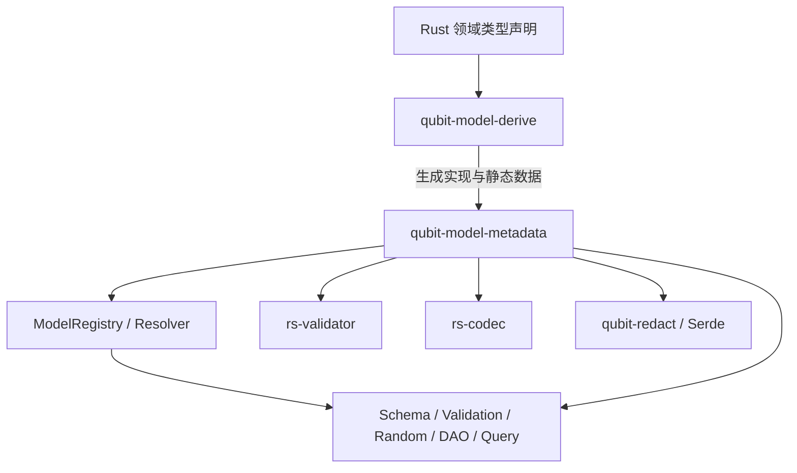

# `rs-model-derive` 最终需求规范

- 日期：2026-08-28
- 状态：目标结果审核稿
- 适用范围：角色化重构完成后的 `qubit-model-derive`、`qubit-model-metadata`、`rs-validator`、
  `rs-codec` 与 `qubit-redact` 集成契约
- 面向读者：产品与架构审核者、实现者、测试者、用户手册维护者、下游框架开发者
- 配套说明：[目标 API 用户手册与参考](2026-08-28-rs-model-derive-target-api-guide.zh_CN.md)
- 决策来源：[完整讨论记录](2026-08-28-discuss-session.md)
- 未决事项：[待确认清单](2026-08-28-rs-model-derive-requirements-open-questions.md)

## 0. 文档定位与规范用语

本文定义系统最终必须呈现的公共能力、语义、API、约束和可观察行为。本文不描述现有代码，不描述迁移步骤，
也不规定提交顺序。重构完成后的代码、测试、Rustdoc 和用户手册必须与本文一致。

本文使用以下规范用语：

- “必须”表示实现和调用者不可偏离的要求；
- “应”表示默认必须遵循，只有有明确理由并补充规范时才可偏离；
- “不得”表示禁止的行为；
- “可以”表示规范允许但不强制的能力；
- 标记为“待确认”的条目只定义候选边界，在确认前不得作为稳定公共 API 发布。

需求编码按最终组件重新组织，不继承讨论过程中的 C/F/R/A 编号。编码一经作为验收基准引用，后续修改内容时
不得复用或改变其原始语义；废弃条目应保留编号并标记为废弃。

## 1. 系统概要

### 1.1 系统提供的组件

| 组件 | 对外 crate/API | 主要职责 | 不负责的内容 |
| --- | --- | --- | --- |
| 模型声明宏 | `qubit-model-derive` | 解析五种角色、字段属性和 Property impl；编译期校验；生成静态 metadata 与能力实现 | 不执行数据库、validator、codec 或生成器 |
| 类型与模型 metadata | `qubit-model-metadata` | 描述 Rust 类型结构、领域角色、Field、Property、约束、关系和输出策略；提供静态查询 | 不保存对象实例，不执行业务逻辑 |
| 模型注册与解析 | `ModelRegistry` 及 resolver | 按稳定 `ModelId` 动态发现类型或泛型模板；完成跨 crate 关系和策略引用校验 | 不为匿名类型制造 ID，不枚举无限泛型实例 |
| Validator 契约 | `rs-validator` | 定义 validator、稳定 ID、注册表、纯 validation 执行协议 | 不访问 repository、网络或外部业务状态 |
| Codec 契约 | `rs-codec` | 定义领域值与规范文本之间的 codec、稳定 ID 和注册表 | 不替代任意 Serde 格式或数据库专用编码 |
| 输出安全 | `qubit-redact`、Serde 联动 | 执行字段脱敏以及默认 Debug、Display、Serialize 安全输出 | 不改变字段身份、关系和值合法性 |
| 下游消费者 | schema、接口文档、validation、随机生成、DAO 测试、查询生成器 | 消费统一 metadata 实现各自功能 | 不反向扩展或改变模型宏语义 |

### 1.2 数据流和依赖方向



模型声明示例：

```rust
#[Entity(id = "qubit.platform.iam.User")]
pub struct User {
    #[identifier]
    pub id: Id,

    #[unique]
    #[text(min_chars = 3, max_chars = 32, allowed_chars = code)]
    pub username: String,

    #[redact(skip)]
    pub password_hash: String,
}
```

该声明必须同时向不同消费者提供同一事实：User 是 Entity，id 是实例身份，username 不区分大小写唯一且有文本约束，
password_hash 不得出现在安全输出中。各消费者不得自行发明另一套字段语义。

### 1.3 系统级约束

- **REQ-SYS-001**：系统必须以强类型、不可变、可静态共享的 metadata 表达模型语义，不得使用任意字符串键值表作为
  核心公共模型。
- **REQ-SYS-002**：`qubit-model-metadata` 不得依赖 `qubit-model-derive`；过程宏展开后的代码可以引用 metadata crate。
- **REQ-SYS-003**：过程宏必须只根据 token、Rust 类型约束和生成的链接期注册项工作，不得在宏执行时读取数据库、
  网络、业务 registry 或加载领域 crate 的运行时类型。
- **REQ-SYS-004**：schema、validation、随机生成、DAO 测试和查询生成器必须消费同一规范化 metadata；宏输入简写不得
  泄漏为消费者必须理解的第二套语义。
- **REQ-SYS-005**：模型 metadata 必须与对象实例分离；读取 metadata 不应要求构造对象。
- **REQ-SYS-006**：同一模型事实在不同组件中的解释必须一致。例如 `reference` 隐含 indexed、opaque 截断递归、
  Value 禁止包含 Entity 等规则必须在派生、registry 和消费者中保持一致。
- **REQ-SYS-007**：可以在当前声明内判定的问题必须在编译期报告；只有跨 crate、稳定 ID 或完整图依赖的问题才可延后到
  registry/resolver 校验。
- **REQ-SYS-008**：所有公开 metadata API 必须只读；全局注册表必须在初始化完成后不可变并可安全并发读取。
- **REQ-SYS-009**：系统必须允许循环 Entity reference 图，但所有 descriptor、查询路径和图校验算法必须有明确递归边界，
  不得无限展开。
- **REQ-SYS-010**：公共类型、宏参数、错误类型和行为必须具备 Rustdoc；用户手册示例和本文规范必须作为 API 验收输入。

## 2. 模型声明宏组件

### 2.1 功能、作用和使用场景

模型声明宏将普通 Rust 类型标记为五种互斥的领域角色，并生成该角色的静态 metadata、注册信息和默认能力。

| 角色 | 典型场景 | 是否有实例身份 | 是否有独立持久化生命周期 |
| --- | --- | ---: | ---: |
| Entity | 用户、订单、租户、设备 | 是 | 是 |
| Projection | UserInfo、OrderSummary、公开视图 | 借用来源 Entity 的 ID | 否 |
| Model | 请求、响应、命令、配置、分页、对象图根 | 否 | 否 |
| Enum | 状态、分类、互斥结果 | 否 | 否 |
| Value | EmailAddress、Phone、Money、Revision | 否 | 否 |

同一业务中的五种角色示例：

```rust
#[Value(transparent, id = "qubit.platform.iam.EmailAddress")]
pub struct EmailAddress(
    #[text(format = email)]
    #[redact(level = "medium")]
    String,
);

#[Enum(id = "qubit.platform.iam.UserState")]
pub enum UserState {
    Pending,
    Active,
    Locked,
}

#[Entity(id = "qubit.platform.iam.User")]
pub struct User {
    #[identifier]
    pub id: Id,
    pub username: String,
    pub email: EmailAddress,
    pub state: UserState,
    pub created_at: DateTime,
    #[redact(skip)]
    pub password_hash: String,
}

#[Projection(source = User)]
pub struct UserInfo {
    #[identifier]
    pub id: Id,
    pub username: String,
    pub email: EmailAddress,
    pub state: UserState,
}

#[Model]
pub struct FindUserRequest {
    #[reference(entity = User, property = id)]
    pub user_id: Id,
}
```

### 2.2 公共角色约束

- **REQ-ROLE-001**：同一 Rust 声明必须且只能使用 `Entity`、`Projection`、`Model`、`Enum`、`Value` 中一个角色宏。
- **REQ-ROLE-002**：五种角色必须共享 Field、Property、TypeDescriptor、约束、输出策略和静态查询基础设施，不得为每个
  角色复制一套不一致的结构模型。
- **REQ-ROLE-003**：角色必须是 metadata 中可查询的一等值，至少包含 Entity、Projection、Model、Enum、Value。
- **REQ-ROLE-004**：注册与角色必须正交；为非 Entity 类型声明 `id` 只增加动态发现能力，不得赋予 identifier、
  持久化或 relation target 身份。
- **REQ-ROLE-005**：五种角色默认实现 Clone、Debug、Display、PartialEq、Eq、Hash、Redact、Serialize、Deserialize。
- **REQ-ROLE-006**：只有全部 variant 都是 unit 的 Enum 默认实现 Copy；其他角色默认不得实现 Copy。
- **REQ-ROLE-007**：五种角色默认不得实现 Default、PartialOrd、Ord。
- **REQ-ROLE-008**：用户已显式派生或实现相同能力时，角色宏必须识别并避免重复实现。
- **REQ-ROLE-009**：泛型类型的自动能力实现必须带准确 trait bound，不得要求所有潜在泛型实参无条件支持该能力。

### 2.3 Entity

Entity 表示具有独立领域身份和持久化生命周期的对象。它是 reference 的唯一正式目标角色。

```rust
#[Entity(id = "qubit.platform.order.Order")]
pub struct Order {
    #[identifier(assigned_by = database)]
    pub id: Id,
    #[indexed]
    pub state: OrderState,
}
```

- **REQ-ENT-001**：`#[Entity]` 必须只接受非泛型、无 lifetime、无 where 子句的具名字段 struct。
- **REQ-ENT-002**：Entity 的 `id = "ModelId"` 参数必须存在，并使该类型进入全局注册表。
- **REQ-ENT-003**：Entity 必须有且仅有一个符合身份约束的直接 identifier 字段。
- **REQ-ENT-004**：Entity 可以声明 reference、indexed、unique 和全部允许的值约束及输出策略。
- **REQ-ENT-005**：Entity 不得直接嵌入另一个 Entity 或 Projection 作为普通值；出现这两种角色必须通过 reference
  明确关联语义。
- **REQ-ENT-006**：Entity 不得声明单数 `projection` 或 `projection_id` 参数。一个 Entity 可以产生零个、一个或多个
  Projection，关系必须从 Projection source 和 Property getter 输出反向发现。
- **REQ-ENT-007**：Entity 的默认 PartialEq、Eq、Hash 必须采用标准结构化字段语义，不得擅自改为只比较 identifier。

### 2.4 Projection

Projection 是某个 Entity 实例的派生表示，适用于公开摘要、列表项、关联值或特定读取场景。它借用来源 Entity 的
identifier，但不是独立记录。

```rust
#[Projection(
    id = "qubit.platform.order.OrderSummary",
    source = Order,
)]
pub struct OrderSummary {
    #[identifier]
    pub id: Id,
    pub state: OrderState,
    pub total: Money,
}
```

- **REQ-PRJ-001**：`#[Projection]` 必须只接受非泛型、无 lifetime 的具名字段 struct。
- **REQ-PRJ-002**：Projection 必须有且仅有一个直接 `Id` identifier；它表示来源 Entity 实例 ID，不产生 Projection
  自己的主键或持久化记录。
- **REQ-PRJ-003**：Projection 可以不声明 source，表示开放 Projection；也可以使用 `source = EntityType` 或
  `source_id = "ModelId"` 声明固定来源，二者最多一个。
- **REQ-PRJ-004**：`source` 与 `source_id` 的业务效果必须相同；前者通过 Rust 类型约束校验，后者通过完整 registry 解析。
- **REQ-PRJ-005**：source 只表达来源约束和数据血缘，不得被解释为自动转换函数。
- **REQ-PRJ-006**：没有 projector 的 Projection 仍可以由 DAO/SQL mapper 或反序列化过程构造；需要默认生成但无
  projector adapter 时，生成器必须报告明确错误。
- **REQ-PRJ-007**：固定来源 Projection 的 producer getter 所属 Entity 必须与 source 一致，生成结果的 identifier
  必须等于来源 Entity identifier。
- **REQ-PRJ-008**：Projection 的 `id` 可选；提供时进入注册表，省略时仍必须可以按 Rust 类型取得完整 metadata。

### 2.5 Model

Model 是没有独立身份的数据契约，适用于请求、响应、命令、配置、分页或组合对象图。

```rust
#[Model(id = "qubit.commons.Page")]
pub struct Page<T>
where
    T: HasTypeDescriptor + 'static,
{
    pub items: Vec<T>,
    pub total: u64,
}

#[Model]
pub struct RefreshCache;
```

- **REQ-MDL-001**：`#[Model]` 必须接受具名字段 struct 和 unit struct，不得接受 tuple struct、enum 或 union。
- **REQ-MDL-002**：Model 必须支持类型参数、`const N: usize` 和 where 子句。
- **REQ-MDL-003**：Model 不得支持 lifetime 参数；可形成静态 metadata 的 concrete 实例必须满足 `'static`。
- **REQ-MDL-004**：Model 禁止 identifier 和独立持久化语义，但可以声明 Entity reference。
- **REQ-MDL-005**：Model 的 `id` 可选；有 id 时注册泛型模板或非泛型类型，无 id 时仍提供静态 metadata。
- **REQ-MDL-006**：单字段领域包装应使用 Value，而不是 tuple Model。

### 2.6 Enum

Enum 表示封闭值域或带 payload 的代数和类型。

```rust
#[Enum(id = "qubit.platform.payment.PaymentResult")]
pub enum PaymentResult<T> {
    Pending,
    Success(T),
    Failure {
        code: String,
        message: String,
    },
}
```

- **REQ-ENUM-001**：`#[Enum]` 必须接受 unit、tuple、struct 和混合 variant。
- **REQ-ENUM-002**：Enum 必须支持类型参数、`const N: usize` 和 where 子句，不得支持 lifetime 或 union。
- **REQ-ENUM-003**：Enum 禁止 identifier、独立持久化和 direct relation；payload 不得直接包含 Entity 或 Projection。
- **REQ-ENUM-004**：每个 payload 字段必须拥有完整 TypeDescriptor、约束与输出 metadata。
- **REQ-ENUM-005**：Enum 的 `id` 可选；声明 id 时注册类型或泛型模板。
- **REQ-ENUM-006**：全部 unit variant 的 Enum 必须默认 Copy，且可用 `no_copy` 关闭。

### 2.7 Value

Value 是只由内容决定语义和相等性的值对象。

```rust
#[Value(transparent, copy, ord)]
pub struct Revision(u64);

#[Value]
pub struct Coordinate {
    #[decimal(precision = 9, scale = 6)]
    pub latitude: Decimal,
    #[decimal(precision = 9, scale = 6)]
    pub longitude: Decimal,
}
```

- **REQ-VAL-001**：`#[Value]` 必须接受具名字段 struct 和单字段 tuple newtype，不得接受 unit struct、多字段 tuple、
  enum 或 union。
- **REQ-VAL-002**：Value 必须支持类型参数、`const N: usize` 和 where 子句，不得支持 lifetime。
- **REQ-VAL-003**：Value 禁止 identifier、reference 和独立持久化生命周期。
- **REQ-VAL-004**：Value 的传递字段闭包不得包含 Entity、Projection 或 Model；它可以包含 scalar、Enum、其他 Value、
  Option、容器和显式 opaque 外部值。
- **REQ-VAL-005**：Value 的 `id` 可选；有 id 时可注册，但注册不得改变纯值角色。
- **REQ-VAL-006**：`transparent` 只允许恰好一个存储字段的 Value，包括单字段 tuple 和单字段 named struct。
- **REQ-VAL-007**：透明 Value 必须保留独立名义类型和完整 metadata；Serialize、Deserialize、Display 使用内部值表示，
  Debug 保留 Value 类型名，Redact 执行唯一字段策略。
- **REQ-VAL-008**：transparent 不得自动生成 Deref、From、Into、TryFrom；表示透明不得绕过值约束。

### 2.8 能力开关

```rust
#[Model(no_debug, no_display, no_serialize)]
struct InternalCommand { /* ... */ }

#[Value(transparent, copy, default, ord)]
struct SequenceNumber(u64);
```

- **REQ-CAP-001**：五种角色必须支持 `no_clone`、`no_debug`、`no_display`、`no_partial_eq`、`no_eq`、`no_hash`、
  `no_redact`、`no_serialize`、`no_deserialize`。
- **REQ-CAP-002**：五种角色必须支持 opt-in `copy`、`default`、`partial_ord`、`ord`。
- **REQ-CAP-003**：`copy` 必须要求 Clone 未关闭且所有存储字段实现 Copy；冲突必须编译报错。
- **REQ-CAP-004**：`no_partial_eq` 必须同时移除 Eq、Hash、PartialOrd、Ord。
- **REQ-CAP-005**：`no_eq` 必须保留 PartialEq，但移除默认 Hash 并禁止 Ord。
- **REQ-CAP-006**：`ord` 必须同时启用 PartialEq、Eq、PartialOrd、Ord，并与 `no_eq/no_partial_eq` 冲突。
- **REQ-CAP-007**：struct 的 `default` 必须使用字段 Default；Enum 的 `default` 必须要求恰有一个标准 `#[default]`
  unit variant。
- **REQ-CAP-008**：自动 Default 只保证 Rust 值可构造，不得声明其一定满足模型约束或 validator。
- **REQ-CAP-009**：`no_redact` 只允许类型及所有 selector 中不存在任何 redact 规则；关闭后保留的 Debug、Display、
  Serialize 使用普通非脱敏实现。
- **REQ-CAP-010**：`no_debug/no_display/no_serialize` 只关闭对应接口，不得关闭 Redact。

## 3. Field 与 Property metadata 组件

### 3.1 功能、作用和使用场景

Field 表示真实存储槽位；Property 表示可按名称读取或写入的逻辑属性。Property 名集合是 field、getter、setter 的并集。
这一区分允许框架同时理解 private field、借用 getter、computed getter 和 setter-only 虚拟属性。

```rust
#[Model]
pub struct PersonName {
    first_name: String,
    last_name: String,
    display_name: String,
}

#[ModelProperties]
impl PersonName {
    pub fn display_name(&self) -> &str {
        &self.display_name
    }

    pub fn full_name(&self) -> String {
        format!("{} {}", self.first_name, self.last_name)
    }

    pub fn set_alias(&mut self, value: String) {
        self.display_name = value;
    }
}
```

结果：display_name 是 field-backed 且使用显式 getter；full_name 是 computed 只读 Property；alias 是 virtual 只写
Property。系统不需要 `#[computed]`。

### 3.2 Field 约束

- **REQ-FLD-001**：所有真实 struct 字段必须进入 TypeMetadata.fields，不受 public/private 等 Rust visibility 影响。
- **REQ-FLD-002**：FieldMetadata 必须提供零基 index、可选 name、TypeDescriptor、FieldVisibility、规范化属性和专用
  查询方法。
- **REQ-FLD-003**：具名字段 name 必须为 Some；tuple Value 或 Enum tuple payload 字段 name 必须为 None，并保留 index。
- **REQ-FLD-004**：Enum 顶层 fields 必须为空；payload fields 必须属于对应 EnumVariantMetadata。
- **REQ-FLD-005**：FieldMetadata 类型访问器必须命名为 `descriptor()`，不得使用含义不明确的 `ty()` 或旧
  `field_type()` 作为最终公共入口。
- **REQ-FLD-006**：FieldVisibility 必须包含 Public、Crate、Super、Path(&'static str)、Private。
- **REQ-FLD-007**：`pub(in crate)`、`pub(in super)`、`pub(in self)` 必须分别归一化为 Crate、Super、Private；普通
  `pub(in path)` 保留 Path。
- **REQ-FLD-008**：visibility 只描述源代码声明，不得决定 metadata 是否可查询，也不得改变 Property readable/writable。

### 3.3 Property 约束

- **REQ-PROP-001**：`#[ModelProperties]` 必须只收集 public、同步、safe、非泛型的合法 getter/setter 方法。
- **REQ-PROP-002**：getter 形状必须为 `pub fn name(&self) -> T`，不得有额外参数，返回值不得为 `()`。
- **REQ-PROP-003**：setter 形状必须为 `pub fn set_name(&mut self, value: T) -> ()`，并且只能有一个值参数。
- **REQ-PROP-004**：同名 field、getter、setter 必须合并为一个 Property；显式 getter/setter 必须优先于生成的 field
  accessor。
- **REQ-PROP-005**：`is_readable()` 必须等价于 `is_field() || is_getter()`。
- **REQ-PROP-006**：`is_writable()` 必须等价于 `is_field() || is_setter()`。
- **REQ-PROP-007**：存在同名 field 的 Property 必须是 FieldBacked；无 field 有 getter 必须是 Computed；无 field、
  无 getter、有 setter 必须是 Virtual。
- **REQ-PROP-008**：`is_computed()` 必须等价于 storage_kind == Computed；不得通过字段或方法 attribute 重复声明。
- **REQ-PROP-009**：PropertyMetadata 必须提供 name、descriptor、field/getter/setter、is_field/is_getter/is_setter、
  is_readable/is_writable/is_computed、storage_kind。
- **REQ-PROP-010**：getter 与 field/setter 的兼容检查至少必须支持 `T ↔ &T`、`String ↔ str/&str`、
  `Vec<T> ↔ [T]/&[T]`、`Option<T> ↔ Option<&T>`。
- **REQ-PROP-011**：getter/setter 的 erased 访问协议必须遵守 Rust ownership、aliasing 和 lifetime 规则；不得将借用结果
  伪装为 `'static` owned 值。
- **REQ-PROP-012**：tuple Value 的无名字段不得自动形成具名 Property；Enum payload field 不得进入类型级 properties。

## 4. 身份、查询和关联组件

### 4.1 功能、作用和使用场景

该组件表达对象实例身份、逻辑查询能力、唯一约束和 Entity 关联。它服务于 schema、DAO、查询条件生成、对象图装配和
随机测试，不等同于物理数据库索引配置。

```rust
#[Entity(id = "qubit.platform.order.Order")]
pub struct Order {
    #[identifier]
    pub id: Id,

    #[unique(respect_to(tenant_id), ignore_case = false)]
    pub order_no: String,

    #[indexed]
    pub created_at: DateTime,

    #[reference(entity = User, property = id)]
    pub owner_id: Id,

    pub tenant_id: Id,
}
```

### 4.2 Identifier

- **REQ-ID-001**：`#[identifier]` 只允许标在 Entity 或 Projection 的直接字段。
- **REQ-ID-002**：identifier 字段的准确类型必须为 `Id`；Option、容器、别名伪装和嵌套路径均不得接受。
- **REQ-ID-003**：语法必须支持 `#[identifier]` 和
  `#[identifier(assigned_by = application | database)]`，默认 application。
- **REQ-ID-004**：database assignment 只允许 Entity；Projection 必须使用默认 application。
- **REQ-ID-005**：database assignment 表示数据库对最终 ID 负责。DAO 必须返回或回填数据库最终 ID，不得假设调用方
  暂时提供的值是权威值。
- **REQ-ID-006**：identifier metadata 只记录分配责任方，不得记录序列、自增、触发器等数据库机制。
- **REQ-ID-007**：identifier 必须隐含 indexed 查询能力，但所属根对象自身的 list filter 不得包含 identifier。

### 4.3 Indexed 和 list filter 投影

- **REQ-QRY-001**：`#[indexed]` 只支持无参数形式，语义是字段路径可参与查询过滤，不是创建物理数据库索引。
- **REQ-QRY-002**：identifier、unique、reference 必须分别增加 IDENTIFIER、UNIQUE、REFERENCE 索引原因。
- **REQ-QRY-003**：字段已有任一隐含 indexed 原因时，再显式添加 `#[indexed]` 必须编译报冗余错误。
- **REQ-QRY-004**：IndexingReasons 必须是集合并支持 EXPLICIT、IDENTIFIER、UNIQUE、REFERENCE；`is_indexed()` 等价于
  该集合非空。
- **REQ-QRY-005**：根对象 list filter 必须包含显式 indexed 普通字段和按 reference 规则展开的路径。
- **REQ-QRY-006**：根对象自身 identifier 和无 respect_to 的全局 unique 字段不得进入 list filter，必须由专用唯一查找
  API 使用。
- **REQ-QRY-007**：scoped unique 的当前字段必须进入 list filter；完整 unique 字段组必须另形成唯一查找键。
- **REQ-QRY-008**：显式 indexed 的非-reference 复杂字段只能沿内部有效 indexed 成员递归；未 indexed 中间节点必须
  截断路径。
- **REQ-QRY-009**：复杂 indexed 字段递归后没有任何可查询叶子时，派生必须报错。
- **REQ-QRY-010**：查询条件的规范身份必须保存结构化 Property 路径，例如 `category.id`；生成平面名称时默认以 `_`
  拼接，例如 `category_id`。
- **REQ-QRY-011**：不同结构化路径产生相同平面名称时必须报错，不得增加 `name` 参数绕过歧义。
- **REQ-QRY-012**：reference 图最多展开一跳；目标 Entity 的直接 identifier、显式 indexed、unique 可以成为根对象条件，
  目标 Entity 的 reference 不得继续展开。
- **REQ-QRY-013**：reference 一跳限制不得截断普通非-reference 值对象嵌套；其内部仍按有效 indexed 路径递归。
- **REQ-QRY-014**：同时设置多个 filter 字段必须解释为 AND；系统不得为此增加组合 query attribute。
- **REQ-QRY-015**：物理组合索引、字段顺序、排序、前缀、部分索引不得进入字段 `indexed` 语义。

### 4.4 Unique

- **REQ-UNQ-001**：`#[unique]` 必须声明当前字段在全局或 respect_to scope 内唯一。
- **REQ-UNQ-002**：`respect_to(field, ...)` 可选；当前字段与 scope 字段按声明顺序构成唯一约束。
- **REQ-UNQ-003**：`ignore_case` 只对 text-capable 当前字段有效，默认 true；显式 false 表示大小写敏感。
- **REQ-UNQ-004**：unique 不得支持逻辑 `name` 参数。
- **REQ-UNQ-005**：schema 必须能消费 unique metadata 建立约束；外部状态唯一性检查不属于纯字段 validator。
- **REQ-UNQ-006**：随机生成器必须同时避开已有数据和当前批次的唯一冲突，并对不可满足情况返回明确错误。

### 4.5 Reference

```rust
#[reference(entity = User)]
pub owner: User,

#[reference(entity = User, property = id)]
pub owner_id: Id,

#[reference(entity_id = "qubit.platform.iam.User", property = info)]
pub owner_info: UserInfo,

#[reference(entity = User, existing = false)]
pub new_owner: User,

#[reference(entity = User, path = "owner")]
pub approver: User,
```

- **REQ-REF-001**：`entity = RustType` 与 `entity_id = "ModelId"` 必须二选一。
- **REQ-REF-002**：RustType 必须通过编译期 trait/role 约束验证为 Entity；entity_id 必须在完整 registry 中解析为 Entity。
- **REQ-REF-003**：省略 property 表示保存完整 Entity；`property = id` 表示 identifier；其他路径必须通过统一
  PropertyMetadata 解析。
- **REQ-REF-004**：reference property 必须存在、可读，并且 descriptor 与 reference 字段兼容；它是否 computed 不影响
  可选性。
- **REQ-REF-005**：`existing` 默认 true；false 表示目标无需预先持久化。
- **REQ-REF-006**：`path` 必须表示复用当前对象图中另一处 reference 已绑定的同一 Entity；它不得被解释为 property
  选择。
- **REQ-REF-007**：reference 不得支持 name、select、bind、reference_key 等替代参数。
- **REQ-REF-008**：reference 必须隐含 indexed；Map 不得作为 reference 的直接保存形状。
- **REQ-REF-009**：对象生成器必须根据 existing、path 和 property 规划目标 Entity 创建顺序、既有对象复用和字段装配。

### 4.6 Key part

```rust
#[Value]
pub struct Owner {
    #[key_part(order = 0)]
    pub kind: String,
    #[key_part(order = 1)]
    pub id: Id,
    pub label: Option<String>,
}
```

- **REQ-KEY-001**：`#[key_part(order = n)]` 只允许标在具名 Model 或 Value 的真实存储字段。
- **REQ-KEY-002**：未标注字段不得参与键投影；允许只选择部分字段。
- **REQ-KEY-003**：order 必须从 0 连续、无重复、无缺号。
- **REQ-KEY-004**：key_part 必须服务于复杂 unique、respect_to、随机去重和 DAO 重复键诊断。
- **REQ-KEY-005**：运行时必须先产生结构化 KeyComponentValue，再由消费者进行比较、大小写规范化或诊断渲染。
- **REQ-KEY-006**：key_part 不得创建物理数据库索引，不得成为通用序列化协议或安全边界。

## 5. 声明式值约束组件

### 5.1 功能、作用和使用场景

值约束描述对象必须满足的不变量，并由 validation、schema、接口文档和合法随机生成共同消费。纯 validator 不修改值；
需要规范化时必须在 codec、解析器或构造流程中完成。

### 5.2 Text

```rust
#[text(
    min_chars = 3,
    max_chars = 32,
    max_bytes = 64,
    non_blank,
    allowed_chars = code,
)]
pub username: String,

#[text(format = email)]
pub email: String,
```

- **REQ-TXT-001**：text 只允许 text-capable 叶子，不得负责 trim、大小写转换等值修改。
- **REQ-TXT-002**：必须支持 min_chars/max_chars，并按 Unicode scalar value 数量计算。
- **REQ-TXT-003**：必须支持 min_bytes/max_bytes，并按 UTF-8 字节长度计算；字符和字节约束必须分别验证。
- **REQ-TXT-004**：`non_blank` 必须拒绝空串和完全由 Unicode whitespace 组成的字符串。
- **REQ-TXT-005**：format 必须支持 email、cn_mobile、uri、uuid；不得使用含义不明确的 mobile。
- **REQ-TXT-006**：allowed_chars 必须支持 unicode、printable_unicode、ascii、printable_ascii、code，默认 unicode。
- **REQ-TXT-007**：unicode 表示所有 Unicode scalar value，包括控制字符；ascii 表示 U+0000..U+007F，包括控制字符。
- **REQ-TXT-008**：printable_ascii 必须限制 U+0020..U+007E；printable_unicode 必须排除控制、格式、私用、未分配、
  行和段分隔符。
- **REQ-TXT-009**：code 必须等价 `[A-Za-z0-9_-]`，不限制首字符且不隐含 non_blank。
- **REQ-TXT-010**：每组 min 不得大于 max；参数不得重复。
- **REQ-TXT-011**：完全无约束的 `#[text]` 必须报错；显式 `allowed_chars = unicode` 必须合法。
- **REQ-TXT-012**：allowed_chars 必须同时可供 validation、前端、随机生成和 schema/charset 消费。

### 5.3 Decimal 与 Money

```rust
#[decimal(
    precision = 8,
    scale = 4,
    min = "0",
    max = "1",
    rounding = half_even,
)]
pub ratio: Decimal,

#[money(
    precision = 12,
    scale = 2,
    min = "0",
    rounding = unnecessary,
)]
pub amount: Decimal,
```

- **REQ-DEC-001**：decimal 和 money 只允许精确 decimal-capable 类型，不得允许 f32/f64。
- **REQ-DEC-002**：必须支持 precision、scale、字符串 min/max、min_inclusive/max_inclusive、rounding。
- **REQ-DEC-003**：scale 存在时不得大于 precision；min 不得大于 max；相同边界不得同时为排他。
- **REQ-DEC-004**：min/max 必须以字符串保存，避免浮点字面量精度损失。
- **REQ-DEC-005**：rounding 必须支持 up、down、ceiling、floor、half_up、half_down、half_even、unnecessary。
- **REQ-DEC-006**：decimal 默认 rounding 为 half_even，并且至少包含一个有效约束。
- **REQ-DEC-007**：money 必须要求显式 scale，默认 rounding 为 unnecessary，metadata numeric semantic 为 Money。
- **REQ-DEC-008**：money 不得包含 currency、货币符号或分组显示参数。
- **REQ-DEC-009**：同一作用位置的 decimal 与 money 必须互斥。
- **REQ-DEC-010**：validator 只验证当前值；超过 scale 的规范化必须在构造最终对象前由 codec/解析器完成。

### 5.4 Time

```rust
#[time(precision = millisecond)]
pub created_at: DateTime,
```

- **REQ-TIME-001**：time 必须要求 precision，支持 second、millisecond、microsecond、nanosecond，不得提供默认值。
- **REQ-TIME-002**：time 只允许有相应亚秒能力的 instant/datetime/time 类型，纯 date 不使用该约束。
- **REQ-TIME-003**：值必须能被声明精度准确表示；validator 不得截断，生成器必须直接生成对齐值。
- **REQ-TIME-004**：时区、过去/未来和跨字段先后关系不得进入 time；它们由类型或 validator 表达。

### 5.5 Sequence 和 Element

```rust
#[sequence(min_items = 1, max_items = 10, unique_items)]
#[element(
    text(max_chars = 32),
    validator(id = "qubit.tag.syntax"),
    redact(level = "low"),
)]
pub tags: Vec<String>,
```

- **REQ-SEQ-001**：sequence 必须支持 min_items、max_items、unique_items，并至少提供一个参数。
- **REQ-SEQ-002**：min_items 不得大于 max_items。
- **REQ-SEQ-003**：unique_items 按元素值相等性禁止重复，不等于数据库 unique。
- **REQ-SEQ-004**：Set 天然唯一，再声明 unique_items 必须报冗余错误。
- **REQ-SEQ-005**：固定数组不得声明 min_items/max_items，但可以声明 unique_items。
- **REQ-SEQ-006**：element 只选择 sequence、set、array 的第一层元素，不作用于容器本身。
- **REQ-SEQ-007**：生成器无法满足容量或唯一性时必须返回约束不可满足错误，不得无限重试。

### 5.6 Map、Map key 和 Map value

```rust
#[map(min_entries = 1, max_entries = 20)]
#[map_key(text(allowed_chars = code, max_chars = 32))]
#[map_value(
    text(max_chars = 256),
    validator(id = "qubit.attribute.value"),
    redact(level = "medium"),
)]
pub attributes: HashMap<String, String>,
```

- **REQ-MAP-001**：map 只约束 entry 数，支持 min_entries/max_entries，至少一个且 min 不得大于 max。
- **REQ-MAP-002**：Map key 唯一由类型保证，不得提供 unique_entries 参数。
- **REQ-MAP-003**：map_key 与 map_value 分别作用于每个实际 key/value，每个 Map 字段最多各一个。
- **REQ-MAP-004**：key/value 是 Option 时，None 必须跳过局部值约束；具名复杂类型必须按 descriptor 递归。
- **REQ-MAP-005**：map_key/map_value 不得继续嵌套 sequence、map、element、map_key、map_value；深层局部结构必须使用
  具名 Value。
- **REQ-MAP-006**：生成器必须同时满足 entry 数、key 规则和 Map 天然键唯一性；有限 key 空间不足时必须返回不可满足。

### 5.7 Selector 组合和递归位置

- **REQ-SEL-001**：element、map_key、map_value 必须允许组合 text、decimal、money、time、validator、codec、redact。
- **REQ-SEL-002**：同一 selector 内每种标准约束最多一个；decimal/money 互斥；允许多个不同 validator；codec/redact
  各最多一个。
- **REQ-SEL-003**：selector 不得包含 identifier、indexed、unique、reference、key_part 或任意角色身份语义。
- **REQ-SEL-004**：Option、Box、Rc、Arc 必须是透明包装；None 跳过标准约束、validator、codec，其他情况解包处理，
  metadata 保留完整包装。
- **REQ-SEL-005**：sequence、set、array、map 不得被视为透明包装。直接字段 validator/codec 作用于整个容器，
  selector 中的 validator/codec 才逐成员执行。
- **REQ-SEL-006**：标准 text/decimal 等不得从容器字段自动下沉；必须使用 element/map_key/map_value。
- **REQ-SEL-007**：未 opaque 的命名 Value、Model、Enum 必须按自身 descriptor 递归，无论位于字段、Option、元素或
  Map key/value。
- **REQ-SEL-008**：opaque 必须截断叶子内部递归，但不得删除外层 Option/容器 shape。

## 6. 自定义策略组件

### 6.1 Validator 的作用与场景

Validator 用于无法由标准属性充分表达、但完全由当前对象值决定的语法和一致性检查，例如身份证校验位以及其与同一
对象 birthday/gender 的一致性。

```rust
#[Validator(id = "qubit.identity.card", value = str)]
pub struct IdentityCardValidator;

#[validator(
    id = "qubit.identity.card",
    depends_on(gender, birthday),
    params(strict = true),
)]
pub identity_card: String,
```

- **REQ-VLD-001**：validator 必须同步、确定、无副作用，只验证当前对象自身可决定的事实。
- **REQ-VLD-002**：validator 不得访问 repository、数据库、网络、权限、库存或其他外部业务状态。
- **REQ-VLD-003**：字段 occurrence 必须使用稳定 ValidatorId，并可以携带 params 和 depends_on。
- **REQ-VLD-004**：params 只允许 bool、整数、字符串及同类型数组；精确 decimal、时间等结构化值使用字符串。
- **REQ-VLD-005**：depends_on 只允许当前对象中的 Field/Property 路径，并向 ValidationContext 暴露明确依赖值。
- **REQ-VLD-006**：同一字段可以声明多个不同 validator，执行和 violation 汇集顺序必须与源码顺序一致。
- **REQ-VLD-007**：`#[Validator(id = "...", value = RustType)]` 只允许无泛型 unit struct，自动提供 Default、
  FieldValidator impl 和链接期 registration。
- **REQ-VLD-008**：`value = str` 可以匹配 String 和提供 text-view adapter 的类型；其他类型默认要求准确匹配。
- **REQ-VLD-009**：ValidationResult 必须结构化，violation 至少包含稳定 code、字段路径和消息参数；本地化展示不属于
  validator 核心契约。
- **REQ-VLD-010**：大写 Validator 宏、trait、registry、context/result 属于 `rs-validator`；小写字段 helper 属于
  `rs-model-derive` 且只生成引用 metadata。

### 6.2 Codec 的作用与场景

Value codec 描述领域值与规范文本之间的双向 whole-value 表示。

```rust
#[ValueCodec(
    id = "qubit.contact.phone",
    value = Phone,
    error = PhoneCodecError,
)]
pub struct PhoneCodec;

#[Value(transparent, codec = PhoneCodec)]
pub struct Phone(String);

#[codec(id = "qubit.contact.phone.international")]
pub international_phone: Phone,
```

- **REQ-CODEC-001**：`#[ValueCodec]` 必须支持必填 id、value，以及 `error` 或互斥的 encode_error/decode_error。
- **REQ-CODEC-002**：ValueCodec 只允许无泛型 unit struct，并自动实现 Default、`ValueEncoder<T, Output=String>`、
  `ValueDecoder<str, Output=T>` 和链接期 registration。
- **REQ-CODEC-003**：ValueCodecRegistry 必须按 ValueCodecId 查询，保存领域类型身份、文本外部表示和 erased 双向入口。
- **REQ-CODEC-004**：同一领域类型允许注册多个不同 codec；重复 ID 和类型不匹配必须成为 registry 错误。
- **REQ-CODEC-005**：领域类型可以使用 `codec = RustType` 或 `codec_id = "ValueCodecId"` 二选一声明 canonical codec。
- **REQ-CODEC-006**：字段 `#[codec(with = RustType)]` 与 `#[codec(id = "ValueCodecId")]` 必须二选一，最多一个，
  不得携带 params 或 depends_on。
- **REQ-CODEC-007**：codec 解析优先级必须为字段显式、类型 canonical、无 codec；字段显式选择 canonical 同一 codec
  必须报冗余错误。
- **REQ-CODEC-008**：大写 ValueCodec 宏、trait、ID、registry 属于 `rs-codec`；字段 helper 属于 derive。

### 6.3 Opaque

```rust
struct ExternalKeyMaterial;

#[opaque]
pub material: Option<ExternalKeyMaterial>,
```

- **REQ-OPAQUE-001**：opaque 必须是无参数 marker，并把最终叶子视为外部黑盒。
- **REQ-OPAQUE-002**：opaque 叶子不得要求 HasTypeDescriptor；默认 validation 不进入叶子，默认生成器不能自行构造。
- **REQ-OPAQUE-003**：opaque 值必须由调用方提供或通过模型系统之外的类型生成 adapter 提供。
- **REQ-OPAQUE-004**：opaque 不得与 identifier/reference 组合，不得隐藏 Entity、Projection、Model 以绕过角色检查。
- **REQ-OPAQUE-005**：opaque 与 indexed/unique 组合只在该类型显式提供查询比较和持久化 adapter 时允许。
- **REQ-OPAQUE-006**：系统不得提供字段级 generator attribute；未来生成策略如有需求必须单独设计。

## 7. 输出表示与安全组件

### 7.1 Redact

```rust
#[redact(level = "high")]
pub phone_numbers: Vec<String>,

#[redact(nested)]
pub email: EmailAddress,

#[redact(skip)]
pub password_hash: String,
```

- **REQ-RED-001**：字段只能选择 level=low/medium/high/secret、skip、nested、map、keyed_by、json 中一种模式。
- **REQ-RED-002**：空参数、重复模式或多个模式组合必须报错；未标字段不得根据字段名猜测敏感性。
- **REQ-RED-003**：nested 必须委托给字段值的 Redact；map、keyed_by、json 必须遵循 qubit-redact 对应能力契约。
- **REQ-RED-004**：FieldMetadata 必须保存规范化 RedactionMode，实际输出必须由 qubit-redact 执行。
- **REQ-RED-005**：字段级 redact 必须穿透 Option、Box/Rc/Arc、sequence、set、array 到实际值。
- **REQ-RED-006**：Map 字段级 redact 默认只进入 value；Map key 必须用 map_key(redact(...)) 显式选择。
- **REQ-RED-007**：字段级与 selector redact 不得同时作用同一路径；重复或歧义必须报错。
- **REQ-RED-008**：redact(skip) 只允许省略整个字段，不得出现在 element/map_key/map_value。
- **REQ-RED-009**：Map key 脱敏产生重复输出 key 时不得静默覆盖，必须返回结构化序列化错误。
- **REQ-RED-010**：五种角色默认 Debug、Display、Serialize 必须执行字段脱敏；Deserialize 只负责输入，不应用脱敏。

### 7.2 Serde 与 keep_serializing

```rust
#[serde(rename = "userName")]
pub username: String,

#[keep_serializing]
pub nickname: Option<String>,

#[keep_serializing]
pub aliases: Vec<String>,
```

- **REQ-SER-001**：五种角色必须完整保留标准 Serde 类型、variant 和字段属性；显式 Serde 配置优先。
- **REQ-SER-002**：metadata 必须规范化最终序列化名称、反序列化名称、方向性 skip 等可发现事实，不得重新定义
  rename/skip/with/flatten 参数。
- **REQ-SER-003**：宏默认只对具名字段省略 Option::None 和空标准集合，并在反序列化缺失时补默认。
- **REQ-SER-004**：标准集合至少包含 Vec、VecDeque、LinkedList、HashMap、BTreeMap、HashSet、BTreeSet、BinaryHeap。
- **REQ-SER-005**：固定数组、newtype、tuple struct、Enum tuple payload 不得自动省略位置。
- **REQ-SER-006**：keep_serializing 必须是无参数 marker，只允许可被默认省略的具名 Option/集合字段。
- **REQ-SER-007**：keep_serializing 只关闭自动 skip_serializing_if，不关闭反序列化缺失默认，也不覆盖用户显式 serde skip。
- **REQ-SER-008**：在不可能被默认省略的字段上使用 keep_serializing 必须报冗余错误。

### 7.3 Enum variant 名称

```rust
#[Enum]
pub enum ReviewState {
    InReview,
    #[variant(name = "APPROVED")]
    #[serde(rename = "accepted")]
    Approved,
}
```

- **REQ-VAR-001**：variant helper 只允许 `name = "CANONICAL_NAME"`。
- **REQ-VAR-002**：省略 name 时，canonical name 必须由 Rust variant 名转换为 SCREAMING_SNAKE_CASE。
- **REQ-VAR-003**：canonical name 不得为空，同一 Enum 内不得重复；声明顺序形成稳定 index/ordinal。
- **REQ-VAR-004**：Rust name、canonical name、serialized name 必须分别保存；Serde rename 可以使 wire name 与
  canonical name 不同。
- **REQ-VAR-005**：按 canonical name 查询的 API 不得同时模糊匹配 Rust/serialized name；其他名称必须使用独立查询。
- **REQ-VAR-006**：variant 不得增加 code、weight 或随机生成概率参数；Default 使用标准 `#[default]`。

## 8. Runtime metadata 组件

### 8.1 功能、作用和使用场景

runtime metadata 是模型声明宏与所有下游消费者之间的只读公共契约。它必须同时支持：

- 已知 Rust 类型时，不依赖全局注册表进行静态查询；
- 只知道稳定 `ModelId` 时，通过注册表动态发现；
- 从模型类型导航到 Field、Property、角色和泛型定义；
- 从 Field、Property 导航回完整类型 descriptor 及其约束、策略和关系语义。

```rust
let user = TypeMetadata::of::<User>();
let optional_infos = TypeDescriptor::of::<Option<Vec<UserInfo>>>();

assert_eq!(user.role(), ModelRole::Entity);
assert_eq!(user.type_id(), std::any::TypeId::of::<User>());
assert_eq!(user.field("username").unwrap().name(), Some("username"));
assert!(optional_infos.metadata().is_none());
```

runtime metadata 的公共对象关系必须符合下图；任何被公开方法返回的 metadata 类型都不得只声明名称而没有公共接口定义：

```text
TypeDescriptor --metadata()--> TypeMetadata
                                  |-- fields() --> FieldMetadata --descriptor()--> TypeDescriptor
                                  |-- properties() --> PropertyMetadata --descriptor()--> TypeDescriptor
                                  |-- role_metadata() --> RoleMetadata
                                  `-- generic_definition() --> GenericTypeMetadata

ModelRegistry / Resolver --stable ID--> TypeMetadata / strategy metadata
```

- **REQ-META-001**：runtime metadata 必须由类型描述、成员描述、角色描述、字段语义、泛型描述和动态发现六组公共组件
  构成；组件职责不得由一个无类型字符串属性表代替。
- **REQ-META-002**：任何从稳定公共接口返回的公开 metadata 类型，都必须在需求规范和 API 参考中列出完整公开方法、
  返回语义、空值语义和至少一个使用示例；尚未确认的必须原位放置唯一 TODO 占位符。
- **REQ-META-003**：所有普通用户查询 API 必须只读；metadata 对象必须可静态共享，查询不得要求构造模型实例。

### 8.2 普通查询 API 与派生宏生产 API 的边界

普通开发者只使用 `TypeMetadata::of()`、`TypeDescriptor::of()` 和从它们导航得到的只读接口。派生宏生成代码还需要
构造静态 metadata、生成 resolver 和提交链接期注册项，但该生产接口不属于普通用户 API。

```rust,ignore
// 只表示目标边界；内部条目名称仍由 META-API-TODO-019 确认。
#[doc(hidden)]
pub mod __private {
    // derive expansion only
}
```

- **REQ-META-010**：普通用户查询 API 与派生宏生产 API 必须分层；用户手册不得要求业务代码手工构造 metadata。
- **REQ-META-011**：派生宏生产 API 必须公开可达，以允许下游 crate 中的宏展开代码调用，但必须放入明确的隐藏模块并
  标记为非普通用户接口。
- **REQ-META-012**：生产 API 的构造器必须重复验证角色与结构组合、descriptor 与 accessor 对齐等内存安全不变量，
  不得因为调用方是派生宏就依赖 unchecked cast。
- **REQ-META-013（待确认：`META-API-TODO-019`）**：隐藏生产 ABI 的具体模块名、构造函数、版本兼容范围和错误策略尚未
  定型；确认前不得将任何候选签名写成稳定承诺。

### 8.3 两个静态查询入口

已知五种角色类型时使用：

```rust
impl TypeMetadata {
    pub fn of<T>() -> &'static TypeMetadata
    where
        T: HasTypeMetadata + 'static;
}
```

已知任意可描述 Rust 类型时使用：

```rust
impl TypeDescriptor {
    pub fn of<T>() -> &'static TypeDescriptor
    where
        T: HasTypeDescriptor + 'static;

    pub fn metadata(&self) -> Option<&'static TypeMetadata>;
}
```

```rust
let user = TypeMetadata::of::<User>();
let string = TypeDescriptor::of::<String>();
let optional_user = TypeDescriptor::of::<Option<User>>();

assert_eq!(user.role(), ModelRole::Entity);
assert!(string.metadata().is_none());
assert!(TypeDescriptor::of::<User>().metadata().is_some());
```

- **REQ-META-020**：`TypeMetadata` 只能描述 Entity、Projection、Model、Enum、Value 五种领域声明类型。
- **REQ-META-021**：`TypeDescriptor` 必须描述任意模型系统可理解的 Rust 类型，包括 scalar、透明包装、容器、tuple、
  opaque、五种角色、泛型参数和 concrete 泛型实例。
- **REQ-META-022**：五种角色类型的唯一静态入口必须为上述 `TypeMetadata::of::<T>()`；类型不满足约束时必须编译失败，
  不得返回 `Option`。
- **REQ-META-023**：任意可描述类型的唯一静态入口必须为上述 `TypeDescriptor::of::<T>()`；`metadata()` 仅在 descriptor
  对应五种角色类型时返回 `Some`。
- **REQ-META-024**：系统不得同时公开 `metadata_of::<T>()` 自由函数，也不得向用户类型注入 `User::metadata()` 固有
  方法。
- **REQ-META-025（待确认：`META-API-TODO-003`）**：`HasTypeMetadata` 与 `HasTypeDescriptor` 必须可用于公共泛型约束，
  但其继承关系、关联项和受支持的手工实现边界尚未定型。

### 8.4 `TypeMetadata` 公共 API

`TypeMetadata` 的目标公共接口必须集中定义如下：

```rust
use std::any::TypeId;

impl TypeMetadata {
    pub fn of<T>() -> &'static TypeMetadata
    where
        T: HasTypeMetadata + 'static;

    pub fn type_id(&self) -> TypeId;
    pub fn type_name(&self) -> &'static str;
    pub fn model_id(&self) -> Option<ModelId>;
    pub fn generic_definition(&self) -> Option<&'static GenericTypeMetadata>;
    pub fn is_registered(&self) -> bool;

    pub fn fields(&self) -> &[FieldMetadata];
    pub fn field(&self, name: &str) -> Option<&FieldMetadata>;
    pub fn field_at(&self, index: usize) -> Option<&FieldMetadata>;

    pub fn properties(&self) -> &[PropertyMetadata];
    pub fn property(&self, name: &str) -> Option<&PropertyMetadata>;

    pub fn role(&self) -> ModelRole;
    pub fn role_metadata(&self) -> &RoleMetadata;
    pub fn as_entity(&self) -> Option<&EntityMetadata>;
    pub fn as_projection(&self) -> Option<&ProjectionMetadata>;
    pub fn as_model(&self) -> Option<&ModelMetadata>;
    pub fn as_enum(&self) -> Option<&EnumMetadata>;
    pub fn as_value(&self) -> Option<&ValueMetadata>;
}
```

身份示例：

```rust
let metadata = TypeMetadata::of::<User>();

assert_eq!(metadata.type_id(), std::any::TypeId::of::<User>());
assert!(metadata.type_name().ends_with("::User"));
assert_eq!(
    metadata.model_id().unwrap().as_str(),
    "qubit.platform.iam.User",
);
```

字段和 Property 导航示例：

```rust
let metadata = TypeMetadata::of::<User>();

let username = metadata.field("username").unwrap();
assert_eq!(username.name(), Some("username"));
assert_eq!(metadata.field_at(username.index()).unwrap().name(), Some("username"));
assert!(metadata.field("missing").is_none());

let info = metadata.property("info").unwrap();
assert_eq!(info.name(), "info");
```

- **REQ-META-030**：`type_id()` 必须直接返回 `std::any::TypeId`；系统不得定义 `RustTypeIdentity`、`RustTypeId` 或自有
  `TypeId` 包装替代它。
- **REQ-META-031**：`type_name()` 必须返回诊断用完整 Rust 类型名；其字符串不得作为稳定协议、持久化键或类型相等依据。
- **REQ-META-032**：`model_id()` 必须表示稳定动态身份；未声明 ID 的非泛型类型和 concrete 泛型实例必须返回 `None`。
- **REQ-META-033**：`generic_definition()` 必须让 concrete 泛型实例返回所属 `GenericTypeMetadata`；非泛型类型返回
  `None`。
- **REQ-META-034**：`is_registered()` 只表示当前 metadata 本身是否直接存在于 registry；不得等价于“可以静态查询”，
  也不得因为 concrete 实例来自已注册模板就返回 `true`。
- **REQ-META-035**：`fields()`、`field()`、`field_at()` 必须具有上述精确签名；`field(name)` 只查具名字段，
  `field_at(index)` 按 Rust 声明顺序查询，查不到返回 `None`。
- **REQ-META-036**：Entity、Projection、具名 Model 和具名 Value 的 `fields()` 必须返回全部存储字段；unit Model 返回
  空切片；tuple Value 返回一个无名称字段；Enum 顶层返回空切片。
- **REQ-META-037**：`properties()` 与 `property(name)` 必须具有上述精确签名；每个存储字段形成同名 Property，显式
  getter/setter 再按名称合并。
- **REQ-META-038**：`role()`、`role_metadata()` 和五个 `as_*()` 方法必须具有上述精确签名；角色不匹配返回 `None`，
  不得提供 panic 型 `unwrap_*()` 便利方法。

### 8.5 `TypeDescriptor` 结构 API（部分已确认）

Field 和 Property 的类型查询必须统一返回 `&'static TypeDescriptor`，使下游能够递归处理包装、容器和模型类型。

```rust
let field = TypeMetadata::of::<User>().field("aliases").unwrap();
let descriptor: &'static TypeDescriptor = field.descriptor();

assert!(descriptor.metadata().is_none()); // Vec<String> 本身不是五种角色类型
```

- **REQ-META-040**：`TypeDescriptor::of()` 和 `metadata()` 必须具有第 8.3 节给出的精确签名。
- **REQ-META-041**：`TypeDescriptor` 必须能够区分并导航 scalar、Option、sequence、set、array、map、tuple、
  `Box`/`Rc`/`Arc`、五种角色、opaque、泛型参数和 concrete 泛型实例，不得通过解析 `type_name()` 字符串推断结构。
- **REQ-META-042（待确认：`META-API-TODO-001`）**：公开结构表示、容器导航、descriptor 类型身份、能力查询和 opaque
  查询的精确接口尚未定型。
- **REQ-META-043（待确认：`META-API-TODO-002`）**：`TypeCapabilities` 的 flag、拥有者、查询入口以及 Rust trait 实现
  能力与字段约束 capability 的边界尚未定型。

### 8.6 `FieldMetadata` 公共 API

```rust
impl FieldMetadata {
    pub fn index(&self) -> usize;
    pub fn name(&self) -> Option<&'static str>;
    pub fn descriptor(&self) -> &'static TypeDescriptor;
    pub fn visibility(&self) -> FieldVisibility;
    pub fn attributes(&self) -> &[FieldAttributeMetadata];

    pub fn identifier(&self) -> Option<&IdentifierMetadata>;
    pub fn is_identifier(&self) -> bool;
    pub fn is_indexed(&self) -> bool;
    pub fn indexing_reasons(&self) -> IndexingReasons;
    pub fn unique(&self) -> Option<&UniqueMetadata>;
    pub fn is_unique(&self) -> bool;
    pub fn reference(&self) -> Option<&ReferenceMetadata>;
    pub fn is_reference(&self) -> bool;

    pub fn constraints(&self) -> &[ConstraintMetadata];
    pub fn validators(&self) -> &[ValidatorMetadata];
    pub fn codec(&self) -> Option<&CodecMetadata>;
    pub fn redact(&self) -> Option<&RedactMetadata>;
}
```

```rust
let field = TypeMetadata::of::<User>().field("username").unwrap();

assert_eq!(field.is_identifier(), field.identifier().is_some());
assert_eq!(field.is_unique(), field.unique().is_some());
assert_eq!(field.is_reference(), field.reference().is_some());
assert_eq!(field.is_indexed(), !field.indexing_reasons().is_empty());
```

```rust
bitflags! {
    pub struct IndexingReasons: u8 {
        const EXPLICIT   = 0b0001;
        const IDENTIFIER = 0b0010;
        const UNIQUE     = 0b0100;
        const REFERENCE  = 0b1000;
    }
}

#[derive(Clone, Copy, Debug, PartialEq, Eq)]
pub enum FieldVisibility {
    Public,
    Crate,
    Super,
    Path(&'static str),
    Private,
}
```

- **REQ-META-050**：`FieldMetadata` 必须提供上述完整基础接口；字段类型方法必须命名为 `descriptor()`，不得退回含义
  较弱的 `ty()` 或只返回 Rust 类型字符串。
- **REQ-META-051**：`is_identifier()`、`is_unique()`、`is_reference()` 必须严格等价于对应 metadata 是否存在。
- **REQ-META-052**：`IndexingReasons` 必须具有上述四个 flag；一个字段可以同时具有多个隐含原因，metadata 不得压缩成
  单一来源。
- **REQ-META-053**：`is_indexed()` 必须严格等价于 `!indexing_reasons().is_empty()`；合法输入不得同时存在
  `EXPLICIT` 和由 identifier、unique、reference 产生的重复显式声明。
- **REQ-META-054**：`FieldVisibility` 必须精确区分 `Public`、`Crate`、`Super`、`Path`、`Private`；可见性只记录源码
  事实，不限制 metadata 查询或自动改变 Property 读写语义。
- **REQ-META-055（待确认：`META-API-TODO-005`）**：`FieldAttributeMetadata` 的公开表示尚未定型。

### 8.7 `PropertyMetadata` 公共 API

```rust
impl PropertyMetadata {
    pub fn name(&self) -> &'static str;
    pub fn descriptor(&self) -> &'static TypeDescriptor;
    pub fn field(&self) -> Option<&FieldMetadata>;
    pub fn getter(&self) -> Option<&GetterMetadata>;
    pub fn setter(&self) -> Option<&SetterMetadata>;
    pub fn is_field(&self) -> bool;
    pub fn is_getter(&self) -> bool;
    pub fn is_setter(&self) -> bool;
    pub fn is_readable(&self) -> bool;
    pub fn is_writable(&self) -> bool;
    pub fn is_computed(&self) -> bool;
    pub fn storage_kind(&self) -> PropertyStorageKind;
}

pub enum PropertyStorageKind {
    FieldBacked,
    Computed,
    Virtual,
}
```

三种代表性状态：

```text
field only:  readable=true,  writable=true,  storage=FieldBacked
getter only: readable=true,  writable=false, storage=Computed
setter only: readable=false, writable=true,  storage=Virtual
```

```rust
assert_eq!(property.is_field(), property.field().is_some());
assert_eq!(property.is_getter(), property.getter().is_some());
assert_eq!(property.is_setter(), property.setter().is_some());
```

- **REQ-META-060**：`PropertyMetadata` 必须提供上述完整基础接口；`descriptor()` 表示 field/getter/setter 合并后的
  逻辑 Property 类型。
- **REQ-META-061**：`is_field()`、`is_getter()`、`is_setter()` 必须严格等价于相应 metadata 是否存在；它们不得与
  readable/writable 混为一谈。
- **REQ-META-062**：一个 Property 可以同时具有 field、getter 和 setter；API 不得把三者建模成互斥 variant。
- **REQ-META-063**：field-backed Property 必须可读、可写；getter 使 Property 可读；setter 使 Property 可写；只有
  setter 的 Property 必须允许不可读但可写。
- **REQ-META-064**：`Computed` 表示无同名 field 且有 getter；`Virtual` 表示无同名 field 且只有 setter；不得要求用户
  添加 `#[computed]` 标记。
- **REQ-META-065（待确认：`META-API-TODO-004`）**：`GetterMetadata`、`SetterMetadata` 的完整接口和 erased accessor
  ABI 尚未定型，包括借用/所有权、失败类型与线程安全边界。

### 8.8 公共角色导航与角色专属 metadata

```rust
pub enum ModelRole {
    Entity,
    Projection,
    Model,
    Enum,
    Value,
}

pub enum RoleMetadata {
    Entity(EntityMetadata),
    Projection(ProjectionMetadata),
    Model(ModelMetadata),
    Enum(EnumMetadata),
    Value(ValueMetadata),
}
```

```rust
let metadata = TypeMetadata::of::<User>();

assert_eq!(metadata.role(), ModelRole::Entity);
assert!(metadata.as_entity().is_some());
assert!(metadata.as_value().is_none());

match metadata.role_metadata() {
    RoleMetadata::Entity(entity) => {
        // 使用 Entity 专属 metadata
    }
    _ => unreachable!(),
}
```

- **REQ-META-070**：`ModelRole` 与 `RoleMetadata` 必须具有上述五个角色；角色公共信息放在 `TypeMetadata`，不得在每个
  角色 payload 中重复存放字段、Property、类型身份和注册状态。
- **REQ-META-071（待确认：`META-API-TODO-013`）**：五种角色专属 metadata 的候选接口记录在用户手册 12.7 节；在
  A003 组最终确认前，不得将其签名视为稳定承诺。

### 8.9 字段语义 metadata 与查询汇总

`IdentifierMetadata`、`UniqueMetadata`、`ReferenceMetadata`、`ConstraintMetadata`、`ValidatorMetadata`、
`CodecMetadata` 和 `RedactMetadata` 都会由稳定公共方法直接返回，因此每个类型都必须形成闭合的公共 API。

```rust,ignore
let field = TypeMetadata::of::<User>().field("username").unwrap();

if let Some(unique) = field.unique() {
    // META-API-TODO-007：读取 unique 的完整声明事实。
}

for constraint in field.constraints() {
    // META-API-TODO-009：强类型匹配具体约束。
}
```

- **REQ-META-080（待确认：`META-API-TODO-006`）**：`IdentifierMetadata` 完整接口尚未定型。
- **REQ-META-081（待确认：`META-API-TODO-007`）**：`UniqueMetadata` 完整接口尚未定型。
- **REQ-META-082（待确认：`META-API-TODO-008`）**：`ReferenceMetadata` 完整接口尚未定型。
- **REQ-META-083（待确认：`META-API-TODO-009`）**：`ConstraintMetadata` 及各强类型约束 variant 的完整接口尚未定型。
- **REQ-META-084（待确认：`META-API-TODO-010`）**：`ValidatorMetadata`、策略 ID、参数和依赖路径视图尚未定型。
- **REQ-META-085（待确认：`META-API-TODO-011`）**：`CodecMetadata`、codec ID、参数和方向视图尚未定型。
- **REQ-META-086（待确认：`META-API-TODO-012`）**：`RedactMetadata` 及 selector 作用位置视图尚未定型。
- **REQ-META-087（待确认：`META-API-TODO-014`）**：独立 `QueryMetadata` 的拥有者、取得入口、路径条目和过滤能力视图
  尚未定型；它不得被未经确认地塞入 `EntityMetadata`。

## 9. ModelId、注册与完整解析组件

### 9.1 功能、作用和使用场景

当调用者只持有字符串协议 ID 而不知道 Rust 类型时，注册表提供动态发现。已知 Rust 类型的 metadata 获取不依赖注册。

```rust,ignore
let static_metadata = TypeMetadata::of::<LocalRequest>();

let dynamic_metadata = ModelRegistry::global()
    .get(/* META-API-TODO-016：精确 key 参数类型待确认 */)
    .expect("linked User registration");
```

注册表负责索引已经链接的稳定注册项；resolver 在该事实集合上完成跨 crate 引用和策略 ID 校验。两者都不得参与已知类型
的普通静态 metadata 递归。

### 9.2 ModelId

- **REQ-REG-001**：ModelId 必须是 Java fully-qualified-class-name 风格的稳定字符串，精确语法为
  `Segment ('.' Segment)*`，Segment 为 `[A-Za-z][A-Za-z0-9_]*`。
- **REQ-REG-002**：单段 ModelId 必须合法；空段、前导点、尾随点、连字符、Unicode 非 ASCII 字符必须非法。
- **REQ-REG-003**：命名空间 lower_snake_case、末段 UpperCamelCase 只能作为推荐，不得成为强制规则；末段不要求等于
  Rust 类型名。
- **REQ-REG-004**：ModelId 必须在所有角色共享的全局命名空间内唯一。
- **REQ-REG-005**：reference.entity_id 和 Projection.source_id 必须只解析到 Entity；ModelId 自身不改变角色。

`ModelId` 的公开构造、验证、借用字符串和错误接口属于普通用户 API，最终必须支持下列使用路径：

```rust,ignore
let id = ModelId::new("qubit.platform.iam.User");
assert_eq!(id.as_str(), "qubit.platform.iam.User");

let invalid = ModelId::try_from("qubit..User");
assert!(invalid.is_err());
```

- **REQ-REG-006（待确认：`META-API-TODO-016`）**：`ModelId::new()` 是仅接受已验证静态字面量的 const/panic 构造器，
  还是统一 fallible 构造器，以及 owned `ModelIdBuf` 是否保留，尚未在目标 API 中完整定型。

### 9.3 注册规则

- **REQ-REG-010**：Entity id 必填并始终注册；Projection、Model、Enum、Value 只有声明 id 才注册。
- **REQ-REG-011**：无 id 类型不得产生只能枚举、不能稳定查询的匿名注册项。
- **REQ-REG-012**：无论是否注册，五种角色都必须可以通过已知 Rust 类型取得 TypeMetadata。
- **REQ-REG-013**：registry 必须检测重复 ModelId，并返回包含两个注册来源位置的结构化错误。
- **REQ-REG-014**：registry 必须能够按 ModelId 查询注册 metadata，并能够使用标准 TypeId 管理当前进程 concrete 类型缓存。
- **REQ-REG-015**：registry 初始化完成后必须不可变；全局入口必须提供可处理错误和 panic 便利两种形式。

`ModelRegistry` 的普通用户 API 至少必须覆盖以下能力，但精确方法签名不得在 `META-API-TODO-016` 关闭前猜测：

```rust,ignore
impl ModelRegistry {
    // 必需能力，方法名和返回类型待确认：
    // - fallible global access
    // - panic convenience global access
    // - lookup metadata by stable ID
    // - lookup registration details
    // - deterministic iteration over registrations
    // - deterministic iteration over generic definitions
    // - optional lookup/cache by std::any::TypeId
}
```

- **REQ-REG-016（待确认：`META-API-TODO-016`）**：`ModelRegistry` 的完整方法集合、`get()` 参数类型、迭代器 item、
  registration 公开视图、按 `TypeId` 查询和模板枚举接口尚未定型。

### 9.4 泛型模板

- **REQ-GEN-001**：带 id 的泛型 Model、Enum、Value 在链接期只注册泛型定义模板，不得枚举 concrete 实例。
- **REQ-GEN-002**：模板必须描述类型参数、const 参数、where 约束和使用参数的字段 descriptor shape。
- **REQ-GEN-003**：`TypeMetadata::of::<Concrete>()` 必须按需实例化并按当前进程标准 TypeId 缓存 concrete metadata。
- **REQ-GEN-004**：模板 id 标识泛型定义；首版不得为 concrete 实例拼接或合成新的 ModelId。
- **REQ-GEN-005**：未声明 id 的泛型类型不得注册模板，但 concrete 类型仍可静态查询。
- **REQ-GEN-006**：未来若需要字符串 concrete 泛型身份，必须另行设计 TypeExpression，不得使用 Rust type_name 作为协议。

```rust
#[Model(id = "qubit.commons.Page")]
struct Page<T> {
    items: Vec<T>,
    total: u64,
}

let concrete = TypeMetadata::of::<Page<UserInfo>>();

assert_eq!(concrete.model_id(), None);
assert!(!concrete.is_registered());
assert!(concrete.generic_definition().is_some());
```

以上示例中的 `Page<UserInfo>` 是当前程序内可静态查询、可缓存的 concrete metadata，但不是链接期注册项。

- **REQ-GEN-007（待确认：`META-API-TODO-015`）**：`GenericTypeMetadata`、类型参数、const 参数、where 约束、concrete
  实参、模板实例化和 registry 枚举的完整公共接口尚未定型。
- **REQ-GEN-008（待确认：`META-API-TODO-015`）**：讨论记录中对首版 const generic 支持存在不同阶段的结论；最终支持
  边界必须确认后再写入稳定接口。

### 9.5 完整解析

- **REQ-RES-001**：完整 resolver 必须解析 entity_id、source_id、ValidatorId、ValueCodecId，并验证目标存在。
- **REQ-RES-002**：resolver 必须验证 ID 目标角色、字段/property descriptor 兼容性和策略值类型兼容性。
- **REQ-RES-003**：resolver 必须验证 fixed Projection source 与 producer 一致，并验证 Projection identifier 契约。
- **REQ-RES-004**：resolver 必须检测跨 crate Value 传递闭包中的非法 Entity/Projection/Model/reference。
- **REQ-RES-005**：resolver 错误必须确定性排序，并包含稳定 ID、完整路径、期望/实际角色或类型及源码位置。

完整解析必须是显式操作，不得由 metadata getter 偷偷读取全局状态：

```rust,ignore
let projection = TypeMetadata::of::<UserInfo>()
    .as_projection()
    .unwrap();

let declared_source = projection.source();
// declared_source 只表示声明事实。

let resolved = resolver.resolve_projection_source(projection)?;
// 上述名称仅说明所需能力，精确 API 受 META-API-TODO-017 约束。
```

- **REQ-RES-006**：`ProjectionMetadata::source()`、`ReferenceMetadata` getter、validator/codec metadata getter 都不得隐式
  使用 `ModelRegistry::global()`；需要解析时必须由调用者显式提供 resolver 或 registry 上下文。
- **REQ-RES-007（待确认：`META-API-TODO-017`）**：resolver 的公共形态、输入、解析后视图、增量/完整解析模式和返回类型
  尚未定型。
- **REQ-RES-008（待确认：`META-API-TODO-018`）**：registry/resolver 的公开错误枚举、稳定错误类别、路径、相关 ID、
  源码位置和多错误集合 API 尚未定型。

## 10. 下游消费者契约

### 10.1 功能、作用和使用场景

metadata 的价值来自多个下游共享同一模型事实。消费者可以选择只实现与自身相关的能力，但不得改变 metadata 定义。

```text
text(max_chars = 64)
  ├─ validator：检查实际字符数
  ├─ schema：生成长度/检查约束
  ├─ random：只生成合法长度
  └─ API docs：公开输入限制

reference(entity = User, property = id)
  ├─ query：形成 owner_id 条件
  ├─ schema：表达 Entity 关联
  ├─ random：先准备或复用 User
  └─ DAO tests：验证关联装配
```

- **REQ-CONS-001**：实例 validation 必须递归遵守 TypeDescriptor、Option、容器 selector、opaque 和 Value 边界。
- **REQ-CONS-002**：schema 消费者可以将领域约束映射到具体数据库/API schema，但不得把数据库专用配置回写为字段语义。
- **REQ-CONS-003**：随机生成器必须生成满足声明式约束的值，并对有限空间、unique、sequence/map 容量等不可满足条件
  返回结构化错误。
- **REQ-CONS-004**：对象图生成必须使用 identifier/reference/existing/path/property 规划依赖，不得将 Value/Model
  误作 Entity 生命周期节点。
- **REQ-CONS-005**：查询生成器必须遵循根唯一键排除、scoped unique、复杂值递归、reference 一跳和平面名冲突规则。
- **REQ-CONS-006**：接口文档必须能发现类型角色、字段约束、最终 Serde 名称、optional/container shape 和 redaction 分类，
  但不得输出敏感实际值。
- **REQ-CONS-007**：DAO 重复键诊断和随机唯一缓存必须基于结构化 key components，不得依赖不稳定 Debug/Display 文本。

## 11. 诊断和错误组件

### 11.1 编译期诊断

- **REQ-ERR-001**：角色与 Rust shape 不匹配、identifier 数量/类型错误、无效参数、约束范围、重复属性、互斥组合必须
  在编译期报告。
- **REQ-ERR-002**：错误必须定位到导致问题的用户 token；涉及两处声明时应同时保留主错误和相关位置。
- **REQ-ERR-003**：parser 应聚合互相独立的错误，使一次编译可以报告多个问题；不得在首个无关错误处停止。
- **REQ-ERR-004**：重复显式/隐含 indexed、空复杂查询路径、平面名冲突、key_part 缺号、selector 非法嵌套必须有专用
  诊断，不得退化为泛化的“invalid attribute”。
- **REQ-ERR-005**：与类型 capability 不匹配的 text/decimal/time/container 约束必须通过清晰编译错误说明期望能力。
- **REQ-ERR-006**：用户选择 `with = RustType` 的 validator/codec 路径时，应由生成的 trait bound 产生编译期类型检查。

### 11.2 运行时/注册表错误

- **REQ-ERR-010**：跨 crate 缺失 ID、重复 ID、错误角色、property 不存在/不可读/类型不兼容、策略未注册必须返回
  结构化错误。
- **REQ-ERR-011**：错误类型必须提供稳定错误类别和机器可读数据；展示文案和本地化不属于核心 metadata。
- **REQ-ERR-012**：错误路径必须使用结构化 Field/Property 路径，并能渲染为清晰诊断文本。
- **REQ-ERR-013**：Map key 脱敏冲突、随机生成不可满足、缺少 Projection projector 等执行期错误必须明确区分，
  不得静默降级或无限重试。

## 12. 明确排除的最终 API

以下能力不得出现在最终公共 API；它们不是暂缓实现的必备项：

- **REQ-OUT-001**：不得提供 lookup_relation 或 ownership 字段/类型属性。
- **REQ-OUT-002**：不得提供 `#[computed]` 或 computed depends_on；computed 必须由 Property 是否有同名 field 推导。
- **REQ-OUT-003**：不得提供字段级 `#[generator]`。
- **REQ-OUT-004**：不得提供字段级 modified/unmodified；它们属于具体 DAO 操作 metadata。
- **REQ-OUT-005**：不得提供通用 `#[exclude]`；一次生成任务的排除必须在生成请求中按结构化路径配置。
- **REQ-OUT-006**：不得提供 `#[key_index]`；最终只使用 `#[key_part(order = n)]`。
- **REQ-OUT-007**：indexed、unique、reference 不得支持逻辑 name 参数。
- **REQ-OUT-008**：不得在字段宏中表达物理数据库表名、列名、组合索引、排序、前缀或部分索引。
- **REQ-OUT-009**：不得提供两套同义 metadata 静态查询入口。
- **REQ-OUT-010**：不得根据 Rust type_name 字符串判断类型相等或生成稳定跨进程 ID。

## 13. 需求验收和文档对齐

- **REQ-ACC-001**：每个非待确认需求编码必须至少映射到一个自动化测试或可执行 doctest；纯文档边界必须有审查清单。
- **REQ-ACC-002**：每个合法宏示例必须有 compile-pass 或 runtime metadata 测试；每个明确非法组合必须有 compile-fail
  测试和稳定诊断断言。
- **REQ-ACC-003**：跨 crate ID、注册、source、reference、validator、codec 必须使用真实多 crate fixture 验证。
- **REQ-ACC-004**：Field/Property erased accessor 必须有内存安全测试；借用 getter 和可写 setter 是高风险必测路径。
- **REQ-ACC-005**：默认能力矩阵、transparent Value、Serde 省略、keep_serializing、Redact 容器传播必须有行为测试。
- **REQ-ACC-006**：泛型模板注册、concrete descriptor 实例化和缓存必须有并发与重复查询测试。
- **REQ-ACC-007**：用户手册中的 API 名称、参数、代码示例和限制必须与本文需求编码一致；修改公共语义时必须同时更新
  本文、用户手册、Rustdoc 和测试。
- **REQ-ACC-008**：所有带 `META-API-TODO-*` 占位符的需求在对应 TODO 关闭前不得计入稳定 API 完成度；关闭后必须
  用最终签名替换占位符，并同步更新用户手册、Rustdoc 和测试。

## 14. 需求索引

| 编码前缀 | 组件 |
| --- | --- |
| REQ-SYS | 系统架构与依赖边界 |
| REQ-ROLE / ENT / PRJ / MDL / ENUM / VAL / CAP | 五种角色与默认能力 |
| REQ-FLD / PROP | Field 与 Property |
| REQ-ID / QRY / UNQ / REF / KEY | 身份、查询、唯一、关联、键投影 |
| REQ-TXT / DEC / TIME / SEQ / MAP / SEL | 声明式值约束和递归 selector |
| REQ-VLD / CODEC / OPAQUE | 自定义策略与结构边界 |
| REQ-RED / SER / VAR | 输出安全、Serde、Enum variant |
| REQ-META | Runtime metadata API |
| REQ-REG / GEN / RES | ModelId、注册、泛型和完整解析 |
| REQ-CONS | 下游消费者契约 |
| REQ-ERR | 诊断和错误 |
| REQ-OUT | 明确排除的 API |
| REQ-ACC | 验收与文档对齐 |
