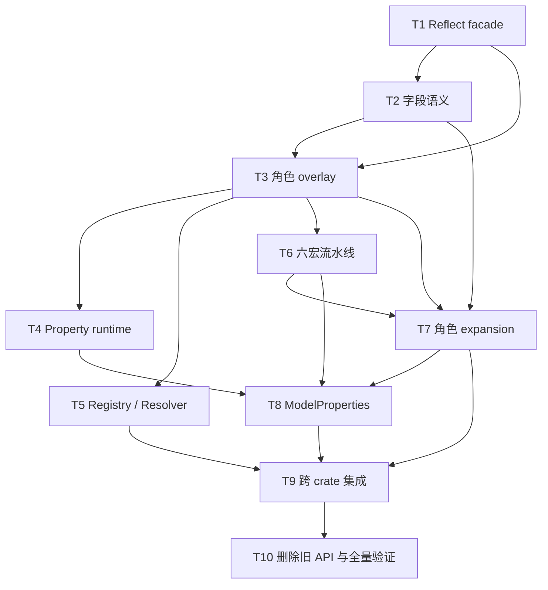

# `rs-model-derive` 基于 `rs-reflect` 的最终 API 重构实施计划

> **面向智能体执行者：** 必须在当前会话使用 superpowers:executing-plans 逐项实施本计划；不得创建 worktree，不得使用 subagent。各步骤使用复选框（`- [ ]`）语法跟踪进度。

**目标：** 按 2026-08-31 最终设计，将 `qubit-reflect` 建立为唯一 Rust 结构反射源，重构 `qubit-model-metadata` 的领域语义覆盖层，并让 `qubit-model-derive` 通过六个共享流水线宏生成最终模型 API。

**架构：** `qubit-model-metadata` 直接复用 `qubit-reflect::TypeDescriptor`、`FieldDescriptor`、`VariantDescriptor`、`TypeRef`、动态值、泛型描述和 typed capability；模型 metadata 通过 `qubit.model.metadata.v1` capability 挂载到唯一 descriptor 根。`qubit-model-derive` 只负责解析、规范化、编译期校验和生成 facade 引用；有稳定 `ModelId` 的 concrete 类型或泛型定义再进入独立 immutable `ModelRegistry`。

**技术栈：** Rust 2024、Rust 1.94、`syn` 2、`quote`、`proc-macro-crate`、`qubit-reflect`、`inventory`、`thiserror`、`bitflags`、`trybuild`、Serde、`qubit-redact`

**Temporary Workspace:** `/tmp/superpowers-rs-model-refactor-3z2qq9`

**执行仓库：** 直接在原始 `rs-reflect`、`rs-model-metadata`、`rs-model-derive` 的当前分支工作，不创建 worktree。
先前临时 worktree 中完成的 T1 已快进合并回 `rs-model-metadata/dev-starfish`，临时 worktree 已删除。

**临时工作区清理：** 执行期间必须保留该工作区，直至任务成功完成。成功后，仅在完成相同的路径组件验证后才能删除；不得使用字符串前缀判断包含关系。必须确认：解析后的工作区不是解析后的临时根目录；其解析后的父目录与临时根目录完全相同；其目录名以 `superpowers-` 开头；`.superpowers-session` 是空的、非符号链接的普通文件。如果执行时存在当前仓库，还必须证明工作区与仓库完全双向不重叠：任一路径都不等于另一路径，也不包含另一路径。否则，应记录未检测到当前仓库，并继续完成其余验证。

## 全局约束

- 规范来源固定为 `rs-model-derive/doc/2026-08-31-182016-rs-model-derive-final-api-and-implementation-design.md`。
- `qubit-reflect` 是唯一 Rust 结构事实源；模型层不得新增平行 `TypeDescriptor`、`TypeIdentity`、`TypeShape`、`HasTypeDescriptor` 或字段 erased-value 系统。
- 每个 concrete Rust 类型只能有一个 `TypeDescriptor` 根；`TypeMetadata::of::<T>()`、descriptor capability 和注册表 concrete metadata 必须指针相同。
- 静态 metadata 查询不得初始化 `ModelRegistry`，不得解析字符串 ID，不得根据 `type_name()` 判断类型相等。
- opaque 和 symbolic 类型必须通过 `qubit_reflect::TypeRef` 暴露；`FieldMetadata::descriptor()` 与 `PropertyMetadata::descriptor()` 返回 `Option`。
- Entity、Projection 不支持泛型；Model、Enum、Value 支持 type parameter、where clause 和 reflect 已支持的 primitive const generic；所有角色拒绝 lifetime parameter。
- 当前声明可判定的错误在编译期聚合报告；跨 crate ID、角色和 Property 兼容性只由显式 resolver 报告。
- validator 当前只保存经过语法校验的 declared ID、params 和 depends_on；不实现 `ValidatorId`、大写 `Validator` 宏、registry 或执行引擎，这些内容在设计文档中保留为后续 TODO。
- codec 直接复用 `qubit-codec` 的 `#[ValueCodec]`、`ValueEncoder` 和 `ValueDecoder`；不得引入 `qubit-codec-contract` 或在模型 crate 自建 `ValueCodecId`/registry。
- 旧 lookup_relation、ownership、field generator、computed、exclude、modified/unmodified、key_index、物理索引参数、`metadata_of`、`HasModelRegistration`、`registration_of` 不得保留为公共兼容别名。
- 业务 crate 只引用解析出的 `qubit-model-metadata` facade；生成代码不得要求直接依赖 `qubit-reflect`。
- 所有行为变更执行 TDD：先运行新测试并确认按预期失败，再写最小实现，再运行 focused GREEN。
- 各仓库分别提交，提交信息使用英文 Angular 格式；完成验证后按内容分组提交，并按用户要求同步与推送 `dev`、`main`、`dev-starfish`。
- 原始 `rs-model-derive` 工作区已有 README 与 doc 改动；实施时必须保留其内容，最终按变更主题与本次文档修订一起分组提交。

---

## 调度图（必填）

| 任务 | 前置任务 | 最小解锁产物 | 写入集合 | 本地验证 | 集成验证归属 | 审查时机 |
| --- | --- | --- | --- | --- | --- | --- |
| T1 | 无 | reflect facade、sealed `HasTypeMetadata`、model capability | metadata 的 Cargo、facade、TypeMetadata 基础与 tests | `cargo test --test reflect_facade_tests --test type_metadata_tests` | T10 | 立即审查 |
| T2 | T1 | Field 领域语义、constraint/selector/validator declaration/codec/redact API | metadata 的 attribute、constraint、relation、strategy、representation、field 与 tests | `cargo test --test attribute_tests --test constraint_tests --test field_metadata_tests` | T10 | 立即审查 |
| T3 | T1、T2 | 五种角色与 Field/Variant overlay | metadata 的 type_metadata、role 与 tests | `cargo test --test type_metadata_tests --test role_metadata_tests` | T10 | 立即审查 |
| T4 | T3 | Property runtime 与安全 local adapter | metadata 的 property、property error 与 tests | `cargo test --test property_tests` | T10 | 立即审查 |
| T5 | T3 | ModelId、generic registration、registry、model resolver、query | metadata 的 model_id、registration、registry、resolver、query 与 tests | `cargo test --test model_id_tests --test metadata_registry_tests --test model_graph_tests` | T9、T10 | 立即审查 |
| T6 | T3 | 六宏入口、共享 IR、Reflect facade 委托 | derive 的 lib、parse、ir、normalize、validate 基础、expand/reflect 与 tests | `cargo test --lib --test runtime_path_tests --test trybuild_tests` | T9、T10 | 立即审查 |
| T7 | T2、T3、T6 | 角色 metadata/capability/registration/default/Serde/Redact expansion | derive 的非 Property validate/expand、options 与 tests | `cargo test --test runtime_metadata_tests --test model_attribute_tests --test trybuild_tests` | T9、T10 | 立即审查 |
| T8 | T4、T6、T7 | `#[ModelProperties]` 完整 expansion | derive 的 Property parse/IR/validate/expand 与 tests | `cargo test --test property_metadata_tests --test trybuild_tests` | T9、T10 | 立即审查 |
| T9 | T5、T7、T8 | 三仓库跨 crate 集成闭环 | derive/metadata integration tests 与 runtime fixtures | `cargo test --test runtime_fixtures_tests --test integration_tests` | T10 | 立即审查 |
| T10 | T9 | 旧 API 删除、文档对齐、完整验证 | 三仓库剩余迁移文件、README、Rustdoc、tests | 三仓库 CI、全量 test/clippy/doc | T10 | 立即审查 + 最终审查 |

逻辑批次：T1；T2；T3；T4 与 T6；T5 与 T7；T8；T9；T10。因用户要求单智能体直接执行，所有任务按依赖顺序串行完成；同一仓库共享 Cargo target 的重型命令同样串行运行。

## 任务拓扑依赖图（必填）



### Task 1（T1）：建立 reflect facade、唯一 descriptor 和 model capability

**文件：**

- 修改：`rs-model-metadata/Cargo.toml`、`src/lib.rs`、`src/type_metadata.rs`、`src/type_metadata/has_type_metadata.rs`
- 新建：`rs-model-metadata/src/reflect_facade.rs`、`tests/reflect_facade_tests.rs`
- 测试：`rs-model-metadata/tests/type_metadata_tests.rs`

**接口：**

```rust
pub use qubit_reflect::{Reflect, TypeDescriptor};

pub trait HasTypeMetadata: Reflect + __private::ModelTypeSeal {
    fn type_metadata() -> &'static TypeMetadata;
}

pub trait ModelDescriptorExt {
    fn model_metadata(&self) -> Option<&'static TypeMetadata>;
    fn is_model_type(&self) -> bool;
}

impl TypeMetadata {
    pub fn of<T: HasTypeMetadata>() -> &'static Self;
    pub fn descriptor(&self) -> &'static TypeDescriptor;
    pub fn type_id(&self) -> std::any::TypeId;
    pub fn type_name(&self) -> &'static str;
}

#[doc(hidden)]
pub type ModelMetadataProvider = fn() -> &'static TypeMetadata;
```

**调度：** 无前置；只写上述 metadata 文件；本地验证为 reflect facade/type metadata tests；T10 负责全量；立即审查。

- [x] 写失败测试，断言 `TypeMetadata::of::<Account>().descriptor()` 与 `TypeDescriptor::of::<Account>()` 指针相同，且 `model_metadata()` 返回同一 `TypeMetadata`。
- [x] 运行 `cargo test --test reflect_facade_tests model_metadata_reuses_the_reflect_descriptor_root`，确认因新 API 缺失而失败。
- [x] 在 `Cargo.toml` 增加 `qubit-reflect = { version = "=0.1.0", path = "../rs-reflect" }` 与 `inventory = "0.3"`。
- [x] 实现 `qubit.model.metadata.v1` 的 `CapabilityKey<ModelMetadataProvider>`；扩展 trait 只查询 capability，不访问 registry。
- [x] 让 `TypeMetadata` 保存唯一 `&'static TypeDescriptor`，身份 getter 全部委托 descriptor；构造器仅在 `__private::v1`。
- [x] 运行 `cargo test --test reflect_facade_tests --test type_metadata_tests --test lib_tests`，确认 GREEN 且无 warning。
- [x] 已完成并审查；最终按内容重组为英文提交。

### Task 2（T2）：实现 Field 领域语义、约束、策略与表示 metadata

**文件：**

- 重写：`rs-model-metadata/src/field_metadata.rs`、`src/attribute/**`、`src/relation/**`
- 修改：`rs-model-metadata/src/constraint/**`
- 新建：`rs-model-metadata/src/strategy.rs`、`src/strategy/**`、`src/representation.rs`、`src/representation/**`
- 测试：`tests/attribute_tests.rs`、`constraint_tests.rs`、`field_metadata_tests.rs`

**接口：** T1 的 `TypeDescriptor`、`TypeRef`、`FieldDescriptor`；输出设计第 7、10 节所有字段语义类型。

```rust
impl FieldMetadata {
    pub fn reflect(&self) -> &'static qubit_reflect::FieldDescriptor;
    pub fn index(&self) -> usize;
    pub fn name(&self) -> Option<&'static str>;
    pub fn type_ref(&self) -> &'static qubit_reflect::descriptor::TypeRef;
    pub fn descriptor(&self) -> Option<&'static TypeDescriptor>;
    pub fn attributes(&self) -> &'static [FieldAttributeMetadata];
    pub fn identifier(&self) -> Option<&'static IdentifierMetadata>;
    pub fn indexing_reasons(&self) -> IndexingReasons;
    pub fn unique(&self) -> Option<&'static UniqueMetadata>;
    pub fn reference(&self) -> Option<&'static ReferenceMetadata>;
    pub fn constraints(&self) -> &'static [ConstraintMetadata];
    pub fn validators(&self) -> &'static [ValidatorMetadata];
    pub fn codec(&self) -> Option<&'static CodecMetadata>;
    pub fn redact(&self) -> Option<&'static RedactMetadata>;
}
```

**调度：** T1 提交后；只写 metadata 字段语义文件；focused tests；T10 全量；立即审查。

- [x] 写 resolved、opaque、symbolic RED 测试，断言 `descriptor()` 分别为 Some/None/None，且 `type_ref()` 保留原 variant。
- [x] 运行 `cargo test --test field_metadata_tests`，确认旧自建 `TypeRef` 导致预期失败。
- [x] 将 `FieldMetadata` 改为 `FieldDescriptor` overlay；index/name/visibility/type 全部委托 reflect descriptor。
- [x] 实现 `FieldAttributeMetadata` 引用枚举；强类型 getter 与统一 attributes 必须引用同一静态对象。
- [x] 实现 Identifier、IndexingReasons、Unique、Reference、KeyPart；实现 Text、Decimal/Money、Time、Sequence、Map 和非递归 selector。
- [x] 实现 Validator declaration occurrence（`declared_id/params/depends_on`）、Codec `RustType/DeclaredId`、Redact 声明模式与 Serde occurrence；不创建 validator/codec contract crate。
- [x] 从新公共导出删除 LookupRelation、Ownership、Generator、PrimaryKey/Index/Key 旧模型。
- [x] 运行 `cargo test --test attribute_tests --test constraint_tests --test field_metadata_tests`，确认 GREEN。
- [x] 已完成并审查；最终按内容重组为英文提交。

### Task 3（T3）：实现 `TypeMetadata`、五种角色和 Enum/Field overlay

**文件：** 修改 `src/type_metadata.rs`、重写 `src/type_metadata/**`、新建 `src/role.rs` 与 `src/role/**`；测试 `type_metadata_tests.rs`、新建 `role_metadata_tests.rs`。

**接口：** T1/T2 输出；实现设计第 6.2、9 节全部签名，包括 `model_id/is_registered/generic_definition/fields/properties/role/as_*`。

```rust
pub enum ModelRole { Entity, Projection, Model, Enum, Value }
pub enum RoleMetadata {
    Entity(EntityMetadata), Projection(ProjectionMetadata),
    Model(ModelMetadata), Enum(EnumMetadata), Value(ValueMetadata),
}
```

**调度：** T1/T2 后；只写 metadata role/type 文件；focused tests；T10 全量；立即审查。

- [x] 写五角色 RED 测试，覆盖 Entity identifier、Projection open/fixed source、空 Model、Enum 三套名称、transparent Value。
- [x] 运行 `cargo test --test type_metadata_tests --test role_metadata_tests`，确认缺少角色 API。
- [x] 实现最小角色 payload：Entity 只含 identifier；Projection 含 identifier/source；Model 为空；Enum 是 VariantDescriptor overlay；Value 含 transparent field/canonical codec。
- [x] 实现 TypeMetadata 字段导航；Enum 顶层 fields 为空；具名 field 按 query name，位置按 source index。
- [x] Enum shape 使用 `VariantDescriptor::kind()`，删除重复 `EnumVariantKind`；serialize/deserialize name 分开。
- [x] 运行 focused GREEN；最终按内容重组为英文提交。

### Task 4（T4）：实现 Property runtime 和安全 erased adapter

**文件：** 新建 `src/property.rs`、`src/property/{property_metadata,getter_metadata,setter_metadata,property_value,error}.rs`、`tests/property_tests.rs`。

**接口：**

```rust
pub enum PropertyValue<'a> {
    Borrowed(qubit_reflect::ReflectedRef<'a>),
    Owned(qubit_reflect::ReflectedOwned),
}

pub type GetterAdapter = for<'a> fn(
    qubit_reflect::ReflectedRef<'a>,
) -> Result<PropertyValue<'a>, PropertyAccessError>;
```

PropertyMetadata 提供 type_ref/descriptor、field/getter/setter、readable/writable/storage_kind、get/set；setter 执行前失败归还 replacement。

**调度：** T3 后，与 T6 并行；只写 property；`cargo test --test property_tests`；T10 Miri；立即审查。

- [x] 写 borrowed str、borrowed slice、owned getter、field fallback、setter exact TypeId、target mismatch、replacement recovery RED 测试。
- [x] 运行 focused test，确认 Property API 缺失。
- [x] field-backed 访问直接委托 `FieldDescriptor::get/set`，不复制 adapter。
- [x] 实现 `for<'a>` getter 与 local-mode setter；禁止伪造 `'static`，禁止自动升级 thread-safe mode。
- [x] 严格实现 readable/writable 与 FieldBacked/Computed/Virtual 规则。
- [x] 运行 GREEN；最终按内容重组为英文提交。

### Task 5（T5）：实现 ModelId、泛型注册、registry、resolver 与 QueryMetadata

**文件：** 重写 `model_id/**`、`model_registration.rs`、`metadata_registry/**`、`metadata_resolver.rs`、`model_graph/**`、`query/**` 及对应 tests；可按设计重命名为 `registration/registry/resolver`。

**接口：**

```rust
impl ModelRegistry {
    pub fn try_global() -> Result<&'static Self, ModelRegistryError>;
    pub fn global() -> &'static Self;
    pub fn get(&self, id: &str) -> Option<&'static ModelRegistration>;
    pub fn metadata(&self, id: &str) -> Option<&'static TypeMetadata>;
    pub fn generic(&self, id: &str) -> Option<&'static GenericModelMetadata>;
    pub fn by_type_id(&self, type_id: TypeId) -> Option<&'static TypeMetadata>;
    pub fn registrations(&self) -> &'static [ModelRegistration];
}

impl<'a> ModelResolver<'a> {
    pub fn new(inputs: ResolveInputs<'a>) -> Self;
    pub fn resolve_all(&self) -> Result<ResolvedModelGraph, ModelResolveErrors>;
}
```

**调度：** T3 后，与 T7 并行；只写 metadata registry/resolver/query；focused tests；T9/T10 集成；立即审查。

- [x] 写 ASCII ModelId、ModelIdBuf、匿名不注册、重复 ID 双 source、concrete/generic、错误排序、reference/source 错误 RED 测试；validator/codec declared ID 不在本任务解析。
- [x] 运行三个 focused tests，确认旧 registry 无新 target/resolved graph。
- [x] 实现共享 ASCII validator；静态 `ModelId::new/try_new` 与 owned `ModelIdBuf::parse` 行为一致。
- [x] 用 inventory factory fragment 建 frozen registry；`try_global` 先初始化 ReflectRegistry；只索引有 ID 的 concrete 或 generic definition。
- [x] 复用 reflect generic definition/concrete descriptor；concrete instance 无 ModelId、不注册。
- [x] 实现 `resolve_all` 的模型图全错误聚合与 immutable graph；QueryMetadata 只为 Entity 生成，并执行设计中的递归/一跳/冲突规则；validator/codec occurrence 原样保留。
- [x] 运行 GREEN；最终按内容重组为英文提交。

### Task 6（T6）：重建六宏共享流水线并委托 Reflect

**文件：** 重写 `rs-model-derive/src/lib.rs`、`runtime_path.rs`；新建/重组 `parse/**`、`ir/**`、`normalize/**`、`validate/**`、`expand/reflect.rs`；修改 parser/runtime-path/trybuild tests。

**接口：** 六个 attribute macro：Entity、Projection、Model、Enum、Value、ModelProperties；共享 `MacroKind` 和 `DeclarationIr`。

**调度：** T3 后，与 T4 并行；只写 derive 核心流水线；focused tests；T9/T10 集成；立即审查。

- [x] 写六入口和 shape RED UI tests：合法五角色形状；非法 generic Entity/Projection、lifetime、tuple Model、非法 Value、enum/union 错配。
- [x] 运行 `cargo test --test trybuild_tests`，确认新入口缺失。
- [x] 入口只传 MacroKind；parser 保留 span；normalizer 生成唯一语义 IR；validator 聚合独立错误。
- [x] 自动生成 `#[derive(resolved_runtime::Reflect)]` 与 `#[reflect(crate = resolved_runtime)]`；检测用户重复 Reflect 并定位到 derive token。
- [x] 模型 helper 从 retained item 删除，只把 opaque/access policy/query name 转换成 reflect helper。
- [x] 运行 focused GREEN；最终按内容重组为英文提交。

### Task 7（T7）：生成角色 metadata、capability、registration 和默认能力

**文件：** derive 的非 Property `validate/**`、`expand/{declaration,metadata,fields,role,capability,registration,defaults,serde,redact,assertions}.rs`、`model_options.rs` 与 role tests。

**接口：** T2/T3 runtime constructors 与 T6 validated IR；输出 HasTypeMetadata impl、`ModelMetadataProvider` capability、可选 registration。

**调度：** T2/T3/T6 后，与 T5 并行；只写 derive 非 Property expansion；focused tests；T9/T10 集成；立即审查。

- [x] 写每角色 runtime RED 测试，断言静态入口、capability、registration 指针相同；匿名 Model 不注册；generic concrete 无 ModelId。
- [x] 运行 `cargo test --test runtime_metadata_tests`，确认 provider/capability 缺失。
- [x] 每个 concrete 类型用 `OnceLock<TypeMetadata>`；构造时检查反射 field/variant 的 index/name/type_ref 对齐。
- [x] capability adapter 强制为 `ModelMetadataProvider`；有 ID 才注册；generic 只注册 definition factory。
- [x] 展开 identifier/indexed/unique/reference/key_part/constraints/selectors、validator declaration、qubit-codec reference、redact/representation 和五角色 payload；不生成大写 `Validator`。
- [x] 实现设计中的默认能力矩阵、transparent Value、Serde omit/keep_serializing 和 Redact 联动。
- [x] 运行 GREEN；最终按内容重组为英文提交。

### Task 8（T8）：实现 `#[ModelProperties]`

**文件：** 新建 `parse/property_impl.rs`、`ir/property.rs`、`validate/properties.rs`、`expand/properties.rs`、`tests/property_metadata_tests.rs` 与 UI fixtures。

**接口：** T4 Property adapter 与 T6/T7 provider；输出隐藏 `ModelPropertiesProvider` seal 实现。

**调度：** T4/T6/T7 后；只写 derive Property；focused tests；T9/T10 集成；立即审查。

- [x] 写 field/getter/setter 合并、borrowed/owned/Option、重复 impl/property、非法 async/unsafe/generic/private/receiver/return RED tests。
- [x] 运行 `cargo test --test property_metadata_tests --test trybuild_tests`，确认缺少 expansion。
- [x] 只接受 public、safe、sync、非泛型 getter/setter；getter 为 `&self -> T/&T`，setter 为 `&mut self, T -> ()`。
- [x] 生成 lifetime-preserving getter、owned getter 与 recoverable setter；执行前校验 target/value TypeId。
- [x] 重复 impl 由 provider seal 冲突；同一 impl 的独立错误由 syn::Error 聚合。
- [x] 运行 GREEN；最终按内容重组为英文提交。

### Task 9（T9）：完成跨 crate 集成闭环

**文件：** derive `tests/runtime-fixtures/**`、新建 derive/metadata `tests/integration/**` 与入口；必要 fixture Cargo.toml。

**调度：** T5/T7/T8 后；只写 integration/fixture 和暴露出的最小接缝修复；focused integration；T10 全量；立即审查。

- [x] 写正常 facade、renamed/missing runtime、重复 ID、跨 crate source/reference、wrong role、missing property、generic definition、validator occurrence 顺序、codec Rust 类型约束/declared ID、Property producer RED fixtures；不要求 validator 注册或执行。
- [x] 运行 `cargo test --test runtime_fixtures_tests --test integration_tests`，确认至少一个新 fixture 按预期失败。
- [x] 只修复 fixture 暴露的公共接缝，不在 fixture 中调用 hidden ABI 绕过用户路径。
- [x] 两仓库 focused GREEN；最终按内容重组为英文提交。

### Task 10（T10）：删除旧 API、对齐文档并完成全量验证

**文件：** 删除被新实现取代的旧源文件/测试；修改三仓库 README、Rustdoc、目标用户指南和测试入口；保留历史设计文档。

**调度：** T9 后；拥有所有集成验证；立即审查并执行最终独立审查。

- [x] 搜索 `metadata_of|HasTypeShape|TypeIdentity|LookupRelation|OwnershipMetadata|HasModelRegistration|registration_of|Generator`，使非历史文档命中归零。
- [x] 删除旧实现；仍表达有效业务语义的测试改写到新 API，不机械删除覆盖。
- [x] README/Rustdoc 从六宏、TypeMetadata::of、ModelDescriptorExt、Field/Property、registry/resolver 主路径讲解。
- [x] 每个涉及修改的仓库必须先运行 `align-ci.sh` 格式化，再运行 `ci-check.sh` 对齐 CI；只有脚本不存在时才运行对应 fallback。
- [x] `rs-reflect` 即使无生产代码变化，也运行 `cargo test --all-features`。
- [x] 默认 1.94 工具链未安装 Miri；已明确记录，未声称通过 Miri。
- [x] 按用户要求不使用 subagent；由主执行者完成两轮独立自审，未发现剩余 substantive finding。
- [ ] 对所有涉及仓库按变更内容分组创建英文提交；将当前分支快进同步到 `dev`、`main`、`dev-starfish` 并推送，最后回到 `dev-starfish`。

## 计划自审映射

| 设计必须项 | 对应任务 |
| --- | --- |
| 唯一 reflect descriptor、facade、model capability | T1、T7、T9 |
| Field/TypeRef resolved/opaque/symbolic | T2、T3 |
| 五角色与角色专属 metadata | T3、T6、T7 |
| Property 安全访问与 ModelProperties | T4、T8、T10 |
| identifier/indexed/unique/reference/key_part | T2、T7 |
| constraint/selector/validator/codec/redact/serde | T2、T7 |
| 泛型定义、primitive const、concrete cache | T5、T7、T9 |
| ModelId、registration、registry | T5、T7、T9 |
| resolver、resolved graph、query | T5、T9 |
| hidden `__private::v1` ABI | T1、T7、T9 |
| 旧 API 删除与文档收口 | T2、T10 |
| 三仓库完整验证和独立审查 | T10 |
