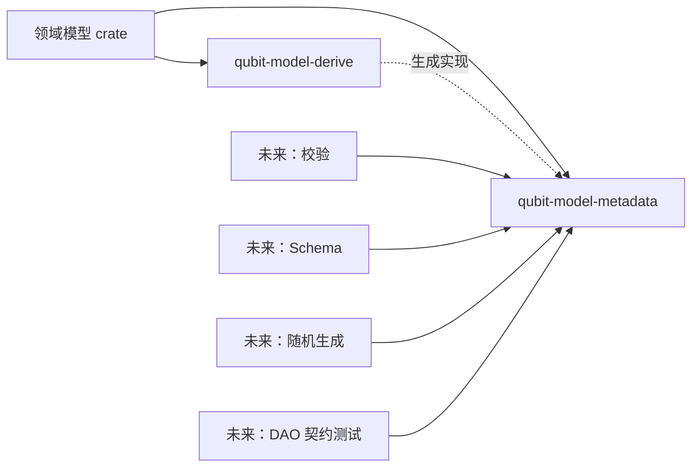

# `qubit-model-metadata` 与 `qubit-model-derive` 设计

> 状态：阶段 A—C 已实现；阶段 D（模型集合与图级关系校验）暂缓，等待真实迁移模型和消费者需求。
>
> 目标仓库：`rs-model-metadata`、`rs-model-derive`
>
> 上位方案：[Java Common 核心能力迁移到 Rust 的整体方案](java-common-to-rust-overall-design.md)
>
> 本文范围：确定两个基础 crate 的职责、核心数据模型、查询方式和宏的生成规则；不实现校验器、随机生成器、Schema 工具、DAO 或 Service。

## 1. 结论

第一阶段采用“Rust 原生的强类型静态元数据”，不复制 Java annotation，也不使用字符串键值形式的通用
属性包。

- `qubit-model-metadata` 是普通 library crate，定义静态元数据、类型结构、强类型属性和只读查询接口；
- `qubit-model-derive` 是独立的 `proc-macro` crate，只负责解析模型和 `#[model(...)]`，在编译期校验并生成元数据实现；
- 领域模型 crate 显式依赖上述两个 crate；
- 校验、PostgreSQL Schema、随机对象和 DAO 契约测试等后续组件只依赖 `qubit-model-metadata`；
- 元数据使用 `&'static` 切片、字符串和函数指针，不在查询时分配内存，也不依赖运行时反射；
- 字段类型结构主要由 Rust trait 系统递归推导，而不是依赖过程宏比较类型名称字符串；
- `identifier`、字段级 `unique` 等输入简写最终规范化为模型级主键、唯一键和索引；
- 可空性只由最外层 `Option<T>` 推断，第一版没有 `#[model(nullable)]`；
- 第一版不引入全局自动注册、SQLx、PostgreSQL、Serde 元数据格式或 Java Bean 概念。

属性语法在 `0.1.0` 发布前仍可以调整，但规范化后的元数据语义应先保持稳定。后续组件依赖元数据语义，
不应依赖宏输入时使用了哪一种简写。

## 2. 方案选择

| 方案 | 优点 | 主要问题 | 结论 |
|---|---|---|---|
| 强类型静态元数据 | 类型匹配和冲突可在编译期检查；校验、随机生成和 Schema 可以共享 | 初期类型设计和宏实现工作较多 | 采用 |
| 通用属性列表 | 添加新键较容易 | 容易变成字符串协议；作用域、冲突和查询都较弱 | 不作为核心模型 |
| 复刻 Java annotation | 可机械迁移 | 保留 getter、`respectTo`、裸 `Reference` 等 Java 反射包袱 | 不采用 |

`TypeMetadata` 和 `FieldMetadata` 内部仍会保存 `&'static [AttributeMetadata]`，但这里的
`AttributeMetadata` 是强类型、`#[non_exhaustive]` 的枚举，不是 `HashMap<String, Value>` 或任意键值列表。
例如文本长度只能表示为 `AttributeMetadata::Text(TextConstraint)`，不能写成未经检查的
`("max_length", "32")`。

现有 `qubit-metadata` 用于对象携带的运行时键值元数据，与这里的模型静态结构语义不同，不复用也不替代
本设计。

## 3. 职责和依赖方向



依赖约束如下：

1. `qubit-model-metadata` 不依赖 `qubit-model-derive`；
2. `qubit-model-derive` 的正式依赖只有 `syn`、`quote`、`proc-macro2`、`proc-macro-crate` 等宏基础设施；
3. 宏展开后的代码引用 `qubit-model-metadata`，derive crate 自身不在编译期加载业务类型；
4. 两个 crate 均不依赖 SQLx、PostgreSQL、随机生成框架或 Web 校验框架；
5. `qubit-model-metadata` 在第一版维护自有的 `ScalarType` 词汇；它需要精确表示 Rust 的
   `isize`、`usize` 等类型，且不把 `qubit-datatype` 的运行时转换、序列化依赖引入静态元数据 crate。
   容器和模型结构由本 crate 在标量词汇之上扩展。

## 4. `qubit-model-metadata`

### 4.1 边界

该 crate 描述：

- Rust 命名类型及其 struct、enum、newtype 结构；
- 真实字段、声明顺序和嵌套字段类型；
- 文本、集合、Map、时间和十进制数等领域约束；
- 主键、唯一键、索引和逻辑组合键；
- 模型之间真实存在的引用、查找和所有权关系；
- 编解码、随机生成和敏感信息等策略的静态引用。

该 crate 不描述：

- Java 字段名、getter/setter、Java Bean computed property；
- JSON 字段名、Controller、权限、Session 或方法注解；
- PostgreSQL 列类型、表名、列名、SQL 或迁移文件；
- 校验错误文案、随机值本身或 DAO 测试执行逻辑；
- 任意可变的对象级键值元数据。

PostgreSQL Schema 组件以后根据领域语义完成映射。例如 `max_chars = 128` 可以映射为
`VARCHAR(128)` 或 `char_length` 检查，`max_bytes = 4096` 则应映射为 `octet_length` 检查；这些数据库
决策不反向污染领域元数据。

### 4.2 类型结构

以下代码用于确定 API 形状，字段可见性和部分命名可以在实现时微调：

```rust
pub trait HasTypeShape: 'static {
    const TYPE_SHAPE: TypeShape;
    const CAPABILITIES: TypeCapabilities;
}

pub trait HasTypeMetadata: HasTypeShape {
    fn type_metadata() -> &'static TypeMetadata;
}

pub fn metadata_of<T: HasTypeMetadata>() -> &'static TypeMetadata {
    T::type_metadata()
}

pub struct TypeMetadata {
    identity: TypeIdentity,
    kind: TypeKind,
    attributes: &'static [AttributeMetadata],
}

pub enum TypeKind {
    Struct(StructMetadata),
    Enum(EnumMetadata),
    Newtype(NewtypeMetadata),
}

pub struct StructMetadata {
    fields: &'static [FieldMetadata],
}

pub struct FieldMetadata {
    ordinal: usize,
    name: &'static str,
    rust_type_name: &'static str,
    field_type: TypeRef,
    attributes: &'static [AttributeMetadata],
}
```

`TypeMetadata` 只代表有名称的模型类型。字段中的 `Option<Vec<Info>>` 等类型表达式由 `TypeRef` 和
`TypeShape` 表示：

```rust
#[non_exhaustive]
pub enum TypeShape {
    Scalar(ScalarType),
    Named(NamedTypeRef),
    Optional(TypeRef),
    Sequence(TypeRef),
    Set(TypeRef),
    Map {
        key: TypeRef,
        value: TypeRef,
    },
    Array {
        element: TypeRef,
        length: usize,
    },
    Opaque(OpaqueTypeMetadata),
}
```

`TypeRef` 是小型、可复制的静态引用。其内部保存类型名称函数和读取 `TypeShape` 的函数指针，因此容器
实现可以递归引用元素类型，而不需要 `Box`、堆分配或自引用静态对象。`NamedTypeRef` 保存读取目标
`TypeMetadata` 的函数指针，可以安全表达 A 引用 B、B 又引用 A 的模型图。函数指针不作为类型身份比较
依据；身份比较使用 `TypeIdentity`。

标准类型由 metadata crate 提供 `HasTypeShape` 实现：

- 标量：布尔、字符、整数、浮点数、`String` 以及启用相应 feature 后的时间、十进制等类型；
- 可空：`Option<T>`；
- 序列：`Vec<T>` 等第一版明确支持的标准序列；
- 集合：`HashSet<T>`、`BTreeSet<T>`；
- Map：`HashMap<K, V>`、`BTreeMap<K, V>`；
- 固定数组：`[T; N]`，其中长度直接取 const generic `N`；
- derive 生成的 struct、enum 和 newtype。

例如 `Option<Vec<UserInfo>>` 的结构由以下 trait 组合得到，而不是由宏猜测 `Option`、`Vec` 的字符串：

```text
Optional
└── Sequence
    └── Named(UserInfo)
```

这种方式也能正确处理类型别名和完整限定路径。未实现 `HasTypeShape` 的外部类型会得到编译错误；确实不应
展开的类型必须显式使用 `#[model(opaque)]`，或者先包装成本地 newtype。宏不能把未知类型静默当成
`Opaque`。

`TypeCapabilities` 是类型能力位集，例如 `TEXT`、`SEQUENCE`、`SET`、`MAP`、`TEMPORAL` 和
`DECIMAL`。它只用于编译期确认属性能否应用到该类型，不是另一份业务约束。`Option<T>` 继承 `T` 的
约束能力，newtype 可以继承内部类型的能力，`Vec<T>` 自身只具有序列能力。

### 4.3 可空性和集合形状

可空性不重复存储：

```rust
name: String             // TypeShape::Scalar，nullable = false
nickname: Option<String> // TypeShape::Optional(...)，nullable = true
```

查询 API 的 `is_nullable()` 只检查最外层是否为 `Optional`。`Option<Vec<T>>` 和 `Vec<Option<T>>` 会保留
不同结构，不会被压平成两个布尔值。

关联基数也从结构计算：普通 `T` 是一个，`Option<T>` 是零或一，`Vec<T>`/`Set<T>` 是多个。固定数组的
精确长度来自 `[T; N]`；第一版不允许再用集合属性重复声明数组长度。

### 4.4 强类型属性

核心枚举建议如下：

```rust
#[non_exhaustive]
pub enum AttributeMetadata {
    Text(TextConstraint),
    Sequence(SequenceConstraint),
    Map(MapConstraint),
    Temporal(TemporalConstraint),
    Decimal(DecimalConstraint),

    PrimaryKey(PrimaryKeyMetadata),
    Unique(UniqueMetadata),
    Index(IndexMetadata),
    Key(KeyMetadata),

    Reference(ReferenceMetadata),
    LookupRelation(LookupRelationMetadata),
    Ownership(OwnershipMetadata),

    Codec(StrategyRef),
    Generator(StrategyRef),
    Sensitive(SensitiveMetadata),
}
```

枚举使用 `#[non_exhaustive]`，让以后添加新语义时不要求所有下游 crate 同步修改穷尽匹配。每个 variant
内部仍是具体类型，消费者可以获得完整的编译期类型检查。

#### 文本

```rust
pub struct TextConstraint {
    min_chars: Option<u32>,
    max_chars: Option<u32>,
    min_bytes: Option<u32>,
    max_bytes: Option<u32>,
    repertoire: TextRepertoire,
    non_blank: bool,
    format: Option<TextFormat>,
}
```

- `chars` 明确定义为 Rust `char` 数量，即 Unicode scalar value 数量；
- `bytes` 明确定义为 UTF-8 字节数；
- 第一版不使用 grapheme cluster；
- `TextRepertoire` 默认是 Unicode，可指定 ASCII；
- `non_blank` 与 `min_chars = 1` 不等价，前者还排除纯空白；
- `TextFormat` 是 email 等强类型格式，不保存任意正则字符串作为通用格式。

#### 容器

```rust
pub struct SequenceConstraint {
    min_items: Option<u32>,
    max_items: Option<u32>,
    unique_items: bool,
}

pub struct MapConstraint {
    min_entries: Option<u32>,
    max_entries: Option<u32>,
}
```

`unique_items` 只对序列有意义；Set 已经保证唯一，宏应拒绝对 Set 重复声明该属性。固定数组的长度来自
类型本身，不再接受等价的 `min_items`/`max_items` 声明。

#### 时间与十进制数

```rust
pub struct TemporalConstraint {
    precision: TemporalPrecision,
}

pub struct DecimalConstraint {
    precision: Option<u16>,
    scale: u16,
    rounding: RoundingMode,
    semantic: DecimalSemantic,
}
```

- `precision` 是总有效数字位数，`scale` 是小数位数，两者不能混用；
- 指定 `precision` 时必须满足 `scale <= precision`；
- `DecimalSemantic` 区分普通高精度数和金额；
- 金额属性第一版要求显式给出 `scale`，不暗中继承 Java `@Money` 的默认值；
- Java `@Money.useGroup` 属于显示格式，不进入领域/存储元数据；
- 时间精度由约束表达，`DateTime<Utc>` 的绝对时间点语义由 `ScalarType::Instant` 表达，具体数据库映射由未来的 Schema 组件完成。

#### 主键、唯一键、索引和逻辑键

主键、唯一键和索引属于模型，而不是单个字段。字段级写法只是宏输入简写。规范化的数据结构至少包含：

```rust
pub struct PrimaryKeyMetadata {
    fields: &'static [PrimaryKeyFieldMetadata],
}

pub struct PrimaryKeyFieldMetadata {
    name: &'static str,
    generated: bool,
}

pub struct UniqueMetadata {
    name: Option<&'static str>,
    fields: &'static [UniqueFieldMetadata],
}

pub struct UniqueFieldMetadata {
    name: &'static str,
    comparison: UniqueComparison,
}

pub enum UniqueComparison {
    Exact,
    IgnoreCase,
}
```

大小写比较按字段记录，而不是给整个复合唯一键设置一个模糊的布尔值。例如组织 ID 精确比较、用户名忽略
大小写时，两个字段的比较策略不同。`IndexMetadata` 和 `KeyMetadata` 保存有序字段列表及可选逻辑名称。

#### 关系和策略引用

```rust
pub struct FieldPath {
    segments: &'static [&'static str],
}

pub struct ReferenceMetadata {
    target: NamedTypeRef,
    property: FieldPath,
    existing: bool,
    path: Option<FieldPath>,
}
```

- 只记录真实业务关联；Java 中没有目标类型的裸 `@Reference` 不迁移；
- `existing = false` 对应旧 `existing = false`；
- 路径保存为静态字段段数组，而不是运行时反复解析的点分字符串；
- 关联基数从字段的 `TypeShape` 推断，不重复保存；
- `ReferenceBy` 规范化为 `LookupRelationMetadata`；
- `OwnedBy` 规范化为模型级 `OwnershipMetadata`；
- `TypeCodec`、自定义随机生成器和 redactor 在此只保存 `StrategyRef`，具体 trait 和调用适配器由相应消费者
  crate 定义，避免 metadata crate 反向依赖所有框架。

### 4.5 规范化规则

元数据只保留语义结果，不保留原始属性写法：

| 宏输入 | 规范化结果 |
|---|---|
| 字段 `identifier` | 模型级 `PrimaryKeyMetadata` |
| 字段 `unique` | 单字段模型级 `UniqueMetadata` |
| 字段 `index` | 单字段模型级 `IndexMetadata` |
| struct 上的复合 unique/index/key | 有序模型级约束 |
| `money(...)` | `DecimalConstraint { semantic: Money, ... }` |
| `Option<T>` | `TypeShape::Optional`，不生成 nullable 属性 |
| `Vec<T>`、Set、Map、数组 | 对应结构化 `TypeShape` |

因此 Schema、校验器和随机生成器不需要分别兼容 `identifier` 简写与 `primary_key` 完整写法。

### 4.6 查询接口

查询以不可变借用为主，字段和属性数量通常较小，第一版直接对静态切片线性查找，不引入全局缓存或
`HashMap`。

公共接口应覆盖：

- `metadata_of::<T>()`；
- `TypeMetadata::identity()`、`kind()`、`fields()`、`field(name)`；
- `TypeMetadata::primary_key()`、`unique_constraints()`、`indexes()`；
- `FieldMetadata::name()`、`field_type()`、`is_nullable()`；
- `FieldMetadata::text_constraint()`、`reference()` 等常用 typed getter；
- `AttributeQuery::attributes()`、`attribute(kind)` 和按 kind 迭代的通用接口；
- `TypeRef::shape()`、`strip_optional()`、`named_metadata()`；
- `TypeMetadata::resolve_field_path()`，用于本模型及可解析的嵌套命名模型路径。

典型用法如下：

```rust
let user = metadata_of::<User>();
let username = user.field("username").expect("username metadata");

assert!(!username.is_nullable());

let text = username
    .text_constraint()
    .expect("username text constraint");
assert_eq!(text.max_chars(), Some(32));

let unique = user
    .unique_constraints()
    .find(|constraint| constraint.contains("username"))
    .expect("username unique constraint");
assert_eq!(unique.comparison_of("username"), Some(UniqueComparison::IgnoreCase));
```

查询失败使用小型、强类型错误，例如字段不存在、路径中间节点不是 struct、目标元数据不可解析；不以
`String` 拼接协议表示失败类别。

## 5. `qubit-model-derive`

### 5.1 对外入口

derive crate 提供一个入口：

```rust
#[proc_macro_derive(Model, attributes(model))]
```

使用方显式导入 derive 宏和 runtime trait：

```rust
use qubit_model_derive::Model;
use qubit_model_metadata::HasTypeMetadata;

#[derive(Model)]
#[model(
    primary_key(fields(id), generated(id)),
    unique(
        fields(organization_id, username),
        ignore_case(username)
    ),
    index(fields(state, create_time)),
    key(name = "owner", fields(r#type, id, property))
)]
pub struct User {
    pub id: Option<i64>,

    #[field(reference(
        entity = "test.derive.Organization",
        property = id,
        existing = true
    ))]
    pub organization_id: i64,

    #[model(text(
        min_chars = 3,
        max_chars = 32,
        repertoire = ascii,
        non_blank
    ))]
    pub username: String,

    pub state: UserState,

    #[model(time(precision = second))]
    pub create_time: chrono::DateTime<chrono::Utc>,

    pub r#type: String,
    pub property: String,
}
```

同一个语义也可以使用单字段简写：

```rust
#[model(identifier(generated))]
pub id: Option<i64>,

#[model(unique(ignore_case))]
pub username: String,

#[model(index)]
pub state: UserState,
```

简写仅服务于可读性，展开后的元数据与 struct 级完整写法相同。复合约束必须写在 struct 上，不再迁移
Java `@Unique(respectTo = ...)` 或 `@KeyIndex(0..n)` 的逐字段编码方式。

### 5.2 第一版属性语法范围

第一版计划支持以下语义；未实现的属性必须报未知属性错误，不能忽略：

| 位置 | 属性 |
|---|---|
| struct | `primary_key`、`unique`、`index`、`key`、`ownership` |
| 字段 | `identifier`、`unique`、`index`、`text`、`sequence`、`map`、`time`、`decimal`、`money`、`reference`、`sensitive`、`codec`、`generator`、`opaque` |
| enum | 类型身份和 fieldless variant 结构；variant 扩展属性暂缓 |
| newtype | 内部类型结构，以及适用于内部类型的领域约束 |

允许把属性拆成多个 `#[model(...)]`，宏按源代码顺序合并并进行统一冲突检查。字段名使用 Rust identifier，
raw identifier `r#type` 在元数据中规范化为 `type`。

第一版支持：

- 具名字段 struct；
- 单字段 tuple newtype；
- fieldless enum；
- unit struct。

第一版明确拒绝 union、带数据的 enum variant、多字段 tuple struct 和泛型模型。容器字段本身可以使用泛型
类型。扩大模型形状支持范围应在出现真实迁移样例后进行。

### 5.3 类型推断

derive 对每个字段生成 `TypeRef::of::<FieldType>()`。Rust 编译器通过 `HasTypeShape` 实现选择完成递归
推断，宏无需根据最后一个路径片段猜测类型：

- `Option<T>` 推断可空；
- `Vec<T>`、Set、Map 和数组保留元素、键、值和固定长度；
- 本地模型类型要求实现 `HasTypeMetadata`；
- newtype 保持独立命名身份，同时可以暴露内部结构；
- 未知外部类型必须显式声明 `opaque`。

这样比仅对 `stringify!(T)` 做字符串分析更可靠，并且类型别名、依赖重命名和完整限定路径都由 Rust 名称
解析负责。

### 5.4 编译期检查

宏至少检查：

- 未知、重复和互斥属性；
- 属性是否出现在允许的 struct、field、enum 或 newtype 位置；
- `text`、`sequence`、`map`、`time`、`decimal` 是否与字段 `TypeCapabilities` 匹配；
- 文本、集合和 Map 的最小值不大于最大值；
- `scale <= precision`；
- Set 上不能声明 `unique_items`，数组上不能重复声明固定长度；
- 主键、唯一键、索引和逻辑键引用的字段真实存在、无重复且顺序明确；
- `generated(...)` 只能引用主键字段；
- `ignore_case(...)` 只能引用该 unique 内的文本字段；
- 一个字段不能同时归属于冲突的主键简写和模型级主键；
- 本模型内的关系路径真实存在；
- `target` 是可解析的 Rust 类型路径，并实现 `HasTypeMetadata`；
- 第一版不支持的模型形状和泛型会得到明确错误；
- `nullable`、`computed` 和没有目标类型的裸 reference 会得到迁移提示，而不是被静默接受。

能够独立报告的问题使用 `syn::Error::combine` 汇总。错误 span 应指向具体属性参数或字段，而不是只指向
整个 derive。跨模型目标字段是否存在、类型是否相容以及关系图是否成环，需要目标模型集合完整后再做图级
检查，不由单个 derive 假装完成。

### 5.5 规范化和展开流程

宏内部采用明确的阶段划分：

1. `syn::DeriveInput` 解析为只反映输入语法的 AST；
2. 解析所有 type-level、field-level `#[model(...)]`；
3. 将字段简写、`money` 等转换为统一的语义 IR；
4. 对类型能力、字段集合、范围和冲突执行校验；
5. 生成静态字段、属性、类型元数据以及 trait 实现。

概念上的展开结果如下：

```rust
const _: () = {
    static USER_FIELDS: &[FieldMetadata] = /* generated */;
    static USER_ATTRIBUTES: &[AttributeMetadata] = /* generated */;
    static USER_METADATA: TypeMetadata = /* generated */;

    impl HasTypeShape for User {
        const TYPE_SHAPE: TypeShape = /* Named(User) */;
        const CAPABILITIES: TypeCapabilities = TypeCapabilities::NONE;
    }

    impl HasTypeMetadata for User {
        fn type_metadata() -> &'static TypeMetadata {
            &USER_METADATA
        }
    }
};
```

真实生成代码使用匿名 const 隔离辅助名称，所有 runtime 路径使用完整限定路径。derive 通过
`proc-macro-crate` 定位 `qubit-model-metadata`，必须同时支持：

- 正常依赖名；
- Cargo.toml 中重命名后的依赖名；
- 缺少 runtime 依赖时的明确诊断。

宏不生成全局可变注册表，不依赖 `inventory`/`linkme`，也不导出供业务代码使用的辅助 symbol。

## 6. 关系解析和模型集合

单个类型的静态元数据不等于完整的领域模型图。第一版按以下边界处理：

1. direct `target = Organization` 保存为可解析的 `NamedTypeRef`；
2. 当前 struct 内出现的字段名和路径由 derive 检查；
3. 目标模型字段、类型兼容性、所有权闭环等由显式模型集合做整体检查；
4. metadata crate 定义只读的 `TypeMetadataResolver`/`MetadataRegistry` 接口，但不自动搜集整个进程中的类型；
5. 具体应用或未来的 registry derive 显式提供模型列表。

不采用隐式全局注册有三个原因：测试隔离更简单、不会依赖链接器行为、不同应用可以选择不同的模型集合。
DAO 契约测试以后使用同一个显式模型集合建立关联依赖图。

Java `Reference.path` 中包含 `..` 的相对导航，以及 `ReferenceBy`、`OwnedBy` 的全部细节，需要结合真实迁移
模型逐项验证。第一版先建立 `FieldPath`、`LookupRelationMetadata` 和 `OwnershipMetadata` 的语义位置，
不把旧字符串语法原样带入 Rust。

## 7. Java 语义迁移对照

| Java 概念 | Rust 规范化语义 |
|---|---|
| `@Size`、`@AsciiText` | `TextConstraint`、`SequenceConstraint` 或 `MapConstraint`，由字段类型决定 |
| `@Precision` | `TemporalConstraint` |
| `@Scale` | `DecimalConstraint { semantic: Number }` |
| `@Money` | `DecimalConstraint { semantic: Money }`；排除 `useGroup` |
| `@Identifier` | 模型级 `PrimaryKeyMetadata` |
| `@Unique(respectTo=...)` | 模型级、有序字段的 `UniqueMetadata` |
| `@Indexed` | 模型级 `IndexMetadata` |
| `@KeyIndex(n)` | struct 上一次性声明的有序 `KeyMetadata` |
| direct `@Reference` | `ReferenceMetadata` |
| 无目标类型的裸 `@Reference` | 不迁移，Rust 根据命名类型递归读取元数据 |
| `@ReferenceBy` | `LookupRelationMetadata` |
| `@OwnedBy` | 模型级 `OwnershipMetadata` |
| `@TypeCodec` | `StrategyRef`，由 codec 消费者解释 |
| `@UseRandomizer` | `StrategyRef`，只保留真正的自定义生成策略 |
| `@Sensitive` | `SensitiveMetadata` |
| `@Computed` | 不迁移；未来真实派生字段使用新的 `derived` 语义 |

字段长度、ASCII、scale 等始终是领域约束。随机生成器消费这些约束，但不会把它们复制到 fixture 专属
配置中。

## 8. 仓库和模块建议

### 8.1 `rs-model-metadata`

Cargo package 名称为 `qubit-model-metadata`，普通 library crate，建议按职责拆分：

```text
src/
├── lib.rs
├── type_metadata.rs
├── type_shape.rs
├── field_metadata.rs
├── attribute.rs
├── constraint.rs
├── relation.rs
└── query.rs
```

依赖保持精简：

- 必需：`bitflags`；
- 可选 feature：`chrono`、`bigdecimal` 等具体 Rust 类型支持；
- 第一版不启用 `serde`，因为含函数指针的静态图不是 wire format。以后需要导出时，单独定义无函数指针的
  owned snapshot DTO。

所有元数据字段默认私有，通过 getter 和 `const fn` 构造器维护不变量。供 derive 使用的构造 API 必须是
明确、受版本控制的 API，不能让宏依赖未声明的内部布局。

### 8.2 `rs-model-derive`

Cargo package 名称为 `qubit-model-derive`，并设置：

```toml
[lib]
proc-macro = true
```

建议内部职责：

```text
src/
├── lib.rs              # 只保留 proc-macro 入口和错误收口
├── input.rs            # 输入 AST
├── attribute.rs        # parse_nested_meta
├── normalize.rs        # 简写到语义 IR
├── validate.rs         # 本地编译期检查
├── expand.rs           # token 生成
└── runtime_path.rs     # proc-macro-crate 路径解析
```

derive crate 的正式依赖不包含 SQLx 或业务模型。`qubit-model-metadata` 作为测试依赖，用于验证展开后的真实
查询行为。

## 9. 测试策略

两个 crate 都把测试放在 `tests/`，不在生产源码中混入 inline test module。

`qubit-model-metadata` 的测试覆盖：

- 各标量和容器的递归 `TypeShape`；
- `Option<Vec<T>>` 与 `Vec<Option<T>>` 的区别；
- 数组长度、Map 键值和 named type 解析；
- 字段、属性和路径查询；
- 主键、唯一键和索引 typed getter；
- metadata graph 的正向和错误查询；
- 可选 feature 类型的矩阵测试。

`qubit-model-derive` 使用 `trybuild` 覆盖 compile-pass 和 compile-fail：

- 正常 struct、fieldless enum、newtype 和嵌套容器；
- 字段简写规范化为模型级约束；
- 文本、时间、十进制和关系属性；
- 未知属性、重复属性、错误作用域、类型不匹配和非法范围；
- 缺失字段、重复字段、非法 `ignore_case`、非法 `generated`；
- `nullable`、`computed`、裸 reference 和不支持的模型形状；
- runtime crate 正常名称、Cargo 重命名和缺失依赖三种 fixture。

另设行为集成测试：对 derive 后的示例模型调用 `metadata_of::<T>()`，断言完整规范化结果，而不只比较宏展开
文本。每次交付至少执行格式化、全 feature 构建、Clippy、普通测试和文档测试。

## 10. 分步实施

### 阶段 A：metadata 骨架

- `TypeIdentity`、`TypeMetadata`、`FieldMetadata`；
- `TypeShape`、`TypeRef`、`HasTypeShape`、`HasTypeMetadata`；
- 标准标量、Option、序列、Set、Map、数组；
- 无分配的基础查询接口。

验收标准是可以手工声明一个模型的静态元数据，并正确查询所有嵌套类型结构。

### 阶段 B：derive 骨架

- named struct、fieldless enum、newtype；
- 静态字段和类型元数据生成；
- runtime 依赖路径解析；
- `trybuild` 基础成功/失败用例。

验收标准是模型只通过 derive 即可获得与阶段 A 手工声明相同的查询结果。

### 阶段 C：领域约束和规范化

- 文本、容器、时间、decimal/money；
- identifier、unique、index、key；
- 类型能力、范围、字段集合和冲突检查；
- 字段简写到模型约束的规范化。

### 阶段 D：关系

- direct reference 和字段路径；
- 显式模型集合及跨模型验证；
- 用真实 Java 模型验证 `ReferenceBy`、`OwnedBy` 和相对路径的迁移语义。

每个阶段先稳定 metadata 查询结果，再扩展宏语法。未来消费者应基于查询接口实现，不读取宏的内部 IR。

## 11. 暂不确定的事项

以下内容不阻塞两个 crate 的骨架实现，留到出现对应消费者或迁移样例时讨论：

- 表名、列名和 PostgreSQL 专属类型映射；
- 全局模型列表由手写、derive 还是构建脚本生成；
- `ReferenceBy`、`OwnedBy` 和 `..` 相对路径的最终 Rust 属性语法；
- 带数据 enum、泛型模型和递归指针包装类型的支持范围；
- newtype 约束与字段附加约束的合并/收紧规则；
- codec、generator、redactor 的具体策略 trait；
- 静态元数据导出为 JSON 等 wire format 的版本协议；
- 是否由 runtime crate 可选 re-export derive 宏。第一版建议保持两个显式依赖，与现有
  `qubit-redact`/`qubit-redact-derive` 模式一致。

这些事项应在相应阶段根据真实模型和消费者需求确定，避免在基础元数据中提前加入 PostgreSQL、fixture 或
Java 反射特有的抽象。
