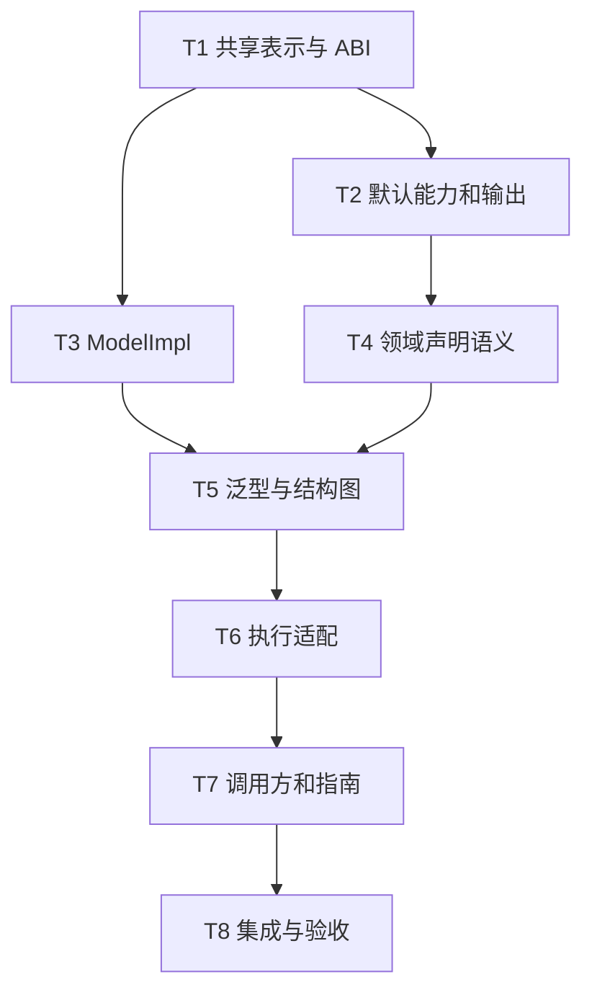

# 模型元数据冻结需求重构实施计划

> **面向智能体执行者：** 必须使用 superpowers:subagent-driven-development（推荐）或 superpowers:executing-plans，逐项实施本计划。各步骤使用复选框（`- [ ]`）语法跟踪进度。

**目标：** 使 rs-model-metadata 和 derive 满足 2026-09-10 冻结需求，完成真实调用方迁移及逐项验收。

**架构：** 复用 rs-reflect 唯一 descriptor 和 checked capability，补齐自动能力、ModelImpl、对象导航、无 ID 类型图和声明视图。默认输出委托 rs-redact；validator/codec 显式绑定；filter 产品策略移出本库。

**技术栈：** Rust 2024，rust-version 1.94，syn 2、quote、qubit-reflect、Serde、qubit-redact、可选 qubit-validator/qubit-codec。

**Temporary Workspace:** `/tmp/superpowers-jkn0qma1`

**临时工作区清理：** 执行期间保留该目录。成功后如需删除，重新验证解析后的父目录等于系统临时根、目录名具有 superpowers- 前缀、目录不等于临时根、.superpowers-session 是空的非符号链接常规文件，且目录与仓库双向不重叠。任一条件失败则保留并报告，不能仅按字符串前缀删除。本计划不授权删除。

## 全局约束

- 仓库根：`/home/starfish/working/qubit/rust-platform`；以下文件路径均相对此根。
- 冻结需求：`rs-model-metadata/derive/doc/rs-model-derive-requirements.zh_CN.md`。
- 新设计：`rs-model-metadata/derive/doc/rs-model-derive-final-design.zh_CN.md`。
- 逐项映射：`rs-model-metadata/derive/doc/rs-model-derive-requirements-coverage.zh_CN.md`。
- 当前任务只交付文档；本计划的代码步骤须在用户授权实施后执行。不预先运行 git add/commit/push。
- 先读取对应代码修改规则；需要隔离时在执行阶段创建 worktree。是否派发子智能体由实际授权及适用规则决定。
- 不削弱 indexed 冗余、Set/数组冗余、Eq/Hash 联动；不增加 computed 标记或 getter 领域属性。
- 每个代码任务先写能暴露真实缺口的测试，确认预期失败，再实现和验证；不得为消除错误而删除需求断言。
- 所有命令默认在 `rs-model-metadata` 执行；指定 rs-platform 的命令例外。
- 本计划是重构任务与验收方案，不是一次性代码补丁；完整行为算法和目标接口见新设计，不授权盲目重写现有基础设施。

## 调度图

| 任务 | 前置任务 | 最小解锁产物 | 写入集合 | 本地验证 | 集成验证归属 | 审查时机 |
| --- | --- | --- | --- | --- | --- | --- |
| T1 共享表示与 ABI | 无 | v6 路径/依赖/可选泛型 ID/解析根接口可编译 | src/relation/、metadata_vocabulary.rs、generic/generic_model_metadata.rs、resolve/resolver.rs 输入、__private.rs、private/、derive pipeline 分发、tests/abi_v6_tests.rs | cargo test -p qubit-model-metadata --all-features --test abi_v6_tests | T8 | 立即 |
| T2 默认能力和输出 | T1 | 自动能力和输出后端可被角色宏调用 | derive/src/parse/options.rs、ir/declaration/options.rs、expand/output.rs（新）、expand/metadata.rs 的输出接入、两 Cargo.toml、derive/tests/default_output_tests.rs（新） | cargo test -p qubit-model-derive --all-features --test default_output_tests | T8 | 立即 |
| T3 ModelImpl | T1 | impl 反射和 Property fragment 新协议可用 | derive/src/expand/model_impl.rs 及其 internal/、src/property.rs、property_fragment_source.rs、derive/tests/property_metadata_tests.rs、model_impl_contract_tests.rs（新） | cargo test -p qubit-model-derive --all-features --test model_impl_contract_tests --test property_metadata_tests | T8 | 立即 |
| T4 领域声明语义 | T2 | 父路径、Enum reference、能力约束和 occurrence 规范化可用 | derive/src/parse/fields.rs、validator.rs、constraints.rs、ir/declaration/、normalize/declaration.rs、expand/fields.rs、语义 ui fixtures、derive/tests/declaration_semantics_tests.rs（新） | cargo test -p qubit-model-derive --all-features --test declaration_semantics_tests | T8 | 立即 |
| T5 泛型与结构图 | T3、T4 | 匿名根/可达图/上下文依赖/查询声明视图可用 | derive/src/expand/metadata.rs、src/generic/、registry/、resolve/、tests/structure_roots_tests.rs（新）、generic_feature_tests.rs | cargo test -p qubit-model-metadata --all-features --test structure_roots_tests --test generic_feature_tests | T8 | 立即 |
| T6 执行适配 | T5 | 无 ID 根与依赖上下文可显式绑定 | src/validation/、codec/、tests/model_validation_tests.rs、validation_binding_tests.rs、codec_binding_tests.rs | cargo test -p qubit-model-metadata --all-features --test model_validation_tests --test validation_binding_tests --test codec_binding_tests | T8 | 立即 |
| T7 调用方和指南 | T6 | 所有现有调用方采用新声明/API | rs-platform/modules/ 中实际受影响模型、两 crate 的 README 与 doc/user_guide、derive/tests/runtime-fixtures/、剩余旧契约测试 | cargo check --manifest-path ../rs-platform/Cargo.toml --workspace --all-features | T8 | 批量 |
| T8 集成与验收 | T7 | 338 条逐项证据，所有本库强制项闭合 | 台账、基线、新设计细节修正、集成 fixture/CI 的必要调整 | 本节末尾的完整验证命令 | T8 独占全量检查 | 立即 |

T2 与 T3 为同一并行批次，写入集合不相交；T1 先固定 pipeline 分发入口，后续两任务不争写 pipeline。T4 等待 T2，以免能力规范化和字段展开互相覆盖；T5 等待 T3/T4 后统一修改共享 metadata/graph。所有 Cargo 重型命令属于同一 target 资源组，串行运行；源文件工作可并行。

## 任务拓扑依赖图



## T1：共享表示与 ABI

**输入：** 当前 reflect TypeDescriptor/TypeRef、ModelRegistry 快照、v5 checked provider。
**输出接口：** 新设计第 5～7 节的 NavigationStep、ObjectPath::steps、DependencyBindingMetadata::object_path/property/declaration、GenericModelMetadata::model_id -> Option<ModelId>、ResolveInputs { models, roots }；所有新的隐藏构造统一 v6。

- [ ] 新建 `rs-model-metadata/tests/abi_v6_tests.rs`，分别验证属性/Parent 步骤保持、空步骤拒绝、可选 ID、错误来源及 checked descriptor/accessor 不匹配；使用真实不匹配类型，不能只比较版本常量。
- [ ] 运行 T1 本地命令，记录新增目标接口不存在或旧类型不匹配的预期失败。
- [ ] 实现 ObjectPath 的强类型步骤和声明位置；PropertyPath 仍用于纯属性选择；不允许把 Parent 作为名称存入 PropertyPath。
- [ ] 发布 checked v6 构造和受控 facade 重导出；新增接口暂不改变消费者算法，调整现有构造调用使 workspace 可编译。
- [ ] 泛型定义 model_id 改为 Option；定义有无 ID 的构造均合法。ResolveInputs 新增 roots，旧调用处显式给空切片作为过渡。
- [ ] 运行 T1 命令和 `cargo check --workspace --all-features`，审查公共接口、布局和借用边界；通过后解锁 T2/T3。

**关键断言：** `NavigationStep::Parent` 与名为普通属性的步骤不可混淆；错误保留 ABI 原因；静态类型引用不借用临时图。

## T2：默认能力与输出

**输入：** T1 的 v6 facade 和固定 pipeline 分发。
**输出：** 五角色默认 trait、准确泛型 bound、能力开关和 rs-redact 输出后端；不会改变方法反射和路径解析。

- [ ] 新建 default_output_tests，先加入未手写 derive 的角色例子；为输出断言增加明确的 serde_json 测试依赖和输出 runtime 依赖。

```rust
#[qubit_model_derive::Model]
struct Label { text: String }

#[test]
fn defaults_are_real_implementations() {
    fn traits<T: Clone + Eq + std::hash::Hash + std::fmt::Debug
        + std::fmt::Display + serde::Serialize
        + for<'de> serde::Deserialize<'de>>() {}
    traits::<Label>();
    let value = Label { text: "visible".into() };
    assert_eq!(serde_json::to_value(&value).unwrap()["text"], "visible");
}
```

- [ ] 运行 T2 命令，确认因缺少默认 trait 失败，不是因为 fixture 缺少导入。
- [ ] 实现能力矩阵、显式 derive 去重、准确 bound 和 Eq/Hash 联动；加入 float+opt-out、unit Enum Copy、Enum default、泛型非必要 bound 的正反例。
- [ ] 委托 rs-redact 生成字段投影，自动 Debug/Display/Serialize 通过借用视图输出；Deserialize 委托原 Serde 语义。
- [ ] 加入 secret 不泄漏、skip 全字段形状、disabled 恢复、map key 冲突、透明 Value、显式 serializer 冲突和 no_redact 嵌套输出测试；测试必须断言字符串/JSON 内容或结构化错误。
- [ ] 加入 named Option/集合自动 omit/default、keep_serializing 与显式 skip 的优先级测试。位置字段只有显式 skip 能省略。
- [ ] 运行 T2 命令；逐条审查输出接入，避免递归调用自身 Serialize 或先编码 JSON 字符串再序列化。

## T3：ModelImpl 与 Property

**输入：** T1 checked fragment 与 reflect impl 委托入口。
**输出：** 设计第 4 节的 `#[model_property(skip)]`、trait/generic impl 反射、符合形状的方法贡献与兼容借用访问。

- [ ] 新建 model_impl_contract_tests，包含普通方法、trait impl、带 where 的泛型 impl、不可动态调用方法和以下排除场景。

```rust
#[qubit_model_derive::Model]
struct Person { name: String }
#[qubit_model_derive::ModelImpl]
impl Person {
    #[model_property(skip)]
    pub fn diagnostic(&self) -> usize { self.name.len() }
    pub fn full_name(&self) -> String { self.name.clone() }
}
#[test]
fn exclusion_does_not_remove_reflection_or_computed_properties() {
    let meta = qubit_model_metadata::metadata::TypeMetadata::of::<Person>();
    assert!(meta.try_property("diagnostic").unwrap().is_none());
    assert!(meta.try_property("full_name").unwrap().unwrap().is_computed());
    assert!(meta.try_property("name").unwrap().unwrap().is_writable());
}
```

- [ ] 运行 T3 命令确认旧 impl 限制或未知标记导致预期失败。
- [ ] 先剥离 model_property(skip)，将完整 impl 委托 reflect_impl；Property 候选只来自未排除的 inherent 方法。
- [ ] 复用原兼容类型映射及反射动态访问，对 getter/setter 冲突按来源确定排序；不符合 Property 形状只保留反射。
- [ ] 验证同名 field 不因 getter skip 消失，trait 方法可反射但不贡献 Property；借用结果不能逃逸，Local 实例不被要求 Send。
- [ ] 运行两个 T3 测试目标，审查动态访问和泛型 impl fragment 的 TypeId 隔离。

## T4：声明语义与规范化

**输入：** T2 能力来源 IR；T1 对象路径与依赖 metadata。
**输出：** reference slash/Parent、validator 独立依赖、Enum payload reference、能力驱动 unique、叠加约束来源；保留现有严格规则。

- [ ] 新建 declaration_semantics_tests，输入两个同 ID validator、一个局部依赖和一个 parent 依赖，断言 occurrence 数量/顺序和结构化步骤。
- [ ] 添加 Enum 中 Id reference 的通过 fixture、Value 经 Enum 隐藏 reference 的失败 fixture；检查 variant/index 定位。
- [ ] 运行 T4 命令确认现有点路径/Enum 禁令等引发失败。
- [ ] 分离 ObjectPath 与 PropertyPath parser；实现 `depends_on(slot(path = "..", property = birthday))` 及裸依赖简写，混合简写和结构化形式规范化到同一 IR。
- [ ] UniqueIr 保留显式 ignore_case；有效默认以 text capability 决定。真实 Id 别名沿用 sealed bound，补防回归测试，不换成字符串启发式。
- [ ] 保留重复 indexed、Set unique_items、数组 min/max 和角色非法组合诊断；删除 target/on_none/validate_nested 未采纳语法的默认入口，并给迁移诊断。
- [ ] 约束记录类型/使用位置来源；decimal 相等端点检查空区间；不在宏求解任意约束组合。
- [ ] 运行 T4 命令，审查标准约束和 selector 的作用位置，不把普通容器当透明包装。

## T5：泛型定义、显式根与结构图

**输入：** T3 Property、T4 声明；T1 Optional ModelId 和 ResolveInputs。
**输出：** ModelGraph 的完整静态关系及 RequiresContext；QueryMetadata::declarations，QueryDeclaration::field/reasons/path。

- [ ] 新建 structure_roots_tests，包含无 ID Model、无 ID 泛型 concrete、两个根共享嵌套类型、递归 Entity 引用、Option<Vec<Id>> reference。

```rust
#[qubit_model_derive::Model]
struct Page<T> { items: Vec<T> }
#[test]
fn anonymous_generic_has_definition() {
    let meta = qubit_model_metadata::metadata::TypeMetadata::of::<Page<String>>();
    assert!(meta.model_id().is_none());
    assert!(!meta.is_registered());
    assert!(meta.generic_definition().unwrap().model_id().is_none());
}
```

- [ ] 运行 T5 命令，记录旧 metadata 缺失关联或没有匿名解析的失败。
- [ ] 为所有泛型生成 definition provider；仅 Some(id) 进入模型稳定 ID 枚举。
- [ ] 从 registry 与 roots 并集遍历闭包；按 TypeId 去重，所有 enum payload 参与，FieldLocation 使用 variant/index。
- [ ] 引用字段先按精确兼容匹配，再逐层穿透允许包装，记录外层结构；Value 闭包按已确认规则检查。
- [ ] Parent 依赖保留 RequiresContext；结构类型已知的部分正常检查，未知父实例不视作非法声明。
- [ ] 从 queries 移出 filter 展开/平面名检查；将 unique scope 检查迁到 relations；断言旧 flat-name 冲突模型可 resolve，而不存在 scope 属性仍失败。
- [ ] 多线程重复查询验证同 TypeId 共享 metadata，错误不变为空结果；运行 T5 命令并审查缓存锁与递归终止。

## T6：可选执行绑定

**输入：** T5 图和显式上下文要求；既有 validator/codec registry。
**输出：** 不依赖必填 ModelId 的 ValidationPlan、准确类型绑定和上下文错误；codec 优先级保持声明来源。

- [ ] 扩展已有三组测试：无 ID root 不 panic；同 ID validator 不同参数分别执行；父依赖由显式上下文提供，缺失时返回带路径错误。
- [ ] 运行 T6 命令，确认无 ID expect 或旧局部路径编译暴露缺口。
- [ ] 将计划/错误身份改为 TypeId + Option<ModelId>；移除必填 ID expect，不使用假 ID 兼容旧函数。
- [ ] 依赖编译拆为已解析前缀与上下文导航；只有具备输入类型时才绑定依赖类型，否则记录未满足的上下文条件。
- [ ] 按既定 Option/selector/opaque 边界执行，类型约束与使用位置约束均保留；不写回被验证值。
- [ ] Codec 增加显式等于 canonical、匿名可达模型、准确类型错误测试；绑定仍显式使用传入 registry。
- [ ] 运行 T6 命令；审核本库只是执行协议适配，没有加入数据库/随机对象/产品 filter 算法。

## T7：真实调用方与指南

**输入：** T2～T6 新语法和 API。
**输出：** rs-platform 模型声明、fixture、示例和两套指南语义一致。

- [ ] 按文件/角色重采集声明基线，与审计的 131 条比对；逐项记录 cfg/新增删除造成的差异。
- [ ] 先处理 gap 报告列出的 5 个点路径候选文件，只替换 reference.path 中的分隔符。
- [ ] 清理与新自动 trait 冲突的 derive；有手写实现的地方显式 no_*，不删除有业务含义的手写实现。
- [ ] 将旧依赖语法和未采纳开关改为新声明或下游配置；替换对 filters/flat_name 的调用，但不为迁移而新建未授权查询产品。
- [ ] 更新 runtime fixtures、trybuild 旧拒绝能力测试和指南；将历史状态说明改为真实支持范围。反向测试必须变为新的正向/负向契约测试。
- [ ] 在 rs-model-metadata 目录运行 T7 cargo check；定位实际失败并修复属于本任务的迁移。外部依赖缺陷单独记录，不放宽新需求。

## T8：最终集成与验收

**输入：** T7 可编译调用方；全量台账任务映射。
**输出：** 本库强制需求的实际验收证据、下游责任明确、不伪报覆盖率。

- [ ] 执行下列命令并保留退出码/结果。只在此任务运行全量检查；若某项失败，修复后重跑受影响面及必要集成。

```sh
cargo fmt --all --check
cargo test --locked --workspace --all-features
cargo test --locked --workspace --no-default-features
cargo clippy --locked --workspace --all-targets --all-features -- -D warnings
cargo doc --locked --workspace --all-features --no-deps
cargo check --manifest-path ../rs-platform/Cargo.toml --workspace --all-features
```

- [ ] 真实 runtime-fixtures 检查重命名 runtime、缺失 runtime、跨 crate ID/source/reference 和策略绑定；使用已有 fixture runner，不以同 crate 测试替代。
- [ ] 逐项为台账添加实现路径、测试名/文档审查记录、命令和执行日期；对未满足条目保持未完成，不把抽样成功套到整组。
- [ ] 审查默认输出安全、匿名/泛型图、borrowed getter 和 ABI，确认无 panic 代替缺失/错误的路径。
- [ ] 对齐需求、新设计、API rustdoc、指南和迁移基线。候选查询方案及外部算法仍标下游，不计本库失败项。
- [ ] 交付变更、测试结果和剩余外部限制；不自动执行 git add/commit/push 或发布。

## 需求映射与自审

全部 338 个需求 ID 的评估组与任务见仓库逐项台账。核心和跨库集成条目映射 T1～T7；文档验收/排除边界由 T8 复核；下游实现条目映射 D（外部责任），参考/废弃映射 R（不实施）。D/R 不是遗漏的重构任务。

调度表、拓扑图、正文使用同一 T1～T8 集合；每个任务都有明确输入输出、文件集合、预期失败和验证命令。API 变化集中在设计第 4～10 节；执行者不能从旧设计恢复已撤回的规则。
